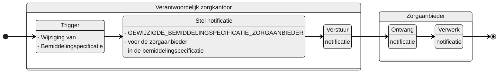

# GEWIJZIGDE_BEMIDDELINGSPECIFICATIE_ZORGAANBIEDER

## Documentatie

Notificatie aan de zorgaanbieder als het verantwoordelijke zorgkantoor een Bemiddelingspecificatie van deze zorgaanbieder heeft gewijzigd. 

De zorgaanbieder is daarmee geïnformeerd over een wijziging van een bemiddelingsspecificatie voor het leveren van zorg aan een client. De notificatie bevat informatie waarmee de zorgaanbieder de Bemiddelingspecificatie kan raadplegen.

## Aanleiding
**De trigger voor de notificatie is:** 

> de wijziging van een Bemiddelingspecificatie in het Bemiddelingsregister

## Instructie
**Stel notificatie op voor:** 
> de zorgaanbieder die geregistreerd is onder instelling in de Bemiddelingspecificatie.

## Type
Het type-notificatie: 
> VERPLICHT

## Schematisch




## Inhoud van de notificatie

| Variabele | Waarde | Voorbeeld | 
| :-- | :-- | :-- |
| timestamp | {timestamp} | ```"timestamp": "2024-07-02T00:00:00.000Z"``` | 
| afzenderIDType | "UZOVI" | ```"afzenderIDType": "UZOVI"``` |
| afzenderID | {uzovi-code afzender} | ```"afzenderID": "5050"``` |
| ontvangerIDType | "AGBCODE" | ```"ontvangerIDType": "AGBCODE"``` |
| ontvangerID | {agb-code ontvanger} | ```"ontvangerID": "12345678"``` |
| ontvangerKenmerk | NULL | |
| eventType | "GEWIJZIGDE_BEMIDDELINGSPECIFICATIE_ZORGAANBIEDER" | ```"eventType": "GEWIJZIGDE_BEMIDDELINGSPECIFICATIE_ZORGAANBIEDER"``` |
| subjectList |  | ```"subjectList": [{```|
| ../subject | "Bemiddeling/{bemiddelingID}" | "subject": "Bemiddeling/ef88ce35-58fa-4e6d-ac7a-6e298dd211d6"|
| ../recordID | "Bemiddelingspecificatie/{bemiddelingspecificatieID}" | "recordID": "Bemiddelingspecificatie/ef88ce35-58fa-4e6d-ac7a-6e298dd211d6" |
| | | ```}]``` | 


## Andere notificaties Bemiddelingsregister
[Andere notificaties Bemiddelingsregister](README.md)

## Meer informatie over Notificaties

Meer informatie over notificeren in het [Afsprakenstelsel iWlz](https://wlz.atlassian.net/wiki/x/5AlgAQ?atlOrigin=eyJpIjoiNzMyN2E3MjM3YjQwNGQ4MmFkZDgwNWY0ZmE0MDIzMGEiLCJwIjoiYyJ9): [link](https://wlz.atlassian.net/wiki/x/5AlgAQ?atlOrigin=eyJpIjoiNzMyN2E3MjM3YjQwNGQ4MmFkZDgwNWY0ZmE0MDIzMGEiLCJwIjoiYyJ9)
