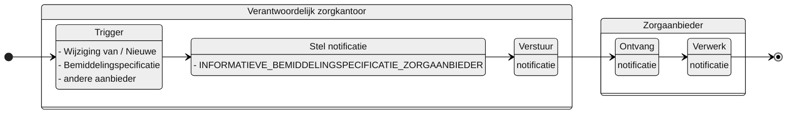

# INFORMATIEVE_BEMIDDELINGSPECIFICATIE_ZORGAANBIEDER

## Documentatie

Notificatie aan de zorgaanbieder die betrokken is bij de zorglevering aan een client waar er in de samenstelling van de zorglevering in de client een wijziging heeft plaatsgevonden. Dit kan een wijziging zijn in een overlappende bemiddelingspecificatie van een ander betrokken zorgaanbieder of de toevoeging van een nieuwe overlappende bemiddelingspecificatie (van een andere zorgaanbieder).


> [!IMPORTANT] 
> ## Implementatie fasen
> Deze Notificatie heeft een afhankelijkheid met de implementatie-fase van het bemiddelingsregister door de zorgkantoren. Er zijn 3 fasen:
>
> | Fase   	| Bemiddelingsregister   	| ZK33 	| Silvester AW33 	| Voor welke zorgaanbieders? |
> | :------	| :--------------------	| :--	| :-- | :-- |
> | **1** 	| Niet alle zorgkantoren hebben een bemiddelingsregister 	| Ja   	| Ja 	| zorgaanbieders die horen bij verantwoordelijk zorgkantoor 	|
> | **2** 	| Alle zorgkantoren hebben een bemiddelingsregister     	| Nee  	| Ja 	| alle zorgaanbieders   |
> | **3** 	| Alle zorgkantoren hebben een bemiddelingsregister en alle zorgaanbieders zijn aangesloten op het bemiddelingsregister    	| Nee  	| Nee | *geen* / *optioneel* / *alle zorgaanbieders* |
>
> Waar het nodig is de fasering mee te nemen zal dit hieronder worden aangegeven. 

## Aanleiding
**De trigger voor de notificatie is:** 

> de wijziging van een Bemiddelingspecificatie of het toevoegen van een nieuwe bemiddelingspecificatie in het Bemiddelingsregister die geen betrekking heeft op de zorgaanbieder die de notificatie dient te ontvangen.

## Instructie

### Trigger voor verzending per fase
**Trigger voor FASE 1:**
| **Scenario** 	| Notificatie voor informatieve bemiddelingspecificatie zorgaanbieder 	|
|---	|---	|
| **Gegeven** 	| een bemiddeling met bestaande bemiddelingsspecificaties 	|
| **Als** 	| er bij de bemiddeling een nieuwe bemiddelingsspecificatie wordt geregistreerd of een bestaande wordt gewijzigd (daarvoor wordt de notificatie verzonden met type NIEUWE_BEMIDDELINGSPECIFICATIE_ZORGAANBIEDER of GEWIJZIGDE_BEMIDDELINGSPECIFICATIE_ZORGAANBIEDER) 	|
| **En** 	| als er andere bemiddelingsspecificaties zijn binnen dezelfde bemiddeling die overlappen met de nieuwe of gewijzigde Bemiddelingspecificatie 	|
| **En** 	| die overlappende bemiddelingspecificaties zijn, op het moment dat de nieuwe bemiddelingsspecificatie wordt geregistreerd of de gewijzigde bemiddelingsspecificatie wordt gewijzigd, niet beëindigd  	|
| **Dan** 	| wordt er voor de zorgaanbieder(s) van die overlappende specificaties een notificatie INFORMATIEVE_BEMIDDELINGSPECIFICATIE_ZORGAANBIEDER opgesteld 	|
| **Als**   | de ontvangende zorgaanbieder bij het verantwoordelijke zorgkantoor hoort. |
|  **En** 	| wordt deze notificatie verzonden aan Silvester als de betreffende zorgaanbieder **niet** is aangesloten op het netwerkmodel 	|
|  **En** 	| wordt deze notificatie verzonden aan de zorgaanbieder als de betreffende zorgaanbieder **wel** is aangesloten op het netwerkmodel 	|

**Trigger voor FASE 2:**
| **Scenario** 	| Notificatie voor informatieve bemiddelingspecificatie zorgaanbieder 	|
|---	|---	|
| **Gegeven** 	| een bemiddeling met bestaande bemiddelingsspecificaties 	|
| **Als** 	| er bij de bemiddeling een nieuwe bemiddelingsspecificatie wordt geregistreerd of een bestaande wordt gewijzigd (daarvoor wordt de notificatie verzonden met type NIEUWE_BEMIDDELINGSPECIFICATIE_ZORGAANBIEDER of GEWIJZIGDE_BEMIDDELINGSPECIFICATIE_ZORGAANBIEDER) 	|
| **En** 	| als er andere bemiddelingsspecificaties zijn binnen dezelfde bemiddeling die overlappen met de nieuwe of gewijzigde Bemiddelingspecificatie 	|
| **En** 	| die overlappende bemiddelingspecificaties zijn, op het moment dat de nieuwe bemiddelingsspecificatie wordt geregistreerd of de gewijzigde bemiddelingsspecificatie wordt gewijzigd, niet beëindigd  	|
| **Dan** 	| wordt er voor de zorgaanbieder(s) van die overlappende specificaties een notificatie INFORMATIEVE_BEMIDDELINGSPECIFICATIE_ZORGAANBIEDER opgesteld 	|
| ~~*Als*~~   | ~~de ontvangende zorgaanbieder bij het verantwoordelijke zorgkantoor hoort~~ |
|  **En** 	| wordt deze notificatie verzonden aan Silvester als de betreffende zorgaanbieder **niet** is aangesloten op het netwerkmodel 	|
|  **En** 	| wordt deze notificatie verzonden aan de zorgaanbieder als de betreffende zorgaanbieder **wel** is aangesloten op het netwerkmodel 	|

**Trigger voor FASE 3:**

*Als de notificatie wordt gehandhaafd, is de trigger hetzelfde als van FASE 2.*

### **Overlap bepaling (voor alle fasen gelijk)**
| Gegeven: | een Bemiddelingspecificatie A  (BS A)|
| --: | :-- | 
| Dan: | is sprake van overlap tussen Bemiddelingspecificatie A en 1 (of meer) andere Bemiddelingspecificatie(s) |
| Als: | deze Bemiddelingspecificatie(s) geheel of gedeeltelijk in tijd overlapt (overlappen) met de Bemiddelingspecificatie A |
| En:	| wordt de overlap bepaald op basis van de periode vanaf de ingangsdatum (of eerder vaststellingsmoment) t/m de einddatum van de Bemiddelingspecificaties |

**Voorbeeld**
| BS      	| **Vaststellings-<br/>moment** 	| **Ingangsdatum** 	| **Einddatum** 	| **Overlap met A** 	| **Toelichting**                                                   	| **Q4-24** 	| **Q1-25** 	| **Q2-25** 	| **Q3-25** 	| **Q4-25** 	| **Q1-26** 	|
|---------	|-------------------------	|------------------	|---------------	|-------------------	|-------------------------------------------------------------------	|-----------	|-----------	|-----------	|-----------	|-----------	|-----------	|
| **A**   	| 01-08-2025 00:00        	| 01-01-2025       	| 31-12-2025    	|                   	|                                                                   	|           	|  OOO      	|  OOO      	|  OOO      	|  OOO      	|           	|
| **BS1** 	| 01-01-2025 00:00        	| 01-01-2015       	|               	| Ja                	| A.Vaststellingsmoment of A.Ingangsdatum = BS1.Vaststellingsmoment 	|           	|  OOO      	|  OOO      	|  OOO      	|  OOO      	|  OOO      	|
| **BS2** 	| 01-01-2024 00:00        	| 01-01-2024       	| 31-12-2024    	| Nee               	| A.Vaststellingsmoment of A.Ingangsdatum > BS2.Einddatum           	|  XXX      	|           	|           	|           	|           	|           	|
| **BS3** 	| 01-01-2026 00:00        	| 01-01-2026       	|               	| Nee               	| A.Einddatum < BS3.Vaststellingsmoment of BS3.Ingangsdatum         	|           	|           	|           	|           	|           	|  XXX      	|
| **BS4** 	| 01-01-2024 00:00        	| 01-01-2024       	| 31-05-2025    	| Ja                	| A.Vaststellingsmoment of A.Ingangsdatum < BS4.Einddatum           	|  OOO      	|  OOO      	|  OO      	|           	|           	|           	|
| **BS5** 	| 01-10-2025 00:00        	| 01-10-2025       	|               	| Ja                	| A.Einddatum > BS3.Vaststellingsmoment of BS3.Ingangsdatum         	|           	|           	|           	|           	|  OOO      	|  OOO      	|

*OOO = Overlap (3 maanden) / XXX = geen overlap (3 maanden)*

### Verzend bepaling
| Gegeven: | een Bemiddelingspecificatie A (BS A) met een wijziging op 1 augustus 2025 (Q3-25)|
| --: | :-- | 
| Dan: | is sprake van verzending wanneer er **overlap** is met Bemiddelingspecificatie A en 1 (of meer) andere Bemiddelingspecificatie(s) |
| EN | deze Bemiddelingspecificatie(s) zijn op je het moment van vaststelling van de wijziging van Bemiddelingspecificatie A (vaststellingsmoment = 01-08-2025) niet beëindigd (toewijzingEinddatum overlappende bemiddelingspecificatie(s) < 01-08-2025) |

**Voorbeeld**
| BS 	| Vaststellingsmoment 	| Ingangsdatum 	| Einddatum 	| Overlap<br/> met A 	| VERZENDEN 	| Toelichting 	|
|---	|---	|---	|---	|---	|---	|---	|
| A 	| **01-08-2025:00:00** 	| 01-01-2025 	| 31-12-2025 	|   	|   	|   	|
| BS1 	| 01-01-2025   00:00 	| 01-01-2015 	|   	| Ja 	| Ja 	|   	|
| BS2 	| 01-01-2024   00:00 	| 01-01-2024 	| 31-12-2024 	| Nee 	| Nee 	|   	|
| BS3 	| 01-01-2026   00:00 	| 01-01-2026 	|   	| Nee 	|  Nee 	|   	|
| BS4 	| 01-01-2024   00:00 	| 01-01-2024 	| **31-05-2025** 	| Ja 	| **NEE** 	| Einddatum   < Vaststellingsmoment A 	|
| BS5 	| 01-10-2025   00:00 	| 01-10-2025 	|   	| Ja 	| Ja 	|   	|

> [!IMPORTANT]
> Let hierbij op de fasering. Als de ontvangende zorgaanbieder niet bij het verantwoordelijk zorgkantoor hoort dan is er in FASE 1 alsnog geen sprake van verzending.


## Type
Het type-notificatie: 
> VERPLICHT (In Fase 3 optioneel?)

## Schematisch




## Inhoud van de notificatie

| Variabele | Waarde | Voorbeeld | 
| :-- | :-- | :-- |
| timestamp | {timestamp} | ```"timestamp": "2024-07-02T00:00:00.000Z"``` | 
| afzenderIDType | "UZOVI" | ```"afzenderIDType": "UZOVI"``` |
| afzenderID | {uzovi-code afzender} | ```"afzenderID": "5050"``` |
| ontvangerIDType | "AGBCODE" | ```"ontvangerIDType": "AGBCODE"``` |
| ontvangerID | {agb-code ontvanger} | ```"ontvangerID": "12345678"``` |
| ontvangerKenmerk | NULL | |
| eventType | "INFORMATIEVE_BEMIDDELINGSPECIFICATIE_ZORGAANBIEDER" | ```"eventType": "INFORMATIEVE_BEMIDDELINGSPECIFICATIE_ZORGAANBIEDER"``` |
| subjectList |  | ```"subjectList": [{```|
| ../subject | "Bemiddeling/{bemiddelingID}" | "subject": "Bemiddeling/ef88ce35-58fa-4e6d-ac7a-6e298dd211d6"|
| ../recordID | "Bemiddelingspecificatie/{bemiddelingspecificatieID}" | "recordID": "Bemiddelingspecificatie/ef88ce35-58fa-4e6d-ac7a-6e298dd211d6" |
| | | ```}]``` | 


## Andere notificaties Bemiddelingsregister
[Andere notificaties Bemiddelingsregister](README.md)

## Meer informatie over Notificaties

Meer informatie over notificeren in het [Afsprakenstelsel iWlz](https://wlz.atlassian.net/wiki/x/5AlgAQ?atlOrigin=eyJpIjoiNzMyN2E3MjM3YjQwNGQ4MmFkZDgwNWY0ZmE0MDIzMGEiLCJwIjoiYyJ9): [link](https://wlz.atlassian.net/wiki/x/5AlgAQ?atlOrigin=eyJpIjoiNzMyN2E3MjM3YjQwNGQ4MmFkZDgwNWY0ZmE0MDIzMGEiLCJwIjoiYyJ9)
