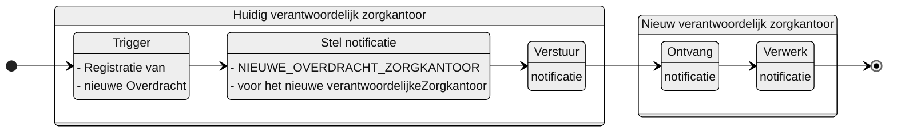

# NIEUWE_OVERDRACHT_ZORGKANTOOR

## Documentatie

Notificatie aan het nieuwe verantwoordelijke zorgkantoor als het huidige (oude) verantwoordelijke zorgkantoor een Overdracht heeft gewijzigd.

Het nieuwe zorgkantoor is daarmee op de hoogte gesteld van de aanwezigheid van een dossieroverdracht van een client. De notificatie bevat informatie waarmee dat zorgkantoor de Overdracht kan raadplegen.

## Aanleiding
**De trigger voor de notificatie is:** 

> de registratie van een Overdracht in het Bemiddelingsregister

## Instructie
**Stel notificatie op voor:** 
> het zorgkantoor dat geregistreerd is onder verantwoordelijke zorgkantoor in de Overdracht.

## Type
Het type-notificatie: 
> VERPLICHT

## Schematisch




## Inhoud van de notificatie

| Variabele | Waarde | Voorbeeld | 
| :-- | :-- | :-- |
| timestamp | {timestamp} | ```"timestamp": "2024-07-02T00:00:00.000Z"``` | 
| afzenderIDType | "UZOVI" | ```"afzenderIDType": "UZOVI"``` |
| afzenderID | {uzovi-code afzender} | ```"afzenderID": "5050"``` |
| ontvangerIDType | "UZOVI" | ```"ontvangerIDType": "UZOVI"``` |
| ontvangerID | {uzovi-code ontvanger} | ```"ontvangerID": "5151"``` |
| ontvangerKenmerk | NULL | |
| eventType | "NIEUWE_OVERDRACHT_ZORGKANTOOR" | ```"eventType": "NIEUWE_OVERDRACHT_ZORGKANTOOR"``` |
| subjectList |  | ```"subjectList": [{```|
| ../subject | "Overdracht/{overdrachtID}" | "subject": "Overdracht/ef88ce35-58fa-4e6d-ac7a-6e298dd211d6"|
| ../recordID | "Overdracht/{overdrachtID}" | "recordID": "Overdracht/ef88ce35-58fa-4e6d-ac7a-6e298dd211d6" |
| | | ```}]``` | 


## Andere notificaties Bemiddelingsregister
[Andere notificaties Bemiddelingsregister](README.md)

## Meer informatie over Notificaties

Meer informatie over notificeren in het [Afsprakenstelsel iWlz](https://wlz.atlassian.net/wiki/x/5AlgAQ?atlOrigin=eyJpIjoiNzMyN2E3MjM3YjQwNGQ4MmFkZDgwNWY0ZmE0MDIzMGEiLCJwIjoiYyJ9): [link](https://wlz.atlassian.net/wiki/x/5AlgAQ?atlOrigin=eyJpIjoiNzMyN2E3MjM3YjQwNGQ4MmFkZDgwNWY0ZmE0MDIzMGEiLCJwIjoiYyJ9)
