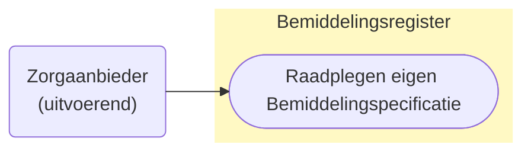
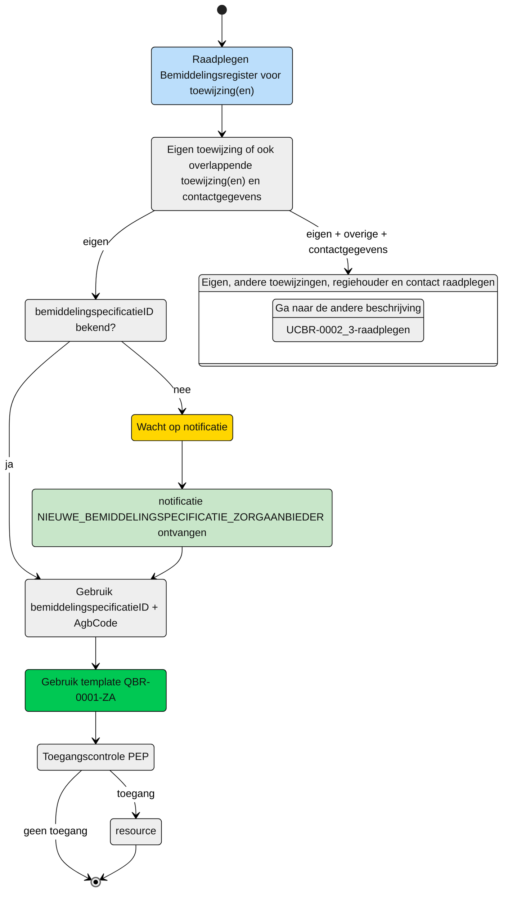

# Raadplegen van de **eigen** Bemiddelingspecificatie door de Zorgaanbieder (UCBR-0001) 




## **Use Case Beschrijving**  
**Titel:** Raadplegen van **eigen** Bemiddelingspecificatie door een Zorgaanbieder  
**Actoren:** Zorgaanbieder betrokken bij de levering van zorg aan een client  

### Precondities:
- De Bemiddelingspecificatie is opgenomen in het Bemiddelingsregister.
- De zorgaanbieder is door het verantwoordelijk zorgkantoor betrokken bij de levering van zorg aan de client door de registratie van een bemiddelingspecificatie


### Autorisatie:
Een zorgaanbieder mag voor het leveren van zorg aan een cliënt de eigen toewijzing raadplegen. 
- Volledige autorisatieregel: [BRA0001-informatiemodel](https://informatiemodel.istandaarden.nl/informatiemodel/iwlz/netwerk/bemiddelingsregister-1/regels/autorisatieregel/bra0001/)
- Autorisatiematrix: [BRA0001](../autorisatiematrix_bemiddelingsregister.md)

**Trigger:**
- Een zorgaanbieder wil de **eigen** toegewezen bemiddelingspecificatie raadplegen voor het leveren van zorg aan een cliënt.


## Query-template beschrijving

| **Query ID** | **Beschrijving** | **Verplichte input** | **resultaat** |
|---|---|---|---|
| [**QBR-0001-ZA**](/gql-query/zorgaanbieder/QBR-0001-ZA.graphql) | Op basis van de (ontvangen) bemiddelingspecificatieID en eigen identificatie, de Bemiddelingspecificatie, Bemiddeling en Cliënt gegevens raadplegen | `bemiddelingspecificatieID`,  eigen `AGBcode` | Bemiddelingspecificatie /  Bemiddeling /  Client |

## **Proces raadplegen**

Een zorgaanbieder wordt bij de zorg van een client betrokken door het zorgkantoor. Het zorgkantoor registreert een bemiddelingspecificatie (toewijzing) voor het leveren van zorg door de zorgaanbieder. De zorgaanbieder ontvangt hiervan een notificatie [```NIEUWE_BEMIDDELINGSPECIFICATIE_ZORGAANBIEDER```](/notificaties/nieuwe_bemiddelingspecificatie_zorgaanbieder.md). Op basis van deze notificatie kan de zorgaanbieder de informatie in het bemiddelingsregister raadplegen. 

> [!NOTE]
> Voor een volledige beeld moeten er altijd 2 bevragingen worden uitgevoerd.
> Te beginnen met de hier beschreven raadpleging. Voor het ophalen van de eigen toewijzing periode en vervolgens één van de twee andere queries voor de overlappende zorgtoewijzingen. Die use-case is beschreven in [UCBR-0002_3-raadplegen](UCBR-0002_3-raadplegen.md).

### Schematisch:




| # | Toelichting |
| --: | :-- |
| 1. | *Start* raadplegen **eigen** bemiddelingspecificatie | 
| 2. | Is de **```bemiddelingspecificatie```** bekend? <br/> - **Ja** →  Ga verder naar stap 6 <br/> - **Nee** → Wacht op notificatie [**`NIEUWE_BEMIDDELINGSPECIFICATIE_ZORGAANBIEDER`**](/notificaties/nieuwe_bemiddelingspecificatie_zorgaanbieder.md)  | 
| 4. | Notificatie is ontvangen | 
| 5. | Gebruik de informatie uit de notificatie voor het raadplegen van het bemiddelingsregister |
| 6. | De **Zorgaanbieder** vult de verplichte **`bemiddelingspecificatieID`** in query-template [QBR-0001-ZA.graphql](/gql-query/zorgaanbieder/QBR-0001-ZA.graphql) en initieert een raadpleging van de bemiddelingspecificatie in het Bemiddelingsregister. | 
| 7. | De **Zorgaanbieder** stuurt Graphql-request + Access-token naar het Policy Enforcement Point (PEP) |
| 8. | De PEP voert de [toegangscontrole](UCBR-0001-toegangscontrole.md) uit en stuurt bij toegang het request door naar het Bemiddelingsregister. |
| 9. | De zorgaanbieder ontvangt response van de PEP (bij ongeldig verzoek) of vanuit het Bemiddelingsregister (resource) |
| 10. | *Einde proces* | 


---

Ga naar beschrijving van de bijbehorende [toegangscontrole](UCBR-0001-toegangscontrole.md) | Ga naar [UCBR-0002_3-raadplegen](UCBR-0002_3-raadplegen.md) voor de beschrijving van het raadplegen van de overlappende toewijzingen |  Terug naar [Raadplegen](/raadplegen/README.md)
