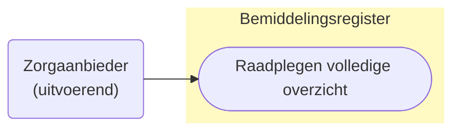
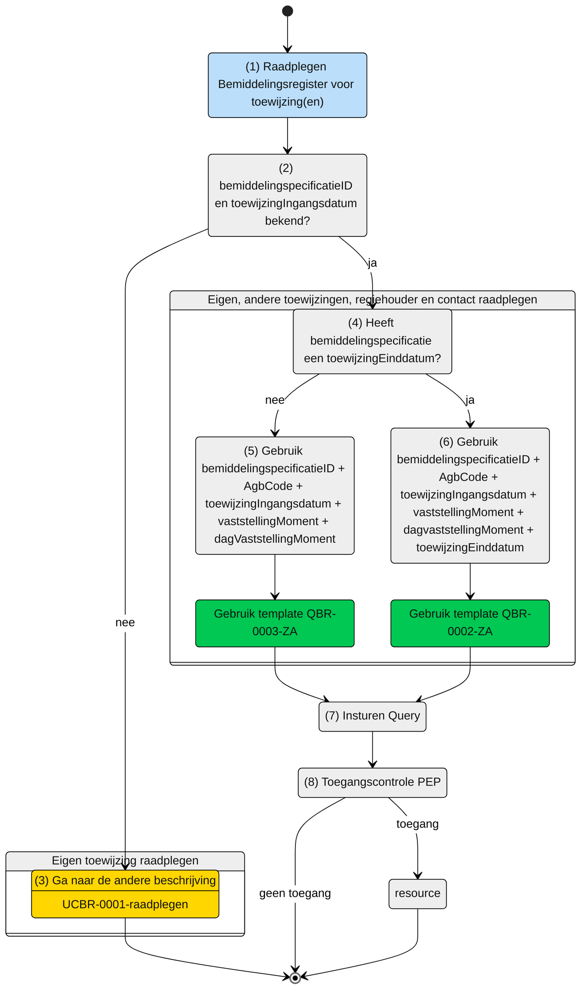

# Raadplegen van de eigen en overlappende Bemiddelingspecificatie(s) en overige informatie door de Zorgaanbieder (UCBR-0002_3) 

## **Use Case Beschrijving**  
**Titel:** Raadplegen van de eigen en overlappende Bemiddelingspecificatie(s) en overige informatie door de Zorgaanbieder  
**Actoren:** Zorgaanbieder betrokken bij de levering van zorg aan een client  

### Precondities:
- De Bemiddelingspecificatie is opgenomen in het Bemiddelingsregister.
- De zorgaanbieder is door het verantwoordelijk zorgkantoor betrokken bij de levering van zorg aan de client door de registratie van een bemiddelingspecificatie.
- De zorgaanbieder weet de toewijzing ingangsdatum, het vaststellingMoment en de toewijzing einddatum van de eigen bemiddelingspecificatie.

### Autorisatie:
Een zorgaanbieder mag voor het leveren van zorg aan een cliënt de eigen toewijzing raadplegen. 
- Volledige autorisatieregel: [BRA0002](https://informatiemodel.istandaarden.nl/informatiemodel/iwlz/netwerk/bemiddelingsregister-1/regels/autorisatieregel/bra0002/), [BRA0004](https://informatiemodel.istandaarden.nl/informatiemodel/iwlz/netwerk/bemiddelingsregister-1/regels/autorisatieregel/bra0004/), [BRA0005](https://informatiemodel.istandaarden.nl/informatiemodel/iwlz/netwerk/bemiddelingsregister-1/regels/autorisatieregel/bra0005/), [BRA0012](https://informatiemodel.istandaarden.nl/informatiemodel/iwlz/netwerk/bemiddelingsregister-1/regels/autorisatieregel/bra0012/)
- Autorisatiematrix: [BRA0002, BRA0004, BRA0005, BRA0012](../autorisatiematrix_bemiddelingsregister.md)

**Trigger:**
- Een zorgaanbieder wil de **eigen** toegewezen bemiddelingspecificatie, de **informatieve** bemiddelingsspecificatie, de **regiehouder** en aanvullende client gegevens raadplegen voor het leveren van zorg aan een cliënt.

## Query-template beschrijving

| **Query ID** | **Beschrijving** | **Verplichte input** | **resultaat** |
|---|---|---|---|
| [**QBR-0002-ZA**](/gql-query/zorgaanbieder/QBR-0002-ZA.graphql) | Op basis van de bemiddelingsspecificatieID, eigen identificatie en toewijzingingangsdatum en toewijzingeinddatum, de (overlappende) Bemiddelingspecificatie(s), Bemiddeling, Client, Dossierhouder, CoordinatorZorgThuis, Contactpersoon en Contactgegevens raadplegen | `bemiddelingspecificatieID`,  `AGBcode`, `toewijzingIngangsdatum`, `vaststellingMoment`, `dagVaststellingMoment`, `toewijzingEinddatum` | Bemiddelingspecificatie /  Bemiddeling /  Client /  Dossierhouder /  Coordinator zorg thuis /  Contactgegevens | [BRA0002](https://informatiemodel.istandaarden.nl/informatiemodel/iwlz/netwerk/bemiddelingsregister-1/regels/autorisatieregel/bra0002/), [BRA0004](https://informatiemodel.istandaarden.nl/informatiemodel/iwlz/netwerk/bemiddelingsregister-1/regels/autorisatieregel/bra0004/), [BRA0005](https://informatiemodel.istandaarden.nl/informatiemodel/iwlz/netwerk/bemiddelingsregister-1/regels/autorisatieregel/bra0005/) | [Autorisatie controle](/gql-query/zorgaanbieder/QBR-0002-ZA-autorisatie.md) |
| [**QBR-0003-ZA**](/gql-query/zorgaanbieder/QBR-0003-ZA.graphql) | Op basis van de bemiddelingsspecificatieID, eigen identificatie en toewijzingingangsdatum, de (overlappende) Bemiddelingspecificatie(s), Bemiddeling, Client, Dossierhouder, CoordinatorZorgThuis, Contactpersoon en Contactgegevens raadplegen | `bemiddelingspecificatieID`,  `AGBcode`, `toewijzingIngangsdatum`, `vaststellingMoment`, `dagVaststellingMoment` | Bemiddelingspecificatie /  Bemiddeling /  Client /  Dossierhouder /  Coordinator zorg thuis /  Contactgegevens | [BRA0002](https://informatiemodel.istandaarden.nl/informatiemodel/iwlz/netwerk/bemiddelingsregister-1/regels/autorisatieregel/bra0002/), [BRA0004](https://informatiemodel.istandaarden.nl/informatiemodel/iwlz/netwerk/bemiddelingsregister-1/regels/autorisatieregel/bra0004/), [BRA0005](https://informatiemodel.istandaarden.nl/informatiemodel/iwlz/netwerk/bemiddelingsregister-1/regels/autorisatieregel/bra0005/) | [Autorisatie controle](/gql-query/zorgaanbieder/QBR-0003-ZA-autorisatie.md) |

## **Proces raadplegen**

Een zorgaanbieder is bij de zorg van een client betrokken door het zorgkantoor. Hiervoor heeft die zorgaanbieder een (eigen) bemiddelingsspecificatie voor het leveren van zorg (zie ook: [UCBR-0001-raadplegen](UCBR-0001-raadplegen.md)). Met de aanvullende informatie uit de eigen bemiddelingsspecificatie mag de aanbieder ook de bemiddelingspecificaties van de andere betrokken zorgaanbieders raadplegen. Hiervoor zijn naast de eigen `bemiddelingspecificatieID` en de eigen `Agbcode`,  ook de `toewijzingIngangsdatum` en het `vaststellingMoment` nodig en de `toewijzingEinddatum` zodra de eigen bemiddelingspecificatie een `toewijzingEinddatum` heeft. Deze informatie is nodig om de overlap met de andere bemiddelingsspecificaties met de eigen bemiddelingspecificatie te bepalen.  

> [!NOTE]
> Volg [UCBR-0001-raadplegen](UCBR-0001-raadplegen.md) voor het raadplegen van de `toewijzingIngangsdatum` en de `toewijzingEinddatum`.

### Schematisch: 

| # | Toelichting |
| --: | :-- |
| 1. | *Start* raadplegen | 
| 2. | Zijn  **`bemiddelingspecificatieID`** en `toewijzingIngangsdatum`bekend?   - **Ja** →  Ga verder naar stap 4.   - **Nee** → Ga naar stap 3.   | 
| 3. | Gebruik eerst query-template `QBR-0001-ZA` (zie beschrijving [`UCBR-0001-raadplegen`](UCBR-0001-raadplegen.md)) | 
| 4. | Heeft de `bmemiddelingspecificatie` (inmiddels) een `toewijzingEinddatum`?   - **Ja** →  Ga verder naar stap 6   - **Nee** → Ga naar stap 5.  | 
| 5. | Gebruik query-template [`QBR-0003-ZA.graphql`](/gql-query/zorgaanbieder/QBR-0003-ZA.graphql) en vul de verplichte parameters:   - `bemiddelingspecificatieID`;   - `instelling`;   - `toewijzingIngangsdatum`;   - `vaststellingMoment`;   - `dagVaststellingMoment`.  |
| 6. | Gebruik query-template [`QBR-0002-ZA.graphql`](/gql-query/zorgaanbieder/QBR-0002-ZA.graphql) en vul de verplichte parameters:   - `bemiddelingspecificatieID`;   - `instelling`;   - `toewijzingIngangsdatum`;   - `vaststellingMoment`;   - `dagVaststellingMoment` ;   - `toewijzingEinddatum`.  | 
| 7. | De **Zorgaanbieder** stuurt Graphql-request + Access-token naar het Policy Enforcement Point (PEP) |
| 8. | De PEP voert de [toegangscontrole](UCBR-0002_3-toegangscontrole.md) uit en stuurt bij toegang het request door naar het Bemiddelingsregister. |
| 9. | De zorgaanbieder ontvangt response van de PEP (bij ongeldig verzoek) of vanuit het Bemiddelingsregister (resource) |
| 10. | *Einde proces* | 

---
Ga naar beschrijving van de bijbehorende [toegangscontrole](UCBR-0002_3-toegangscontrole.md)  |  Terug naar [Raadplegen](/raadplegen/README.md)
