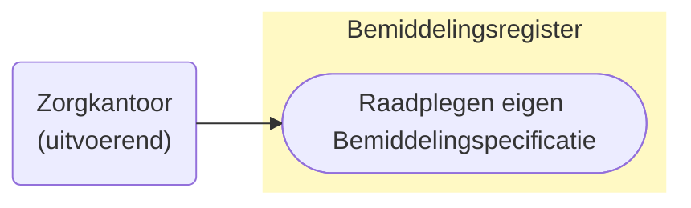
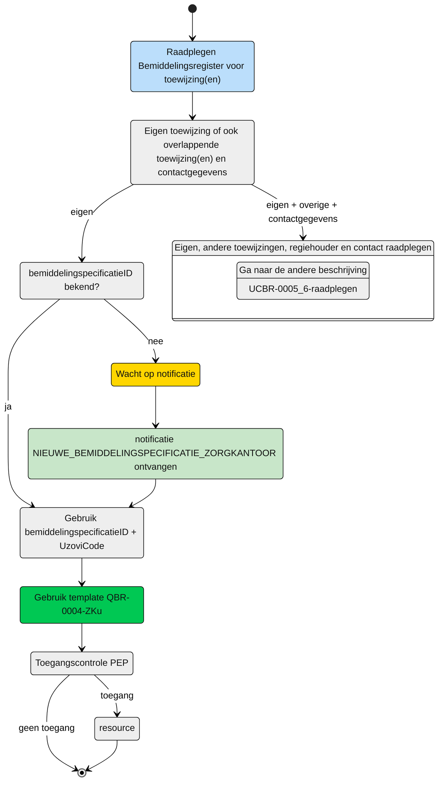

# Raadplegen van de **eigen** Bemiddelingspecificatie door het (bovenregionaal) uitvoerend zorgkantoor (UCBR-0004) 

## **Use Case Beschrijving**  
**Titel:** Raadplegen van **eigen** Bemiddelingspecificatie door een (bovenregionaal) uitvoerend zorgkantoor.  
**Actoren:** Zorgkantoor dat contract heeft met de zorgaanbieder die betrokken is bij de levering van zorg aan een client.  

### Precondities:
- De Bemiddelingspecificatie is opgenomen in het Bemiddelingsregister.
- Het zorgkantoor is betrokken bij de levering van zorg aan de client door de registratie van een bemiddelingspecificatie door het verantwoordelijk zorgkantoor.

### Autorisatie:
Het zorgkantoor mag de toewijzing raadplegen. 
- Volledige autorisatieregel: [BRA0006](https://informatiemodel.istandaarden.nl/informatiemodel/iwlz/netwerk/bemiddelingsregister-1/regels/autorisatieregel/bra0006/)
- Autorisatiematrix: [BRA0006](../autorisatiematrix_bemiddelingsregister.md)

**Trigger:**
- Een zorgkantoor wil de bemiddelingspecificatie raadplegen waarin het is geregistreerd als uitvoerend zorgkantoor.

## Query-template beschrijving

| **Query ID** | **Beschrijving** | **Verplichte input** | **resultaat** |
|---|---|---|---|
| [**QBR-0004-ZKu**](/gql-query/zorgkantoor/QBR-0004-ZKu.graphql) | Op basis van de (ontvangen) bemiddelingspecificatieID en eigen identificatie, de Bemiddelingspecificatie, Bemiddeling en Cliënt gegevens raadplegen | `bemiddelingspecificatieID`, `uzoviCode` | Bemiddelingspecificatie /  Bemiddeling /  Client |

## **Proces raadplegen**

Een zorgaanbieder wordt bij de zorg van een client betrokken door het zorgkantoor. Het zorgkantoor registreert een bemiddelingspecificatie (toewijzing) voor het leveren van zorg door de zorgaanbieder. Als de zorgaanbieder contract heeft bij een zorgkantoor uit een andere regio (bovenregionaal) dan het verantwoordelijke zorgkantoor, ontvangt dat bovenregionale zorgkantoor de notificatie [`NIEUWE_BEMIDDELINGSPECIFICATIE_ZORGKANTOOR](/notificaties/nieuwe_bemiddelingspecificatie_zorgkantoor.md). Op basis van deze notificatie kan het zorgkantoor de informatie in het bemiddelingsregister raadplegen. 

> [!NOTE]
> Voor een volledige beeld moeten er altijd 2 bevragingen worden uitgevoerd.
> Te beginnen met de hier beschreven raadpleging, voor het ophalen van de eigen toewijzing periode. Vervolgens één van de twee andere queries voor de overlappende zorgtoewijzingen. Die use-case is beschreven in [UCBR-0005_6-raadplegen](UCBR-0005_6-raadplegen.md).

### Schematisch:

| # | Toelichting |
| --: | :-- |
| 1. | *Start* raadplegen **eigen** bemiddelingspecificatie | 
| 2. | Is de **`bemiddelingspecificatieID`** bekend?   - **Ja** →  Ga verder naar stap 6   - **Nee** → Wacht op notificatie [**`NIEUWE_BEMIDDELINGSPECIFICATIE_ZORGKANTOOR`**](/notificaties/nieuwe_bemiddelingspecificatie_zorgkantoor.md)  | 
| 4. | Notificatie is ontvangen | 
| 5. | Gebruik de informatie uit de notificatie voor het raadplegen van het bemiddelingsregister |
| 6. | Het zorgkantoor vult de verplichte **`bemiddelingspecificatieID`** in query-template [QBR-0004-ZKu.graphql](/gql-query/zorgkantoor/QBR-0004-ZKu.graphql) en initieert een raadpleging van de bemiddelingspecificatie in het Bemiddelingsregister. | 
| 7. | Het zorgkantoor stuurt Graphql-request + Access-token naar het Policy Enforcement Point (PEP) |
| 8. | De PEP voert de [toegangscontrole](UCBR-0004-toegangscontrole.md) uit en stuurt bij toegang het request door naar het Bemiddelingsregister. |
| 9. | Het zorgkantoor ontvangt response van de PEP (bij ongeldig verzoek) of vanuit het Bemiddelingsregister (resource) |
| 10. | *Einde proces* | 

---

Ga naar beschrijving van de bijbehorende [toegangscontrole](UCBR-0004-toegangscontrole.md) | Ga naar [UCBR-0005_6-raadplegen](UCBR-0005_6-raadplegen.md) voor de beschrijving van het raadplegen van de overlappende toewijzingen |  Terug naar [Raadplegen](/raadplegen/README.md)
