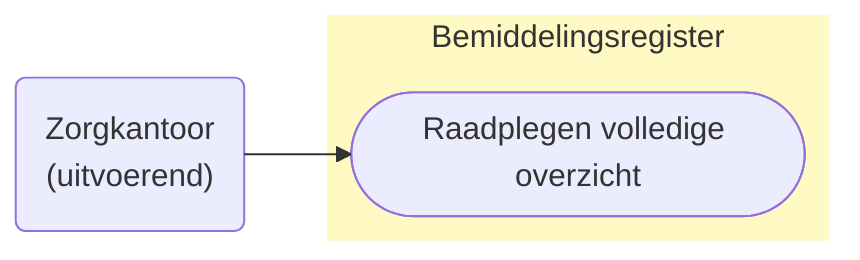
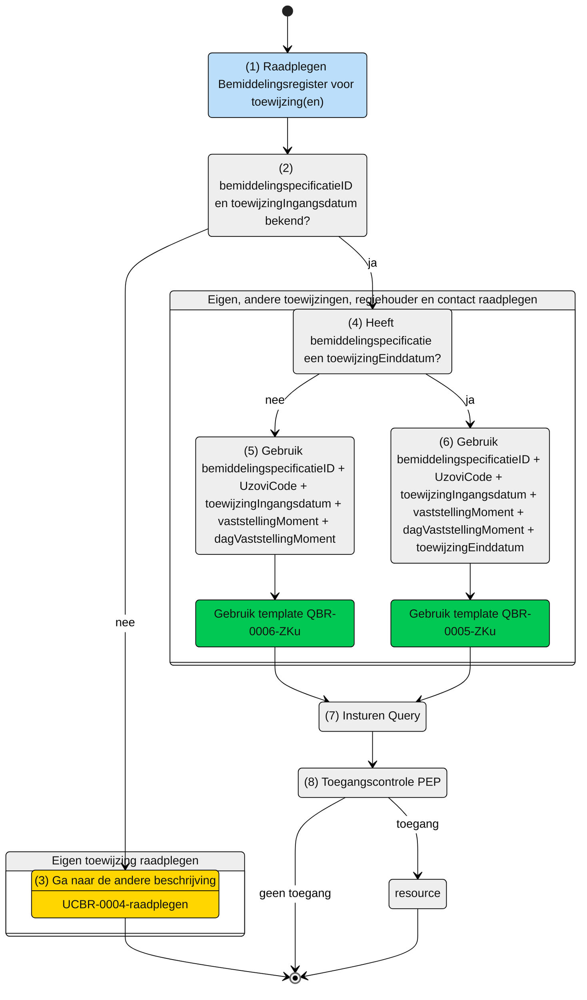

# Raadplegen van de eigen en overlappende Bemiddelingspecificatie(s) en overige informatie door het Zorgkantoor (UCBR-0005_6) 

## **Use Case Beschrijving**  
**Titel:** Raadplegen van de eigen en overlappende Bemiddelingspecificatie(s) en overige informatie door het Zorgkantoor.  
**Actoren:** Zorgkantoor betrokken bij de levering van zorg aan een client uit een andere regio. 

### Precondities:
- De Bemiddelingspecificatie is opgenomen in het Bemiddelingsregister.
- Het Zorgkantoor is door het verantwoordelijk zorgkantoor betrokken bij de levering van zorg aan de client door de registratie van een bemiddelingspecificatie.
- Het Zorgkantoor weet de toewijzing ingangsdatum, het vaststellingsmoment en de toewijzing einddatum van de bemiddelingspecificatie.

### Autorisatie:
Een zorgkantoor mag voor het toeleiden van de client de Bemiddelingspecificatie raadplegen waarin dit zorgkantoor als uitvoerend zorgkantoor is opgenomen. 
- Volledige autorisatieregel: [BRA0006](https://informatiemodel.istandaarden.nl/informatiemodel/iwlz/netwerk/bemiddelingsregister-1/regels/autorisatieregel/bra0006/), [BRA0007](https://informatiemodel.istandaarden.nl/informatiemodel/iwlz/netwerk/bemiddelingsregister-1/regels/autorisatieregel/bra0007/), [BRA0008](https://informatiemodel.istandaarden.nl/informatiemodel/iwlz/netwerk/bemiddelingsregister-1/regels/autorisatieregel/bra0008/), [BRA0009](https://informatiemodel.istandaarden.nl/informatiemodel/iwlz/netwerk/bemiddelingsregister-1/regels/autorisatieregel/bra0009/)
- Autorisatiematrix: [BRA0006, BRA0007, BRA0008, BRA0009](../autorisatiematrix_bemiddelingsregister.md)

(../autorisatiematrix_bemiddelingsregister.md)

**Trigger:**
- Een zorgkantoor wil de **eigen** toegewezen bemiddelingspecificatie, de **informatieve** bemiddelingsspecificatie, de **regiehouder** en aanvullende client gegevens raadplegen voor het leveren van zorg aan een cliënt.

## Query-template beschrijving

| **Query ID** | **Beschrijving** | **Verplichte input** | **resultaat** | 
|---|---|---|---| 
| [**QBR-0005-ZKu**](/gql-query/zorgkantoor/QBR-0005-ZKu.graphql) | Op basis van de bemiddelingsspecificatieID, eigen identificatie en toewijzingingangsdatum en toewijzingendatum, de (overlappende) Bemiddelingspecificatie(s), Bemiddeling, Client, Dossierhouder, CoordinatorZorgThuis, Contactpersoon en Contactgegevens raadplegen | `bemiddelingspecificatieID`,  `uzoviCode`, `toewijzingIngangsdatum`, `vaststellingMoment`, `dagVaststellingMoment`, `toewijzingEinddatum` | Bemiddelingspecificatie /  Bemiddeling /  Client /  Dossierhouder /  Coordinator zorg thuis /  Contactgegevens | 
| [**QBR-0006-ZKu**](/gql-query/zorgkantoor/QBR-0006-ZKu.graphql) | Op basis van de bemiddelingsspecificatieID, eigen identificatie en toewijzingingangsdatum, de (overlappende) Bemiddelingspecificatie(s), Bemiddeling, Client, Dossierhouder, CoordinatorZorgThuis, Contactpersoon en Contactgegevens raadplegen | `bemiddelingspecificatieID`,  `uzoviCode`, `toewijzingIngangsdatum`, `vaststellingMoment`, `dagVaststellingMoment` | Bemiddelingspecificatie /  Bemiddeling /  Client /  Dossierhouder /  Coordinator zorg thuis /  Contactgegevens |

## **Proces raadplegen**

Een zorgaanbieder wordt bij de zorg van een client betrokken door het zorgkantoor. Het zorgkantoor registreert een bemiddelingspecificatie (toewijzing) voor het leveren van zorg door de zorgaanbieder. Als de zorgaanbieder contract heeft bij een zorgkantoor uit een andere regio (bovenregionaal) dan het verantwoordelijke zorgkantoor, heeft dat zorgkantoor een (eigen) bemiddelingsspecificatie voor het leveren van zorg (zie ook: [UCBR-0004-raadplegen](UCBR-0004-raadplegen.md)). Met de aanvullende informatie uit de eigen bemiddelingsspecificatie mag dat zorgkantoor ook de bemiddelingspecificaties van de andere betrokken zorgaanbieders raadplegen. Hiervoor zijn naast de eigen `bemiddelingspecificatieID` en de eigen `uzoviCode`,  ook de `toewijzingIngangsdatum` en het `vaststellingMoment` nodig en de `toewijzingEinddatum` zodra de eigen bemiddelingspecificatie een `toewijzingEinddatum` heeft. Deze informatie is nodig om de periode-overlap met de andere bemiddelingsspecificaties met de eigen bemiddelingspecificatie te bepalen.  

> [!NOTE]
> Zie [UCBR-0004-raadplegen](UCBR-0004-raadplegen.md) voor het raadplegen van de `toewijzingIngangsdatum` en de `toewijzingEinddatum`.

### Schematisch: 

| # | Toelichting |
| --: | :-- |
| 1. | *Start* raadplegen | 
| 2. | Zijn  **`bemiddelingspecificatieID`** en `toewijzingIngangsdatum`bekend?   - **Ja** →  Ga verder naar stap 4.   - **Nee** → Ga naar stap 3.   | 
| 3. | Gebruik eerst query-template `QBR-0004-ZKu` (zie beschrijving [`UCBR-0004-raadplegen`](UCBR-0004-raadplegen.md)) | 
| 4. | Heeft de `bmemiddelingspecificatie` (inmiddels) een `toewijzingEinddatum`?   - **Ja** →  Ga verder naar stap 6   - **Nee** → Ga naar stap 5.  | 
| 5. | Gebruik query-template [`QBR-0006-ZKu.graphql`](/gql-query/zorgkantoor/QBR-0006-ZKu.graphql) en vul de verplichte parameters:   - `bemiddelingspecificatieID`;   - `instelling`;   - `toewijzingIngangsdatum`;   - `vaststellingMoment`;   - `dagVaststellingMoment`.  |
| 6. | Gebruik query-template [`QBR-0005-ZKu.graphql`](/gql-query/zorgkantoor/QBR-0005-ZKu.graphql) en vul de verplichte parameters:   - `bemiddelingspecificatieID`;   - `instelling`;   - `toewijzingIngangsdatum`;   - `vaststellingMoment`;   - `dagVaststellingMoment`;   - `toewijzingEinddatum`.  | 
| 7. | Het Zorgkantoor stuurt Graphql-request + Access-token naar het Policy Enforcement Point (PEP) |
| 8. | De PEP voert de [toegangscontrole](UCBR-0002_3-toegangscontrole.md) uit en stuurt bij toegang het request door naar het Bemiddelingsregister. |
| 9. | Het Zorgkantoor ontvangt response van de PEP (bij ongeldig verzoek) of vanuit het Bemiddelingsregister (resource) |
| 10. | *Einde proces* | 

---
Ga naar beschrijving van de bijbehorende [toegangscontrole](UCBR-0005_6-toegangscontrole.md)  |  Terug naar [Raadplegen](/raadplegen/README.md)
