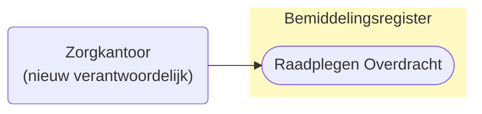
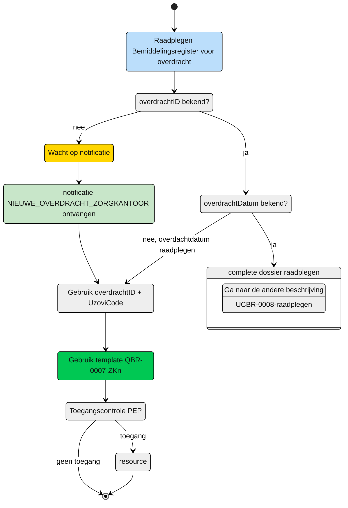

# Raadplegen van de Overdracht door het nieuw verantwoordelijk zorgkantoor (UCBR-0007) 

## **Use Case Beschrijving**  
**Titel:** Raadplegen van het dossier van de overgedragen client en de toegewezen zorg aan de, zodat ik de verantwoordelijkheid over de client zorgvuldig kan overnemen.  
**Actoren:** Zorgkantoor dat door dossier overdracht verantwoordelijk wordt voor de zorgbemiddeling van de overgedragen client.  

### Precondities:
- De Overdracht is opgenomen in het Bemiddelingsregister.
- Het zorgkantoor wordt verantwoordelijk voor de bemiddeling van zorg aan de client door de registratie van een overdracht door het huidige verantwoordelijk zorgkantoor.

### Autorisatie:
Het zorgkantoor mag de overdracht raadplegen. 
- Volledige autorisatieregel: [BRA0010](https://informatiemodel.istandaarden.nl/informatiemodel/iwlz/netwerk/bemiddelingsregister-1/regels/autorisatieregel/bra0010/)
- Autorisatiematrix: [BRA0010](../autorisatiematrix_bemiddelingsregister.md)

**Trigger:**
- Een zorgkantoor wil de overdracht waarin het is geregistreerd als verantwoordelijk zorgkantoor.

## Query-template beschrijving

| **Query ID** | **Beschrijving** | **Verplichte input** | **resultaat** |
|---|---|---|---|
| [**QBR-0007-ZKn**](/gql-query/zorgkantoor/QBR-0007-ZKn.graphql) | Op basis van de overdrachtID en eigen identificatie de overgedragen Bemiddeling, Bemiddelingspecificatie(s) en Client raadplegen | `overdrachtID`, `uzoviCode` | Overdracht /  Bemiddeling /  Overdrachtspecificatie / Bemiddelingspecificatie / Client |

## **Proces raadplegen**

Een zorgkantoor ontvangt van een ander zorgkantoor dat verantwoordelijk is voor de bemiddeling van zorg aan een client de notificatie [`NIEUWE_OVERDRACHT_ZORGKANTOOR](/notificaties/nieuwe_overdracht_zorgkantoor.md). Op basis van deze notificatie kan het zorgkantoor de informatie in het bemiddelingsregister raadplegen. 

> [!NOTE]
> Voor een volledige beeld moeten er **altijd** 2 bevragingen worden uitgevoerd.
> Met de hier beschreven raadpleging kan de overdrachtDatum worden gelezen. Vervolgens kan de tweede query worden uitgevoerd voor het raadplegen van de Client contactgegevens de contactpersonen en de regiehouder. Die use-case is beschreven in [UCBR-0008-raadplegen](UCBR-0008-raadplegen.md).

### Schematisch:

| # | Toelichting |
| --: | :-- |
| 1. | *Start* raadplegen **Overdracht**  | 
| 2. | Is de **`overdrachtID`** bekend?   - **Ja** →  Ga verder naar stap 6   - **Nee** → Ga verder volgende stap.  | 
| 3. | Wacht op notificatie [**`NIEUWE_OVERDRACHT_ZORGKANTOOR`**](/notificaties/nieuwe_overdracht_zorgkantoor.md) |
| 4. | Notificatie is ontvangen | 
| 5. | Gebruik de informatie uit de notificatie voor het raadplegen van het bemiddelingsregister →  Ga verder naar stap 8. |
| | |
| 6. | Overdrachtdatum bekend?   - **Ja** →  Ga verder naar volgende stap.   - **Nee** → Ga verder naar stap 8. |
| 7. | Volg de beschrijving van [UCBR-0008-raadplegen]() |
| | |
| 8. | Het zorgkantoor vult de verplichte **`overdrachtID`** en en **`verantwoordelijkZorgkantoor`**in query-template [QBR-0007_ZKn.graphql](/gql-query/zorgkantoor/QBR-0007-ZKn.graphql) en initieert een raadpleging van de Overdracht in het Bemiddelingsregister. | 
| 9. | Het zorgkantoor stuurt Graphql-request + Access-token naar het Policy Enforcement Point (PEP) |
| 10. | De PEP voert de [toegangscontrole](UCBR-0007-toegangscontrole.md) uit en stuurt bij toegang het request door naar het Bemiddelingsregister. |
| 11. | Het zorgkantoor ontvangt response van de PEP (bij ongeldig verzoek) of vanuit het Bemiddelingsregister (resource) |
| 12. | *Einde proces* | 

---

Ga naar beschrijving van de bijbehorende [toegangscontrole](UCBR-0007-toegangscontrole.md) | Ga naar [UCBR-0008-raadplegen](UCBR-0008-raadplegen.md) voor de beschrijving van het raadplegen van de overlappende toewijzingen |  Terug naar [Raadplegen](/raadplegen/README.md)
