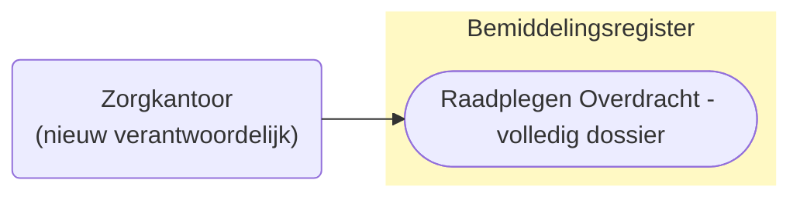
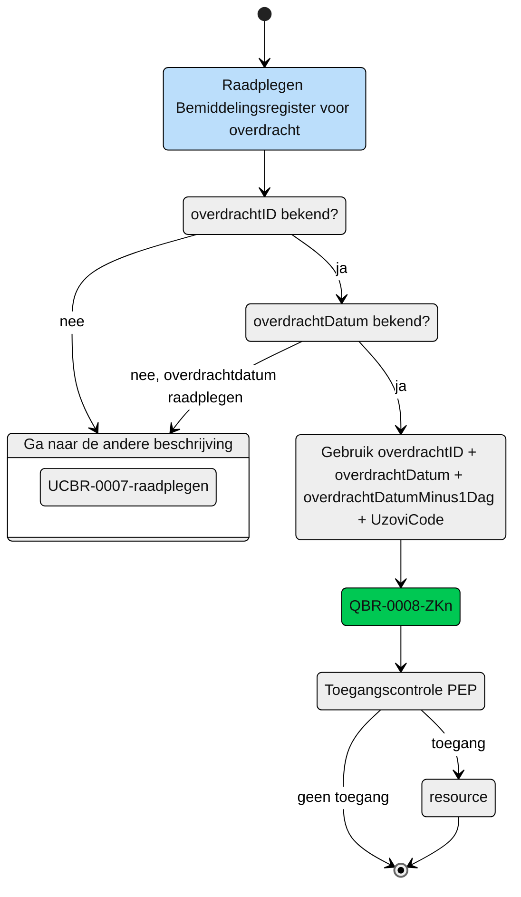

# Raadplegen van de Overdracht door het nieuw verantwoordelijk zorgkantoor inclusief contactgegevens en regiehouder (UCBR-0008) 

## **Use Case Beschrijving**  
**Titel:** Raadplegen van het dossier van de overgedragen client en de toegewezen zorg aan de, zodat ik de verantwoordelijkheid over de client zorgvuldig kan overnemen.  
**Actoren:** Zorgkantoor dat door dossier overdracht verantwoordelijk wordt voor de zorgbemiddeling van de overgedragen client.  

### Precondities:
- De Overdracht is opgenomen in het Bemiddelingsregister.
- Het zorgkantoor wordt verantwoordelijk voor de bemiddeling van zorg aan de client door de registratie van een overdracht door het huidige verantwoordelijk zorgkantoor.

### Autorisatie:
Het zorgkantoor mag de overdracht raadplegen. 
- Volledige autorisatieregel: [BRA0010](https://informatiemodel.istandaarden.nl/informatiemodel/iwlz/netwerk/bemiddelingsregister-1/regels/autorisatieregel/bra0010/) en [BRA0013](https://informatiemodel.istandaarden.nl/informatiemodel/iwlz/netwerk/bemiddelingsregister-1/regels/autorisatieregel/bra0013/)
- Autorisatiematrix: [BRA0010](../autorisatiematrix_bemiddelingsregister.md) en [BRA0013](../autorisatiematrix_bemiddelingsregister.md)

**Trigger:**
- Een zorgkantoor wil de overdracht waarin het is geregistreerd als verantwoordelijk zorgkantoor raadplegen inclusief de aanvullende contactgegevens en regiehouder.

## Query-template beschrijving

| **Query ID** | **Beschrijving** | **Verplichte input** | **resultaat** |
|---|---|---|---|
| [QBR-0008_ZKn.graphql](/gql-query/zorgkantoor//QBR-0008-ZKn.graphql) | Op basis van de overdrachtID en eigen identificatie de overgedragen Bemiddeling, Bemiddelingspecificatie(s) en Client raadplegen  en de  Contactgegevens, Contactpersonen en Regiehouder die in periode overlap hebben met de Overdracht (op basis van overdrachtdatum) | `overdrachtID`, `overdrachtdatum`, `uzoviCode`, `overdrachtDatumMinus1Dag` | Overdracht /  Bemiddeling /  Overdrachtspecificatie / Bemiddelingspecificatie / Client / Contactpersoon / Contactgegevens / Regiehouder |

## **Proces raadplegen**

Het zorgkantoor wil na overdracht van een client het volledige dossier raadplegen om de verantwoordelijkheid zorgvuldig over te kunnen nemen. 

> [!NOTE]
> Voor het ophalen van de `overdrachtDatum` zie dan de use-case is beschreven in [UCBR-0007-raadplegen](UCBR-0007-raadplegen.md).

### Schematisch:

| # | Toelichting |
| --: | :-- |
| 1. | *Start* raadplegen **Overdracht**  | 
| 2. | Is de **`overdrachtID`** bekend?   - **Ja** →  Ga verder naar de volgende stap.   - **Nee** → Ga naar de andere beschrijving: [UCBR-0007-raadplegen](UCBR-0007-raadplegen.md)   | 
| 3. | Overdrachtdatum bekend?   - **Ja** →  Ga verder naar volgende stap.   - **Nee** → Ga naar de andere beschrijving: [UCBR-0007-raadplegen](UCBR-0007-raadplegen.md) |
| 4. | Het zorgkantoor vult de verplichte **`overdrachtID`**, **`overdrachtDatum`**, **`overdrachtDatumMinus1Dag`** en **`verantwoordelijkZorgkantoor`** in query-template [QBR-0008_ZKn.graphql](/gql-query/zorgkantoor//QBR-0008-ZKn.graphql) en initieert een raadpleging van de Overdracht in het Bemiddelingsregister. | 
| 5. | Het zorgkantoor stuurt Graphql-request + Access-token naar het Policy Enforcement Point (PEP) |
| 6. | De PEP voert de [toegangscontrole](UCBR-0008-toegangscontrole.md) uit en stuurt bij toegang het request door naar het Bemiddelingsregister. |
| 7. | Het zorgkantoor ontvangt response van de PEP (bij ongeldig verzoek) of vanuit het Bemiddelingsregister (resource) |
| 8. | *Einde proces* | 

---

Ga naar beschrijving van de bijbehorende [toegangscontrole](UCBR-0008-toegangscontrole.md)  |  Terug naar [Raadplegen](/raadplegen/README.md)
