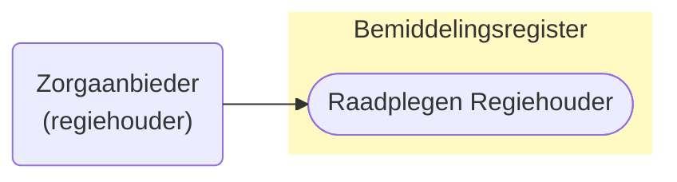
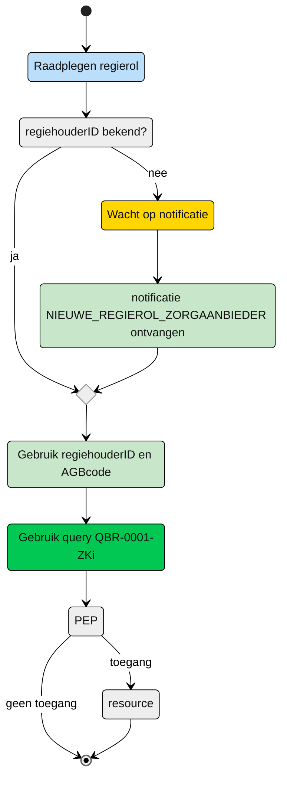

# Raadplegen van Regiehouder door de Zorgaanbieder (UCBR-0009) 

## **Use Case Beschrijving**  
**Titel:** Raadplegen van Regiehouder door een Zorgaanbieder  
**Actoren:** Zorgaanbieder is de regiehouder (Coordinator zorg thuis of Dossierhouder) van een client.  

### Precondities:
- De Regiehouder is opgenomen in het Bemiddelingsregister.
- De zorgaanbieder is door het verantwoordelijk zorgkantoor geregistreerd als Coordinator Zorg Thuis of Dossierhouder in Regiehouder

### Autorisatie:
Een zorgaanbieder mag de rol van Regiehouder raadplegen nadat deze aanbieder als Regiehouder is geregistreerd. 
- Volledige autorisatieregel: [BRA0012](https://informatiemodel.istandaarden.nl/informatiemodel/iwlz/netwerk/bemiddelingsregister-1/regels/autorisatieregel/bra0012/)
- Autorisatiematrix: [BRA0012](../autorisatiematrix_bemiddelingsregister.md)

**Trigger:**
- Een zorgaanbieder wil de **eigen** toegekende regierol en periode raadplegen.

## Query-template beschrijving

| **Query ID** | **Beschrijving** | **Verplichte input** | **resultaat** |
|---|---|---|---|
| [**QBR-0009-ZA**](/gql-query/zorgaanbieder/QBR-0009-ZAr.graphql) | Op basis van de (ontvangen) regiehouderID en eigen identificatie, de Regiehouder, Bemiddeling en Cliënt gegevens raadplegen | `regiehouderID`,  `AGBcode` | Regiehouder /  Bemiddeling /  Client |

## **Proces raadplegen**

Een zorgaanbieder wordt Coordinator zorg thuis of dossierhouder voor een client. Het zorgkantoor registreert dit in Regiehouder. De zorgaanbieder ontvangt hiervan een notificatie [`NIEUWE_REGIEHOUDER_ZORGAANBIEDER`](/notificaties/nieuwe_regiehouder_zorgaanbieder.md). Op basis van deze notificatie kan de zorgaanbieder de informatie in het bemiddelingsregister raadplegen. 

### Schematisch:

| # | Toelichting |
| --: | :-- |
| 1. | *Start* raadplegen Regiehouder | 
| 2. | Is de **`regiehouderID`** bekend?   - **Ja** →  Ga verder naar stap 6   - **Nee** → Wacht op notificatie [**`NIEUWE_REGIEHOUDER_ZORGAANBIEDER`**](/notificaties/nieuwe_regiehouder_zorgaanbieder.md)  | 
| 4. | Notificatie is ontvangen | 
| 5. | Gebruik de informatie uit de notificatie voor het raadplegen van het bemiddelingsregister |
| 6. | De **Zorgaanbieder** vult de verplichte **`regiehouderID`** in query-template [QBR-0009-ZAr.graphql](/gql-query/zorgaanbieder/QBR-0009-ZAr.graphql) en initieert een raadpleging van de regierol en periode in het Bemiddelingsregister. | 
| 7. | De **Zorgaanbieder** stuurt Graphql-request + Access-token naar het Policy Enforcement Point (PEP) |
| 8. | De PEP voert de [toegangscontrole](UCBR-0009-toegangscontrole.md) uit en stuurt bij toegang het request door naar het Bemiddelingsregister. |
| 9. | De zorgaanbieder ontvangt response van de PEP (bij ongeldig verzoek) of vanuit het Bemiddelingsregister (resource) |
| 10. | *Einde proces* | 

---

Ga naar beschrijving van de bijbehorende [toegangscontrole](UCBR-0009-toegangscontrole.md) | Terug naar [Raadplegen](/raadplegen/README.md)
