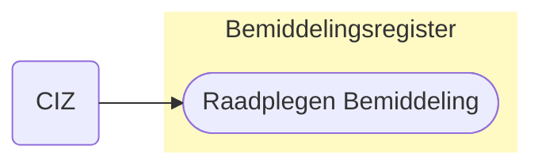
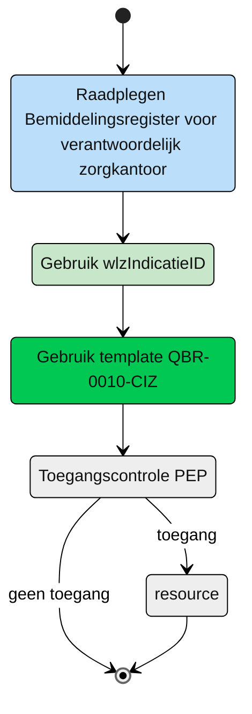

# Raadplegen van het zorgkantoor betrokken bij de Wlz Indicatie (UCBR-0010) 

## **Use Case Beschrijving**  
**Titel:** Raadplegen van het zorgkantoor betrokken bij de Wlz Indicatie door CIZ  
**Actoren:** Het CIZ verantwoordelijk voor het op de hoogte stellen van het zorgkantoor dat betrokken is (geweest) bij een gewijzigde Wlz Indicatie.

### Precondities:
- De wlzIndicatieID is opgenomen in het Bemiddelingsregister.
- De Bemiddeling bevat de informatie met de verbinding tussen de Wlz indicatie en het verantwoordelijke zorgkantoor

### Autorisatie:
Het CIZ mag voor het beoordelen van recht op Wlz de entiteit Bemiddeling in het Bemiddelingsregister raadplegen die hoort bij de Wlz-indicatie waarin het CIZ een wijziging heeft doorgevoerd. 
- Volledige autorisatieregel: [BRA0011](https://informatiemodel.istandaarden.nl/informatiemodel/iwlz/netwerk/bemiddelingsregister-1/regels/autorisatieregel/bra0011/)
- Autorisatiematrix: [BRA0011](../autorisatiematrix_bemiddelingsregister.md)

**Trigger:**
- Het CIZ wil raadplegen welk zorgkantoor betrokken is (geweest) bij een gewijzigde Wlz indicatie.

## Query-template beschrijving

| **Query ID** | **Beschrijving** | **Verplichte input** | **resultaat** |
|---|---|---|---|
| [**QBR-0010-CIZ**](/gql-query/ciz/QBR-0010-CIZ.graphql) | Op basis van de wlzIndicatieID de betrokken zorgkantoren raadplegen. | `wlzIndicatieID` | Bemiddeling.verantwoordelijkZorgkantoor  |

## **Proces raadplegen**

Door verhuizingen van de client kan het verantwoordelijk zorgkantoor gewijzigd zijn en niet meer het initieel verantwoordelijk zorgkantoor zijn. Het CIZ raadpleegt op basis van de wlzIndicatieID in het Bemiddelingregister de betrokken verantwoordelijk zorgkantoren. 

### Schematisch:

| # | Toelichting |
| --: | :-- |
| 1. | *Start* raadplegen Bemiddelingsregister | 
| 6. | Het CIZ vult de verplichte **`wlzIndicatieID`** in query-template [QBR-0010-CIZ.graphql](/gql-query/ciz/QBR-0010-CIZ.graphql) en initieert een raadpleging van het Bemiddelingsregister. | 
| 7. | Het CIZ stuurt Graphql-request + Access-token naar het Policy Enforcement Point (PEP) |
| 8. | De PEP voert de [toegangscontrole](UCBR-0010-toegangscontrole.md) uit en stuurt bij toegang het request door naar het Bemiddelingsregister. |
| 9. | Het CIZ ontvangt response van de PEP (bij ongeldig verzoek) of vanuit het Bemiddelingsregister (resource) |
| 10. | *Einde proces* | 

---

Ga naar beschrijving van de bijbehorende [toegangscontrole](UCBR-0010-toegangscontrole.md) | Terug naar [Raadplegen](/raadplegen/README.md)
