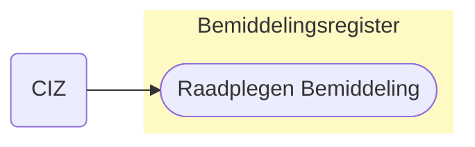
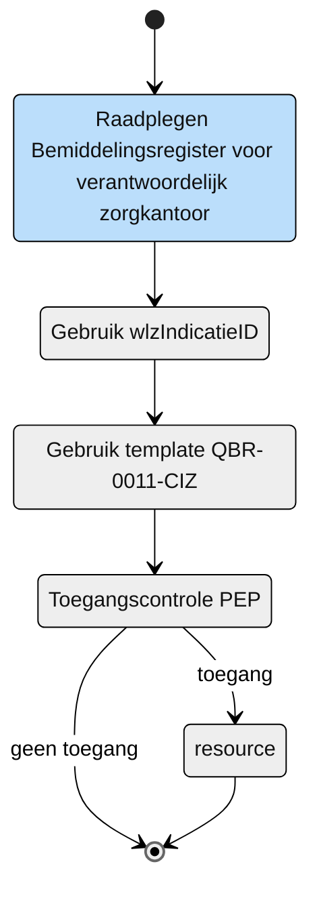

# Raadplegen van de zorgkantoren die als uitvoerend zorgkantoor betrokken zijn of waren bij de Wlz indicatie (UCBR-0011)

## Use Case beschrijving

**Titel:** Raadplegen van de zorgkantoren die als uitvoerend zorgkantoor betrokken zijn of waren bij de Wlz indicatie door CIZ   
**Actoren:** Het CIZ verantwoordelijk voor het op de hoogte stellen van de zorgkantoren die als uitvoerend zorgkantoor betrokken zijn of waren bij een nieuwe, gewijzigde of verwijdere VervallenGeldigheid.

### Precondities:
- De wlzIndicatieId is opgenomen in het Bemiddelingsregister.
- Via Bemiddeling bevat Bemiddelingspecificatie de informatie met de verbinding tussen de Wlz indicatie en het uitvoerend zorgkantoor. 

### Autorisatie:

Het CIZ mag voor het beoordelen van recht op Wlz de entiteiten Bemiddeling en Bemiddelingspecificatie in het Bemiddelingsregister raadplegen die horen bij de Wlz-indicatie waar een nieuwe, gewijzigde of verwijdere VervallenGeldidheid voor is geregistreerd.
- volledige autorisatieregel: [BRA0014](https://informatiemodel.istandaarden.nl/informatiemodel/iwlz/netwerk/bemiddelingsregister-1/regels/autorisatieregel/bra0014/)
- Autorisatiematrix: [BRA0014](../autorisatiematrix_bemiddelingsregister.md)

### Trigger:
- Het CIZ wil raadplegen welke zorgkantoren als uitvoerend zorgkantoor betrokken zijn of waren bij een Wlz-indicatie waar een VervallenGeldigheid voor is geregistreerd, gewijzigd of verwijderd. 

## Query-template beschrijving

| Query ID | Beschrijving | Verplichte input | Resultaat |
| :---- | :---- | :---- | :---- | 
| [QBR-0011-CIZ](/gql-query/ciz/QBR-0011-CIZ.graphql) | Op basis van het wlzIndicatieID de zorgkantoren die als uitvoerend zorgkantoor betrokken zijn, zijn geweest raadplegen. | `wlzIndicatieID` |  Bemiddeling / Bemiddelingspecificatie | 

## Proces raadplegen

Wanneer een een VervallenGeldigheid wordt geregistreerd, gewijzigd of verwijderd is het van belang om de zorgkantoren die als uitvoerend zorgkantoor betrokken zijn of waren op de hoogte te brengen. Het CIZ raadpleegt op basis van het `wlzIndicatieID` in het Bemiddelingregister welke zorgkantoren dit zijn. 

## Schematisch:

| # | Toelichting |
| --: | :-- |
| 1. | *Start* raadplegen Bemiddelingsregister | 
| 6. | Het CIZ vult de verplichte **`wlzIndicatieID`** in query-template [QBR-0011-CIZ.graphql](/gql-query/ciz/QBR-0011-CIZ.graphql) en initieert een raadpleging van het Bemiddelingsregister. | 
| 7. | Het CIZ stuurt Graphql-request + Access-token naar het Policy Enforcement Point (PEP) |
| 8. | De PEP voert de [toegangscontrole](UCBR-0011-toegangscontrole.md) uit en stuurt bij toegang het request door naar het Bemiddelingsregister. |
| 9. | Het CIZ ontvangt response van de PEP (bij ongeldig verzoek) of vanuit het Bemiddelingsregister (resource) |
| 10. | *Einde proces* | 

---

Ga naar beschrijving van de bijbehorende [toegangscontrole](UCBR-0011-toegangscontrole.md) | Terug naar [Raadplegen](/raadplegen/README.md)
