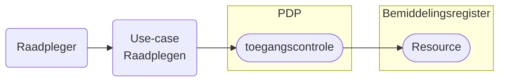

# Raadplegen Bemiddelingsregister 1

De use-cases voor het raadplegen van het Bemiddelingsregister per rol en bijbehorende beschrijving van de toegangscontrole door de PDP. 

!!! info
    Ga naar [Leeswijzer](../../../leeswijzer/index.md) voor de algemene toelichting over het onderdeel Raadplegen.

## Use-cases

Kies een use-case voor de beschrijving van het raadplegen of controleren van de toegang van die raadpleging.

### CIZ
| Doel | toelichting | raadplegen | toegangscontrole |
| :-- |:-- | :-- | :-- |
| Bij Indicatie betrokken zorgkantoren raadplegen | **Als** CIZ, **wil ik** bij wijzigingen in een Wlz-indicatie het bemiddelingsregister kunnen raadplegen, **zodat** ik de betrokken zorgkantoren tijdig kan informeren over de wijziging. | [UCBR-0010-raadplegen](./UCBR-0010-raadplegen.md) | [UCBR-0010-toegangscontrole](../toegangscontrole/UCBR-0010-toegangscontrole.md) | 
| Bij indicatie betrokken uitvoerende zorgkantoren raadplegen | **Als** CIZ, **wil ik** bij wijzigingen in VervallenGeldigheid het bemiddelingsregister raadplegen, **zodat** ik de betrokken uitvoerende zorgkantoren tijdig kan informeren over de wijziging. | [UCBR-0011-raadplegen](./UCBR-0011-raadplegen.md) | [UCBR-0011-toegangscontrole](../toegangscontrole/UCBR-0011-toegangscontrole.md) |

### Zorgaanbieder
| Doel | toelichting | raadplegen | toegangscontrole |
| :-- |:-- | :-- | :-- |
| Eigen toewijzing (na notificatie) | **Als** zorgaanbieder die betrokken is bij het leveren van zorg, **wil ik** mijn eigen bemiddelingsspecificatie (toewijzing) kunnen raadplegen, **zodat** ik inzicht heb in de zorgtoewijzingen die op mij van toepassing zijn. | [UCBR-0001-raadplegen](./UCBR-0001-raadplegen.md) | [UCBR-0001-toegangscontrole](../toegangscontrole/UCBR-0001-toegangscontrole.md) |
| Complete overzicht  | **Als** zorgaanbieder die betrokken is bij het leveren van zorg, **wil ik** naast mijn eigen toewijzing ook de toewijzing(en) van de andere betrokken aanbieder(s) raadplegen, de contactgegevens van de client en contactpersoon en de regiehouder **zodat** ik het volledige inzicht heb in overlappende toewijzingen of informatieve zorgtoewijzingen, en zorgverlening beter kan afstemmen. | [UCBR-0002_3-raadplegen](./UCBR-0002_3-raadplegen.md) | [UCBR-002_3-toegangscontrole](../toegangscontrole/UCBR-0002_3-toegangscontrole.md) |
| Regiehouder rol en periode (na notificatie) | **Als** zorgaanbieder die een notificatie over `regiehouder` heeft ontvangen, **wil ik** de rol, de geldigheidsperiode, de bijbehorende bemiddeling en de cliënt kunnen raadplegen, **zodat** ik mijn taken als regiehouder correct en tijdig kan uitvoeren. | [UCBR-0009-raadplegen](./UCBR-0009-raadplegen.md) | [UCBR-0009-toegangscontrole](../toegangscontrole/UCBR-0009-toegangscontrole.md) |

### Zorgkantoor
| Doel | toelichting | raadplegen | toegangscontrole |
| :-- |:-- | :-- | :-- |
| Toewijzing als uitvoerend (bovenregionaal) zorgkantoor (na notificatie) | **Als** (bovenregionaal) zorgkantoor dat een contract heeft met een zorgaanbieder die betrokken is bij het leveren van zorg, **wil ik** de bemiddelingsspecificatie (toewijzing) van die aanbieder kunnen raadplegen, **zodat** ik inzicht heb in de zorg die door deze aanbieder geleverd moet worden. | [UCBR-0004-raadplegen](./UCBR-0004-raadplegen.md) | [UCBR-0004-toegangscontrole](../toegangscontrole/UCBR-0004-toegangscontrole.md) |
| Complete overzicht als uitvoerend (bovenregionaal) zorgkantoor | **Als** (bovenregionaal) zorgkantoor dat een contract heeft met een zorgaanbieder die betrokken is bij het leveren van zorg, **wil ik** naast de toewijzing van de door mij gecontracteerde zorgaanbieder ook de toewijzing(en) van andere betrokken aanbieder(s) kunnen raadplegen, evenals de contactgegevens van de cliënt, diens contactpersoon en de regiehouder, **zodat** ik volledig inzicht heb in de betrokken partijen en de situatie van de cliënt. | [UCBR-0005_6-raadplegen](./UCBR-0005_6-raadplegen.md) | [UCBR-0005_6-toeganscontrole](../toegangscontrole/UCBR-0005_6-toegangscontrole.md) | 
| Dossieroverdracht (na notificatie) | **Als** (nieuw verantwoordelijk) zorgkantoor die een client krijgt overgedragen van een ander zorgkantoor, **wil ik** de overgedragen client en de toegewezen zorg aan de client raadplegen, **zodat** ik de verantwoordelijkheid over de client zorgvuldig kan overnemen. | [UCBR-0007-raadplegen](./UCBR-0007-raadplegen.md) | [UCBR-0007-toegangscontrole](../toegangscontrole/UCBR-0007-toegangscontrole.md) | 
| Complete dossieroverdracht | **Als** (nieuwe verantwoordelijk) zorgkantoor dat een cliënt overgedragen krijgt van een ander zorgkantoor, **wil ik** naast de zorg ook de contactgegevens en regiehouder raadplegen, **zodat** ik inzage heb in het volledige overgedragen dossier  |  [UCBR-0008-raadplegen](./UCBR-0008-raadplegen.md) | [UCBR-0008-toegangscontrole](../toegangscontrole/UCBR-0008-toegangscontrole.md) |

