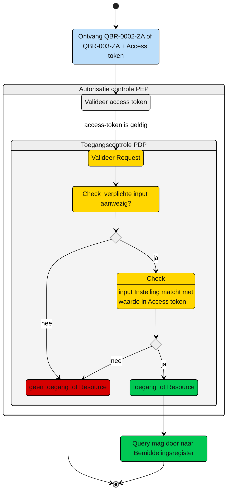

# Toegangscontrole: Raadplegen van de eigen en overlappende Bemiddelingspecificatie(s) en overige informatie door de Zorgaanbieder (UCBR-0002_3)

Beschrijving van de **toegangscontrole** door de Policy Decision Point (PDP) en indien van toepassing Policy Information Point (PIP).

N.b. Het valideren van de Acces-token door de PEP is geen onderdeel van de ze beschrijving. Zie daarvoor het [Afsprakenstelsel iWlz - nID netwerkstelsel - 5. Policy Enforcement Point.](https://wlz.atlassian.net/wiki/spaces/IWLZAS/pages/229441537/nID+netwerkstelsel#5.-Policy-Enforcement-Point-(PEP))

## Toegangscontrole PDP
### Subject
- **Entiteit:** Zorgaanbieder (toegewezen)
- **Kenmerk:** In bezit van een access-token met eigen `agbcode`


### **Action**
- **Type:** `raadplegen` (read)
- **Omschrijving:** Uitvoeren van GraphQL-query [`QBR-0002-ZA.graphql`](/gql-query/zorgaanbieder/QBR-0002-ZA.graphql) of [`QBR-0003-ZA.graphql`](/gql-query/zorgaanbieder/QBR-0003-ZA.graphql) (wanneer de eigen `bemiddelingspecificatie` een einddatum heeft) op het bemiddelingsregister door een zorgaanbieder. 


### **Resource**
- **Type:** `Bemiddelingsregister`
- **ID:** `bemiddelingspecificatieID`
- **Beperking:** Toegang tot gegevens waarvoor de zorgaanbieder een toewijzing heeft en de gegevens die overlap hebben met die toewijzing
- **Inhoud:** De nodes Bemiddelingspecificatie en de gerelateerde Bemiddeling en Client die horen bij de opgevraagde Bemiddelingspecificatie, en de Regiehouder, contactgegevens, contactpersoon en Bemiddelingspecificaties van andere aanbieders die in periode overlap hebben met de eigen Bemiddelingspecificatie, mogen direct worden opgevraagd.


### **Context**
- **Query-parameters vereist:** 
  | QBR-0002-ZA                   | QBR-0003-ZA                   |
  | :---------------------------- | :---------------------------- |
  | - `bemiddelingspecificatieID` | - `bemiddelingspecificatieID` |
  | - `instelling`                | - `instelling`                |
  | - `toewijzingIngangsdatum`    | - `toewijzingIngangsdatum`    |
  | - `vaststellingMoment`        | - `vaststellingMoment`        | 
  | - `DagVaststellingMoment`     | - `DagVaststellingMoment`     |
  | - `toewijzingEinddatum`       |                               |


- **Toegangsvoorwaarde:**  Er is alleen toegang als aan alle volgende voorwaarden is voldaan:
  - De parameters zoals hierboven zijn aanwezig;
  - De **access-token** bevat een geldige `agbcode` van de zorgaanbieder;
  - De `agbcode` van de in de query meegegeven `instelling` komt overeen met de `agbcode` in de access-token;
  - Voor contactgegevens en contactpersonen geldt toegang tot en met EinddatumToewijzing + 2 jaar;
  - Voor Bemiddelingspecificaties geldt toegang tot en met Einddatum + 31mei.


### Resultaat

> Toegang tot het Bemiddelingsregister via query [`QBR-0002-ZA.graphql`](/gql-query/zorgaanbieder/QBR-0002-ZA.graphql) of [`QBR-0003-ZA.graphql`](/gql-query/zorgaanbieder/QBR-0003-ZA.graphql) is **alleen toegestaan** als:
>
> - De relevante parameters aanwezig zijn per query;
> - De access-token bevat een geldige **`agbcode`**
> - De in de query meegegeven `agbcode` in `instelling` komt overeen met de `agbcode` in de access-token;
> 
>
> Als aan deze voorwaarden is voldaan, mogen de volgende gegevens worden opgevraagd:
> - De `Bemiddelingspecificatie`, de bijbehorende `Bemiddeling` en `Client`;
> - De `Contactpersoon`, `Contactgegevens`, `Regiehouder`, en andere `Bemiddelingspecificaties` binnen dezelfde Bemiddeling, mits deze een periode-overlap hebben met de eigen toewijzing.
> - Voor contactgegevens en contactpersonen geldt toegang tot en met EinddatumToewijzing + 2 jaar;
> - Voor Bemiddelingspecificaties geldt toegang tot en met Einddatum + 31mei


## Toegangscontrole-flows Zorgaanbieder: QBR-0002-ZA.graphql of QBR-0003-ZA.graphql

Beschrijving van het autorisatieproces door de PEP.

**schematisch:**




| # | Toelichting |
| --: | :-- |
| 1. |Ontvangst GraphQL-request + access-token door **PEP** |
| 2. |De **PEP** valideert de access-token en geeft na goedkeur het request door aan de PDP |
| 3. |De **PDP** controleert op:<br/>1. Of het request voldoet aan de template en er geen ongeoorloofde gegevens worden opgevraagd.<br/>2. Aanwezigheid van de verplichte parameters in het request;<br/>3. Of de **`agbcode`** in request overeenkomt met de waarde in de **`access-token`**;<br/>4. Of indien contactgegevens en Contactpersoon onderdeel zijn van het request, de datum van het request kleiner dan of gelijk is aan ToewijzingEinddatum + 2 jaar;<br/>5. Of indien Bemiddelingspecificatie onderdeel is van het request, de datum van het request kleiner dan of gelijk is aan ToewijzingEinddatum + 31 mei <br/><br/>Is aan alle voorwaarden voldaan?<br/> - **Ja** →  Ga verder naar stap 4<br/>- **Nee** → *Einde proces (geen toegang.)*   |
| 4. | De zorgaanbieder krijgt toegang tot het bemiddelingsregister.|
| 5. | *Einde* |


## Toegangscontrole PIP:
```gql
nvt

```


---
Ga naar [UC beschrijving raadplegen](UCBR-0002_3-raadplegen.md) -- Terug naar [Raadplegen](/raadplegen/README.md)
