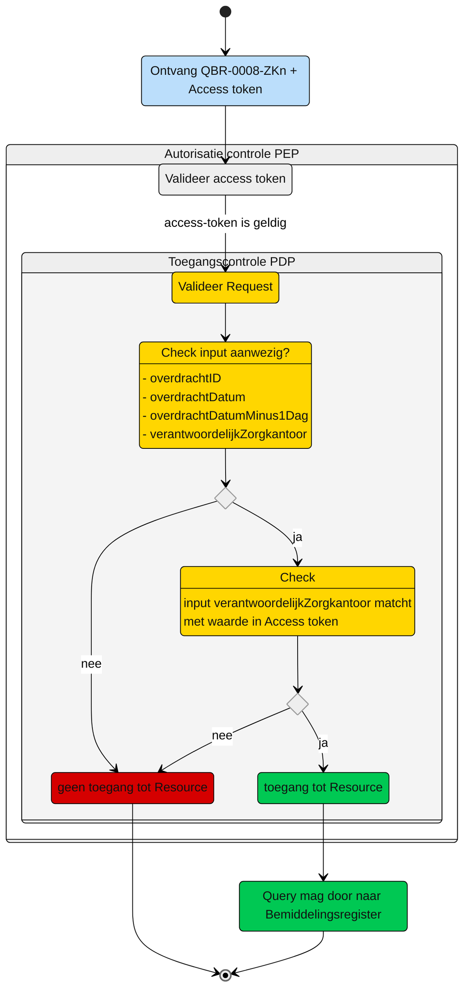

# Toegangscontrole: Raadplegen van de Overdracht door het nieuw verantwoordelijk zorgkantoor inclusief contactgegevens en regiehouder (UCBR-0008)   

Beschrijving van de **toegangscontrole** door de Policy Decision Point (PDP) en indien van toepassing Policy Information Point (PIP).

N.b. Het valideren van de Acces-token door de PEP is geen onderdeel van de ze beschrijving. Zie daarvoor het [Afsprakenstelsel iWlz - nID netwerkstelsel - 5. Policy Enforcement Point.](https://wlz.atlassian.net/wiki/spaces/IWLZAS/pages/229441537/nID+netwerkstelsel#5.-Policy-Enforcement-Point-(PEP))

## Toegangscontrole PDP
### Subject
- **Entiteit:** Zorgkantoor (nieuw verantwoordelijk)
- **Kenmerk:** In bezit van een access-token met daarin de eigen `uzovicode`


### **Action**
- **Type:** `raadplegen` (read)
- **Omschrijving:** Uitvoeren van GraphQL-query [`QBR-0008-ZKn.graphql`](/gql-query/zorgkantoor/QBR-0008-ZKn.graphql) op het bemiddelingsregister door een zorgkantoor.


### **Resource**
- **Type:** `Bemiddelingsregister`
- **ID:** `overdrachtID`
- **Beperking:** Alleen toegang tot gegevens waarvoor het zorgkantoor een Overdracht heeft (op basis van uzovicode, overdrachtID, overdrachtDatum)
- **Inhoud:** Alleen de nodes Overdracht en de gerelateerde Bemiddeling en Overdrachtspecificatie en Bemiddelingspecificatie en de Client Contactgegevens, Contactpersonen en Regiehouder die in periode overlap hebben met de Overdracht (op basis van overdrachtdatum minus 1 dag), mogen direct worden opgevraagd.


### **Context**
- **Query-parameters vereist:** De `overdrachtID`, de `overdrachtDatum`, de `overdrachtDatumMinus1Dag` en de `uzovicode` moeten aanwezig zijn in de query
- **Toegangsvoorwaarde:**  Er is alleen toegang als aan alle volgende voorwaarden is voldaan:
  - De parameter `overdrachtID` is aanwezig in de query;
  - De parameter `overdrachtDatum` is aanwezig in de query;
  - De parameter `overdrachtDatumMinus1Dag` is aanwezig in de query;
  - De parameter `uzovicode` is aanwezig in de query;
  - De **access-token** bevat een geldige `uzovicode` van het zorgkantoor;
  - De in de query meegegeven `uzovicode` komt overeen met de `uzovicode` in de access-token;


### Resultaat

> Toegang tot het Bemiddelingsregister via query [`QBR-0008-ZKn.graphql`](/gql-query/zorgkantoor/QBR-0008-ZKn.graphql)) is **alleen toegestaan** als:
>
> - Parameter **`overdrachtID`** is meegegeven in de query;
> - Parameter **`overdrachtDatum`** is aanwezig in de query;
> - Parameter **`overdrachtDatumMinus1Dag`** is aanwezig in de query;
> - Parameter **`uzovicode`** is meegegeven in de query;
> - De access-token bevat een geldige **`uzovicode`**;
> - De in de query meegegeven `uzovicode` komt overeen met de `uzovicode` in de access-token; 
> 
> Als aan alle voorwaarden is voldaan, mogen de nodes `Overdrachtspecificatie`, `Bemiddeling`, `Bemiddelingspecificatie` en `Client` die horen bij deze `Overdracht` en de  `Contactgegevens`, `Contactpersonen` en `Regiehouder` die in periode overlap hebben met de `Overdracht` (op basis van `overdrachtDatumMinus1Dag`), mogen direct worden opgevraagd.


## Toegangscontrole-flows Zorgkantoor: QBR-0008-ZKn.graphql

Beschrijving van het autorisatieproces door de PEP.

### **schematisch:**




| # | Toelichting |
| --: | :-- |
| 1. |Ontvangst GraphQL-request + access-token door **PEP** |
| 2. |De **PEP** valideert de access-token en geeft na goedkeur het request door aan de PDP |
| 3. |De **PDP** controleert op:<br/>1. Of het request voldoet aan de template en er geen ongeoorloofde gegevens worden opgevraagd.<br/>2. Aanwezigheid van de verplichte parameters in het request;<br/>3. Of de **`uzovicode`** in request overeenkomt met de waarde in de **`access-token`**;<br/><br/>Is aan alle voorwaarden voldaan?<br/> - **Ja** →  Ga verder naar stap 4<br/>- **Nee** → *Einde proces (geen toegang.)*   |
| 4. | Het zorgkantoor krijgt toegang tot het bemiddelingsregister.|
| 5. | *Einde* |


## Toegangscontrole PIP:
```gql
nvt

```


---
Ga naar [UC beschrijving raadplegen](UCBR-0008-raadplegen.md) -- Terug naar [Raadplegen](/raadplegen/README.md)
