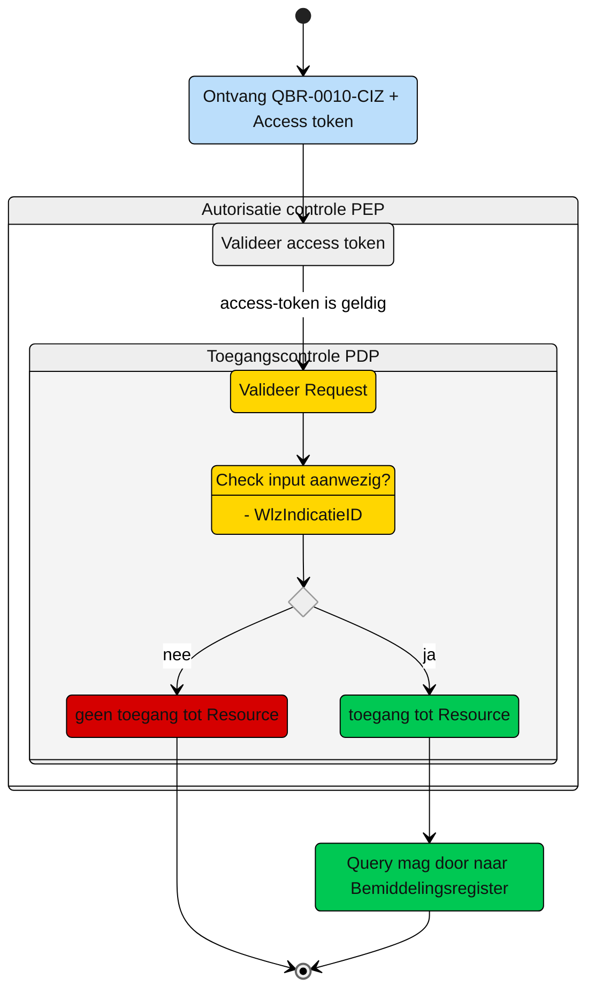

# Toegangscontrole: Raadplegen van het zorgkantoor betrokken bij de Wlz Indicatie (UCBR-0010) 

Beschrijving van de **toegangscontrole** door de Policy Decision Point (PDP) en indien van toepassing Policy Information Point (PIP).

N.b. Het valideren van de Acces-token door de PEP is geen onderdeel van de ze beschrijving. Zie daarvoor het [Afsprakenstelsel iWlz - nID netwerkstelsel - 5. Policy Enforcement Point.](https://wlz.atlassian.net/wiki/spaces/IWLZAS/pages/229441537/nID+netwerkstelsel#5.-Policy-Enforcement-Point-(PEP))

## Toegangscontrole PDP
### Subject
- **Entiteit:** CIZ
- **Kenmerk:** In bezit van een access-token met daarin de eigen `kvkcode`


### **Action**
- **Type:** `raadplegen` (read)
- **Omschrijving:** Uitvoeren van GraphQL-query [`QBR-0010-CIZ.graphql`](/gql-query/ciz/QBR-0010-CIZ.graphql) op het bemiddelingsregister door het CIZ


### **Resource**
- **Type:** `Bemiddelingsregister`
- **ID:** `wlzIndicatieID`
- **Beperking:** Alleen toegang tot gegevens waarvoor het CIZ autorisatie heeft.
- **Inhoud:** Alleen het `verantwoordelijkZorgkantoor` in Bemiddeling bij de `wlzIndicatieID`.


### **Context**
- **Query-parameters vereist:** De `wlzIndicatieID` moeten aanwezig zijn in de query
- **Toegangsvoorwaarde:**  Er is alleen toegang als aan alle volgende voorwaarden is voldaan:
  - De parameter `wlzIndicatieID` is aanwezig in de query;
  - De **access-token** bevat een geldige `kvkcode` van de zorgaanbieder;


### Resultaat

> Toegang tot het Bemiddelingsregister via query [`QBR-0010-CIZ.graphql`](/gql-query/ciz/QBR-0010-CIZ.graphql) is **alleen toegestaan** als:
>
> - Parameter **`wlzIndicatieID`** is meegegeven in de query
> - De **access-token** bevat een geldige `kvkcode` van de zorgaanbieder;
> 
> Als aan alle voorwaarden is voldaan, mag het `verantwoordelijkZorgkantoor` uit `Bemiddeling` de `wlzIndicatieID` direct worden opgevraagd.


## Toegangscontrole-flows CIZ: QBR-0010-CIZ.graphql

Beschrijving van het autorisatieproces door de PEP.

### **schematisch:**




| # | Toelichting |
| --: | :-- |
| 1. |Ontvangst GraphQL-request + access-token door **PEP** |
| 2. |De **PEP** valideert de access-token en geeft na goedkeur het request door aan de PDP |
| 3. |De **PDP** controleert op:<br/>1. Of het request voldoet aan de template en er geen ongeoorloofde gegevens worden opgevraagd.<br/>2. Aanwezigheid van de verplichte parameters in het request;<br/><br/>Is aan alle voorwaarden voldaan?<br/> - **Ja** →  Ga verder naar stap 4<br/>- **Nee** → *Einde proces (geen toegang.)*   |
| 4. | De zorgaanbieder krijgt toegang tot het bemiddelingsregister.|
| 5. | *Einde* |


## Toegangscontrole PIP:
```gql
nvt

```


---
Ga naar [UC beschrijving raadplegen](UCBR-0010-raadplegen.md) -- Terug naar [Raadplegen](/raadplegen/README.md)
