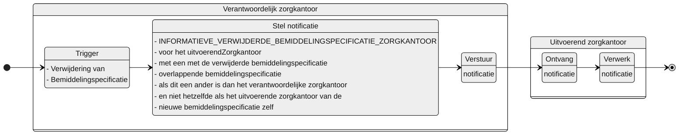

# INFORMATIEVE_VERWIJDERDE_BEMIDDELINGSPECIFICATIE_ZORGKANTOOR

## Documentatie

Notificatie aan het uitvoerende zorgkantoor als het verantwoordelijke zorgkantoor een Bemiddelingspecificatie  heeft verwijderd, die niet van dat uitvoerende zorgkantoor is of voor het verantwoordelijke zorgkantoor zelf.

Het uitvoerende (bovenregionale) zorgkantoor is daarmee informatief geïnformeerd over een verwijdering van een bemiddelingsspecificatie die overlapt met een bemiddelingspecificatie van dat uitvoerende zorgkantoor. 

## Aanleiding
**De trigger voor de notificatie is:** 

> de verwijdering van een Bemiddelingspecificatie in het Bemiddelingsregister

## Instructie
**Stel notificatie op voor:**   
 elk uitvoerend zorgkantoor (`Bemiddelingspecificatie.uitvoerendZorgkantoor`) met een Bemiddelingspecificatie waarvan op het moment van verwijdering van een Bemiddelingspecificatie: 
 - de toewijzingIngangsdatum (of eerder vaststellingsmoment) van de eigen Bemiddelingspecificatie voor of gelijk was aan de toewijzingEinddatum (of later vaststellingMoment) van de gewijzigde Bemiddelingspecificatie en 
 - de toewijzingEinddatum van de eigen Bemiddelingspecificatie na of gelijk was aan de toewijzingIngangsdatum (of eerder vaststellingMoment) van de gewijzigde Bemiddelingspecificatie.
 - en de toewijzingEinddatum van de eigen Bemiddelingspecificatie kleiner of gelijk is aan  31 mei van het jaar dat volgt op de einddatum van die eigen Bemiddelingspecificatie.

## Type
Het type-notificatie: 
> VERPLICHT (*zolang er geen abonnementenregistratie beschikbaar is*)

## Schematisch




## Inhoud van de notificatie

| Variabele | Waarde | Voorbeeld | 
| :-- | :-- | :-- |
| timestamp | {timestamp} | ```"timestamp": "2024-07-02T00:00:00.000Z"``` | 
| afzenderIDType | "UZOVI" | ```"afzenderIDType": "UZOVI"``` |
| afzenderID | {uzovi-code afzender} | ```"afzenderID": "5050"``` |
| ontvangerIDType | "UZOVI" | ```"ontvangerIDType": "UZOVI"``` |
| ontvangerID | {uzovi-code ontvanger} | ```"ontvangerID": "5151"``` |
| ontvangerKenmerk | NULL | |
| eventType | "INFORMATIEVE_VERWIJDERDE_BEMIDDELINGSPECIFICATIE_ZORGKANTOOR" | ```"eventType": "INFORMATIEVE_VERWIJDERDE_BEMIDDELINGSPECIFICATIE_ZORGKANTOOR"``` |
| subjectList |  | ```"subjectList": [{```|
| ../subject | "Bemiddeling/{bemiddelingID}" | "subject": "Bemiddeling/ef88ce35-58fa-4e6d-ac7a-6e298dd211d6"|
| ../recordID | "Bemiddelingspecificatie/{bemiddelingspecificatieID}" | "recordID": "Bemiddelingspecificatie/ef88ce35-58fa-4e6d-ac7a-6e298dd211d6" |
| | | ```}]``` | 

