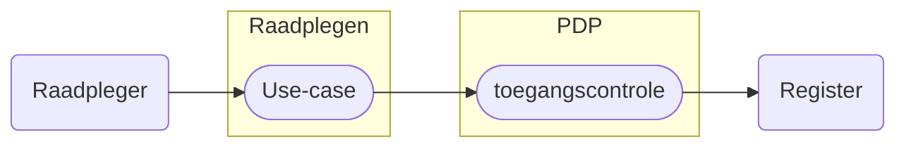

# Raadplegen Bemiddelingsregister

Het raadplegen van het Bemiddelingsregister is gebonden aan voorwaarden. De raadpleger moet bevoegd zijn én het vastgestelde raadpleegpatroon volgen. Dit patroon is essentieel voor het valideren van de toestemming. 

Als het patroon niet wordt gevolgd — bijvoorbeeld door ontbrekende autorisatie, onjuiste of incomplete input, of het opvragen van ongeoorloofde gegevens — wordt de toegang geweigerd of het resultaat beperkt.

Use-cases beschrijven hoe een deelnemer het register correct raadpleegt. Per use-case zijn er toegangscontroles beschreven zodat de verbinding met de bijbehorende autorisatie en de benodigde policy gemaakt kan worden. 

Meer informatie over de structuur van het raadplegen en het valideren ervan is te lezen in het [Afsprakenstelsel iWlz - Raadplegen](https://wlz.atlassian.net/wiki/x/KgpgAQ)

## Casuistiek
Casuïstiek is bedoeld om te laten zien hoe registatie in de verschillende registers plaatsvindt en hoe het proces van notificeren en raadplegen verloopt. De casuïstiek is [hier](../raadplegen/casuistiek) te vinden.

## Autorisatieregels en autorisatiematrix
De toegang tot gegevens is vastgelegd doormiddel van **Autorisatieregels** en de **Autorisatiematrix**. De [autorisatieregels](https://informatiemodel.istandaarden.nl/informatiemodel/iwlz/netwerk/bemiddelingsregister-1/regels/autorisatieregel/) zijn te vinden in het Informatiemodel Bemiddelingsregister (via [hier](https://informatiemodel.istandaarden.nl/informatiemodel/iwlz/netwerk/bemiddelingsregister-1/regels/autorisatieregel/)) en de [autorisatiematrix](/raadplegen/autorisatiematrix_bemiddelingsregister.md) is [hier](/raadplegen/autorisatiematrix_bemiddelingsregister.md) te vinden.

## Use cases raadplegen Bemiddelingsregister

De use cases voor het raadplegen van het Bemiddelingsregister per rol en bijbehorende beschrijving van de toegangscontrole door de PDP[^1]. 

Kies een use-case voor de beschrijving van het raadplegen of controleren van de toegang van die raadpleging.

### CIZ
| Doel | toelichting | raadplegen | toegangscontrole |
| :-- |:-- | :-- | :-- |
| Bij Indicatie betrokken zorgkantoren raadplegen | **Als** CIZ, **wil ik** bij wijzigingen in een Wlz-indicatie het bemiddelingsregister kunnen raadplegen, **zodat** ik de betrokken zorgkantoren tijdig kan informeren over de wijziging. | [UCBR-0010-raadplegen](/raadplegen/ciz/UCBR-0010-raadplegen.md) | [UCBR-0010-toegangscontrole](/raadplegen/ciz/UCBR-0010-toegangscontrole.md) | 
| Bij indicatie betrokken uitvoerende zorgkantoren raadplegen | **Als** CIZ, **wil ik** bij wijzigingen in VervallenGeldigheid het bemiddelingsregister raadplegen, **zodat** ik de betrokken uitvoerende zorgkantoren tijdig kan informeren over de wijziging. | [UCBR-0011-raadplegen](/raadplegen/ciz/UCBR-0011-raadplegen.md) | [UCBR-0011-toegangscontrole](/raadplegen/ciz/UCBR-0011-toegangscontrole.md) |

### Zorgaanbieder
| Doel | toelichting | raadplegen | toegangscontrole |
| :-- |:-- | :-- | :-- |
| Eigen toewijzing (na notificatie) | **Als** zorgaanbieder die betrokken is bij het leveren van zorg, **wil ik** mijn eigen bemiddelingsspecificatie (toewijzing) kunnen raadplegen, **zodat** ik inzicht heb in de zorgtoewijzingen die op mij van toepassing zijn. | [UCBR-0001-raadplegen](/raadplegen/zorgaanbieder/UCBR-0001-raadplegen.md) | [UCBR-0001-toegangscontrole](/raadplegen/zorgaanbieder/UCBR-0001-toegangscontrole.md) |
| Complete overzicht  | **Als** zorgaanbieder die betrokken is bij het leveren van zorg, **wil ik** naast mijn eigen toewijzing ook de toewijzing(en) van de andere betrokken aanbieder(s) raadplegen, de contactgegevens van de client en contactpersoon en de regiehouder **zodat** ik het volledige inzicht heb in overlappende toewijzingen of informatieve zorgtoewijzingen, en zorgverlening beter kan afstemmen. | [UCBR-0002_3-raadplegen](/raadplegen/zorgaanbieder/UCBR-0002_3-raadplegen.md) | [UCBR-002_3-toegangscontrole](/raadplegen/zorgaanbieder/UCBR-0002_3-toegangscontrole.md) |
| Regiehouder rol en periode (na notificatie) | **Als** zorgaanbieder die een notificatie over `regiehouder` heeft ontvangen, **wil ik** de rol, de geldigheidsperiode, de bijbehorende bemiddeling en de cliënt kunnen raadplegen, **zodat** ik mijn taken als regiehouder correct en tijdig kan uitvoeren. | [UCBR-0009-raadplegen](/raadplegen/zorgaanbieder/UCBR-0009-raadplegen.md) | [UCBR-0009-toegangscontrole](/raadplegen/zorgaanbieder/UCBR-0009-toegangscontrole.md) |

### Zorgkantoor
| Doel | toelichting | raadplegen | toegangscontrole |
| :-- |:-- | :-- | :-- |
| Toewijzing als uitvoerend (bovenregionaal) zorgkantoor (na notificatie) | **Als** (bovenregionaal) zorgkantoor dat een contract heeft met een zorgaanbieder die betrokken is bij het leveren van zorg, **wil ik** de bemiddelingsspecificatie (toewijzing) van die aanbieder kunnen raadplegen, **zodat** ik inzicht heb in de zorg die door deze aanbieder geleverd moet worden. | [UCBR-0004-raadplegen](/raadplegen/zorgkantoor/UCBR-0004-raadplegen.md) | [UCBR-0004-toegangscontrole](/raadplegen/zorgkantoor/UCBR-0004-toegangscontrole.md) |
| Complete overzicht als uitvoerend (bovenregionaal) zorgkantoor | **Als** (bovenregionaal) zorgkantoor dat een contract heeft met een zorgaanbieder die betrokken is bij het leveren van zorg, **wil ik** naast de toewijzing van de door mij gecontracteerde zorgaanbieder ook de toewijzing(en) van andere betrokken aanbieder(s) kunnen raadplegen, evenals de contactgegevens van de cliënt, diens contactpersoon en de regiehouder, **zodat** ik volledig inzicht heb in de betrokken partijen en de situatie van de cliënt. | [UCBR-0005_6-raadplegen](/raadplegen/zorgkantoor/UCBR-0005_6-raadplegen.md) | [UCBR-0005_6-toeganscontrole](/raadplegen/zorgkantoor/UCBR-0005_6-toegangscontrole.md) | 
| Dossieroverdracht (na notificatie) | **Als** (nieuw verantwoordelijk) zorgkantoor die een client krijgt overgedragen van een ander zorgkantoor, **wil ik** de overgedragen client en de toegewezen zorg aan de client raadplegen, **zodat** ik de verantwoordelijkheid over de client zorgvuldig kan overnemen. | [UCBR-0007-raadplegen](/raadplegen/zorgkantoor/UCBR-0007-raadplegen.md) | [UCBR-0007-toegangscontrole](/raadplegen/zorgkantoor/UCBR-0007-toegangscontrole.md) | 
| Complete dossieroverdracht | **Als** (nieuwe verantwoordelijk) zorgkantoor dat een cliënt overgedragen krijgt van een ander zorgkantoor, **wil ik** naast de zorg ook de contactgegevens en regiehouder raadplegen, **zodat** ik inzage heb in het volledige overgedragen dossier  |  [UCBR-0008-raadplegen](/raadplegen/zorgkantoor/UCBR-0008-raadplegen.md) | [UCBR-0008-toegangscontrole](/raadplegen/zorgkantoor/UCBR-0008-toegangscontrole.md) |
| Informatieve toewijzing als uitvoerend (bovenregionaal) zorgkantoor (na notificatie) | **Als** (bovenregionaal) uitvoerend zorgkantoor, **wil ik** de bemiddelingsspecificatie (toewijzing) raadplegen die niet van mijzelf is maar waar ik wel bij betrokken ben en ik een *informatieve* notificatie over ontvangen heb, **zodat** ik inzicht heb in de zorg die door deze aanbieder geleverd moet worden. | [UCBR-0012-raadplegen](/raadplegen/zorgkantoor/UCBR-0012-raadplegen.md) | [UCBR-0012-toegangscontrole](/raadplegen/zorgkantoor/UCBR-0012-toegangscontrole.md) |
| Actuele Regiehouder informatie (na notificatie) | **Als** (bovenregionaal) uitvoerend zorgkantoor, **wil ik** de regiehouder informatie raadplegen, **zodat** ik een actueel inzicht heb in de zorg situatie van een client. | [UCBR-0013-raadplegen](/raadplegen/zorgkantoor/UCBR-0013-raadplegen.md) | [UCBR-0013-toegangscontrole](/raadplegen/zorgkantoor/UCBR-0013-toegangscontrole.md) |

---
Terug naar [HOME](/README.md)

[^1]: PDP: Policy Decision Point. [Afsprakenstelsel iWlz - Raadplegen](https://wlz.atlassian.net/wiki/x/KgpgAQ)