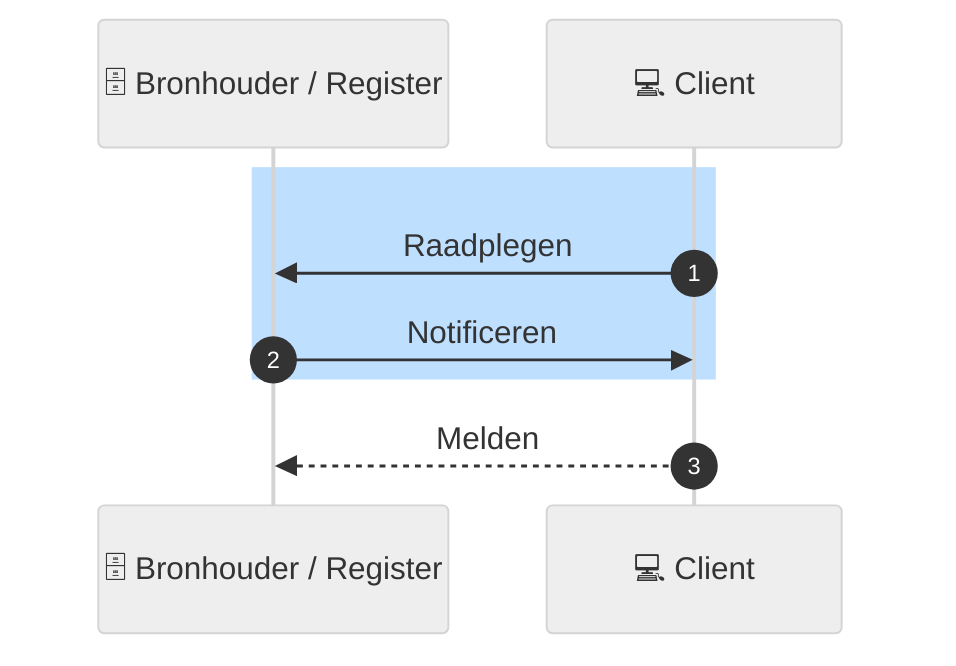

# Koppelvlakspecificaties Netwerkmodel

## Inleiding

In het netwerkmodel is er een *bronhouder* met een *register* waar een *client* informatie kan ***(1) raadplegen***. Deze raadpleging kan de client uitvoeren naar aanleiding van het ***(2) notificeren*** door een bronhouder van een bepaalde gebeurtenis die relevant is voor de ontvanger van een *notificatie*. 

Figuur 1 - Overzicht actoren en basis acties netwerkmodel

Technisch verloopt het raadplegen en notificeren en melden met [GraphQL](https://graphql.org). Hiervoor zijn **koppelvlak-specificaties** opgesteld. De documentatie van deze koppelvlak-specificaties is hier te vinden. 

### Leeswijzer
Ga eerst naar de [**LEESWIJZER**](./leeswijzer/index.md) voor de algemen toelichting over hoe de documentatie is opgebouwd en wat elk onderdeel beschrijft.

## Andere onderdelen Netwerkmodel iWlz
De koppelvlak-specificatie maken onderdeel uit van de **iStandaard iWlz**. De andere onderdelen die samen het Netwerkmodel iWlz vormen zijn:

  - [Afsprakenstelsel iWlz](https://istandaarden.github.io/Afsprakenstelsel-iWlz/)
  - [Informatiemodel iStandaarden](https://informatiemodel.istandaarden.nl/)
  - Actieprogramma iWlz: van keten naar netwerk: [het Actieprogramma iWlz](https://www.istandaarden.nl/iwlz/actieprogramma/index "Over Actieprogramma iWlz")

## Meer informatie
  - Portaal voor iStandaarden in de Zorg en Ondersteuning: [homepagina iStandaarden](https://www.istandaarden.nl)

