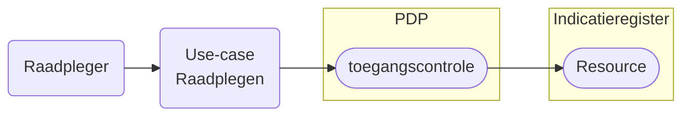

# Raadplegen Indicatieregister

## Inleiding

Ga naar [Leeswijzer](../../../leeswijzer/index.md) voor de algemene toelichting over het onderdeel Raadplegen.

## Use-cases raadplegen Indicatieregister 2

De use-cases voor het raadplegen van het Indicatieregister per rol en bijbehorende beschrijving van de toegangscontrole door de PDP[^1]. 

Kies een use-case voor de beschrijving van het raadplegen of controleren van de toegang van die raadpleging.

### Zorgaanbieder

| Doel | toelichting | raadplegen | toegangscontrole |
| :-- |:-- | :-- | :-- |
| Wlz Indicatie raadplegen | **Als** zorgaanbieder die betrokken is bij het leveren van zorg, **wil ik** de Wlz Indicatie raadplegen van de client waar ik een bemiddelingsspecificatie heb, **zodat** ik inzicht heb in de geïndiceerde zorg  | [UCIR-0002-raadplegen](./ucir-0002-raadplegen.md) | [UCIR-0002-toegangscontrole](../toegangscontrole/UCIR-0002-toegangscontrole.md) |

### Zorgkantoor

| Doel | toelichting | raadplegen | toegangscontrole |
| :-- |:-- | :-- | :-- |
|  Wlz Indicatie raadplegen door **Initieel** verantwoordelijk zorgkantoor | **Als** zorgkantoor dat initieel verantwoordelijk is voor de client en zorgt voor de bemiddeling van zorg, **wil ik** de Wlz Indicatie raadplegen van de client, **zodat** ik inzicht heb in de geïndiceerde zorg. | [UCIR-0001-raadplegen](./ucir-0001-raadplegen.md) | [UCIR-0001-toegangscontrole](/raadplegen/zorgkantoor/UCIR-0001-toegangscontrole.md) | 
|  Wlz Indicatie raadplegen na dossieroverdracht | **Als** zorgkantoor dat de client krijgt overgedragen van het huidige verantwoordelijk zorgkantoor , **wil ik** de Wlz Indicatie raadplegen van de client, **zodat** ik inzicht heb in de geïndiceerde zorg. | [UCIR-0003-raadplegen](/raadplegen/zorgkantoor/UCIR-0003-raadplegen.md) | [UCIR-0003-toegangscontrole](/raadplegen/zorgkantoor/UCIR-0003-toegangscontrole.md) |
|  Wlz Indicatie raadplegen bovenregionaal betrokken | **Als** zorgkantoor dat bovenregionaal betrokken is bij de uitvoering van zorg , **wil ik** de Wlz Indicatie raadplegen van de client, **zodat** ik inzicht heb in de geïndiceerde zorg. | [UCIR-0004-raadplegen](/raadplegen/zorgkantoor/UCIR-0004-raadplegen.md) | [UCIR-0004-toegangscontrole](/raadplegen/zorgkantoor/UCIR-0004-toegangscontrole.md) | 
| WlzIndicatieID opvragen | **Als** zorgkantoor dat door dossieroverdracht via het berichtenverkeer (ZK31) een client krijgt overgedragen, **wil ik** de WlzIndicatieID raadplegen van de client, **zodat** ik de client kan bemiddelen | [UCIR-0005-raadplegen](/raadplegen/zorgkantoor/UCIR-0005-raadplegen.md) | [UCIR-0005-toegangscontrole](/raadplegen/zorgkantoor/UCIR-0005-toegangscontrole.md) | 

[^1]: PDP: Policy Decision Point. [Afsprakenstelsel iWlz - Raadplegen](https://istandaarden.github.io/Afsprakenstelsel-iWlz/current/applicatie/diensten/raadplegen/)

