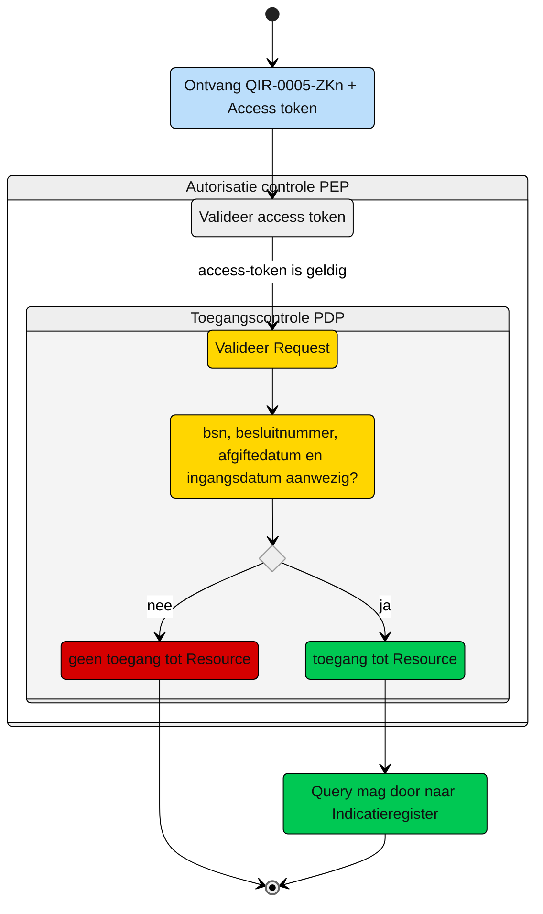

# Toegangscontrole: Raadplegen van WlzIndicatieID door nieuw verantwoordelijk Zorgkantoor via ZK31 (UCIR-0005)

Beschrijving van de **toegangscontrole** door de Policy Decision Point (PDP) en indien van toepassing Policy Information Point (PIP). 

N.b. Het valideren van de Acces-token door de PEP is geen onderdeel van deze beschrijving. 

## Toegangscontrole PDP

### Subject
- **Entiteit:** Zorgkantoor, dat verantwoordelijk wordt door overdracht (ZK31)
- **Kenmerk:** In bezit van een acces-token met daarin eigen `uzovicode`.

### Action
- **Type:** `raadplegen` (read)
- **Omschrijving:** Uitvoeren van GraphQl-query ['QIR-0005-ZKn.graphql`graphql](https://github.com/iStandaarden/iWlz-indicatie/tree/Indicatieregister-3/gql-query/zorgkantoor/QIR-0005-ZKn.graphql) op het Indicatieregister door een zorgkantoor

### Resource
- **Type:** `WlzIndicatie register`  
- **ID:** `bsn`, `besluitnummer` 
- **Beperking:** Alleen toegang tot gegevens van de Wlz-indicatie waarvoor het zorgkantoor door dossieroverdracht verantwoordelijk is geworden. 
- **Inhoud:** Alle nodes in het GraphQl-schema die horen bij deze indicatie mogen worden opgevraagd. 

### Context
- **Query-parameters vereist:** Het `bsn`, `besluitnummer`, `afgiftedatum` en `ingangsdatum` moeten zijn meegegeven in de query. 
- **Toegangsvoorwaarde:** Er is alleen toegang als aan alle volgende voorwaarden is voldaan:
    - De vereiste parameters zijn aanwezig in de query;
    - De acces-token bevat een geldige `uzovicode`van het zorgkantoor
    
### Resultaat 
> Toegang tot het Indicatieregister via query ['QIR-0005-ZKn.graphql`graphql](https://github.com/iStandaarden/iWlz-indicatie/tree/Indicatieregister-3/gql-query/zorgkantoor/QIR-0005-ZKn.graphql) is **alleen toegestaan** als:
>- de relevante parameters aanwezig zijn in de query;
>- de acces-token bevat een geldige `uzovicode`;
>
> Indien aan deze voorwaarden is voldaan, mogen alle bijbehorende GraphQL-nodes worden opgevraagd conform de structuur van de query-template.

# Toegangscontrole-flows Zorgkantoor nieuw verantwoordelijk: QIR-0005-ZKn.graphql

Beschrijving van het autorisatieprocces door de PEP.

**schematisch**

| # | Toelichting |
| --: | :-- |
| 1. |Ontvangst GraphQL-request + access-token door **PEP** |
| 2. |De **PEP** valideert de access-token en geeft na goedkeur het request door aan de PDP |
| 3. |De **PDP** controleert op:<ol><li>Of het request voldoet aan de template en er geen ongeoorloofde gegevens worden opgevraagd.<li> Aanwezigheid van de verplichte parameters in het request;</ol>Is aan alle voorwaarden voldaan?<br/> - **Ja** → Toegang tot de resource: stap 4<br/>- **Nee** → geen toegang tot de resource - *Einde proces (geen toegang.)* |  
| 4. | Het zorgkantoor krijgt toegang tot alle entiteiten die bij de Wlz-indicatie horen. |
| 5. | *Einde* |

**Controle query PIP:**
```gql
niet van toepassing

``` 

