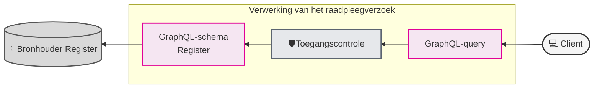
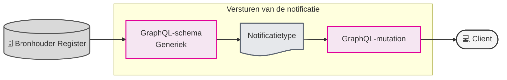

# Leeswijzer

## Inleiding
Elke koppelvlak-specificatie van een register bevat uit dezelfde componenten. Een GraphQL-schema, GraphQL-query specificatie(s), usecases voor raadpleging, toegangscontrole beschrijvingen en functionele beschrijvingen van de notificaties en de autorisatiematrix.

## Raadplegen
Het raadplegen is een dienst die wordt aangeboden door bronhouders aan (toekomstige) afnemers. De volledige beschrijving van deze dienst is te vinden in het [Afsprakenstelsel iWlz > Raadplegen](https://istandaarden.github.io/Afsprakenstelsel-iWlz/current/applicatie/diensten/raadplegen/). 

Hier worden alleen de componenten beschreven die voortkomen uit de koppelvlak-specificatie. 

Figuur 1 - Versimpelde weergave van raadplegen

Die componenten die onderdeel zijn van het raadplegen zijn:

| Component                   | type          | Voor wie         |
| :-------------------------- | :------------ | :--------------- |
| GraphQL-schema specificatie | GrapQL-schema | Bronhouder       |
| Raadpleeg use-cases         | Documentatie  | Raadpleger       |
| GraphQL-query template      | GraphQL-query | Raadpleger       |
| Toegangscontrole use-cases  | Documentatie  | Toegangscontrole |
| Autorisatiematrix           | Documentatie  | Toegangscontrole |

## Notificeren

| Onderdeel                   | type          | Voor wie                |
| :-------------------------- | :------------ | :---------------------- |
| GraphQL-schema specificatie | GrapQL-schema | Bronhouder              |
| Notificaties                | Documentatie  | Bronhouder / Raadpleger |

