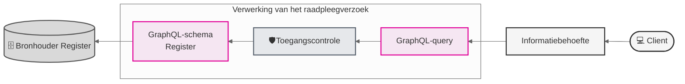
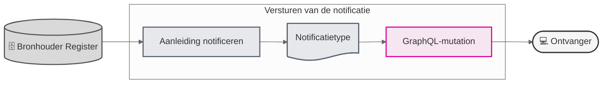

# Leeswijzer

Elke koppelvlak-specificatie van een register bevat uit dezelfde componenten. Een GraphQL-schema, GraphQL-query specificatie(s), usecases voor raadpleging, toegangscontrole beschrijvingen en functionele beschrijvingen van de notificaties en de autorisatiematrix.

## Raadplegen
De dienst **Raadplegen** wordt aangeboden door de bronhouders aan (toekomstige) afnemer zodat de afnemers instaat worden gesteld relevante informatie in te zien.

Hier worden alleen de onderdelen beschreven die voortkomen uit de koppelvlak-specificatie. 

```mermaid
---
config:
  theme: neutral
---
flowchart RL
    Client(["💻 Client"])

    subgraph Pipeline["Verwerking van het raadpleegverzoek"]
        direction RL
        GQ["GraphQL-query"]
        OPA["🛡️Toegangscontrole"]
        GS["GraphQL-schema <br/>Register"]
        GQ --> OPA --> GS 
    end

    DB[("🗄️ Bronhouder Register")]
    IB["Informatiebehoefte"]
    Client --> IB
    IB --> GQ
    GS --> DB

    classDef graphql fill:#f5e6f2,stroke:#E10098,stroke-width:2px,color:#333;
    classDef opa fill:#e6e8eb,stroke:#5b6470,stroke-width:2px,color:#333;
    classDef client fill:#f5f5f5,stroke:#333,stroke-width:2px,color:#333;
    classDef db fill:#d9d9d9,stroke:#555,stroke-width:2px,color:#333;

    class GQ,GS graphql;
    class OPA opa;
    class Client,IB client;
    class DB db;
```
Figuur 1 - Vereenvoudigde weergave van raadplegen

Een toeliching op de onderdelen van raadplegen in het artikel [Leeswijzer > Raadplegen](./raadplegen.md)

## Notificeren
De dienst **Notificeren** is er om een deelnemer op de hoogte te brengen dat er relevante informatie beschikbaar is voor die deelnemer.

```mermaid
---
config:
  theme: neutral
---
flowchart LR
 subgraph Pipeline["Versturen van de notificatie"]
    direction LR
        GQ["Aanleiding notificeren"]
        OPA["Notificatietype"]
        GS["GraphQL-mutation"]
  end
    GQ --> OPA
    OPA --> GS
    DB[("🗄️ Bronhouder Register")] --> GQ
    GS --> Client(["💻 Ontvanger"])

    OPA@{ shape: doc}
     GQ:::opa
     OPA:::opa
     GS:::graphql
     DB:::db
     Client:::client
    classDef graphql fill:#f5e6f2,stroke:#E10098,stroke-width:2px,color:#333
    classDef opa fill:#e6e8eb,stroke:#5b6470,stroke-width:2px,color:#333
    classDef client fill:#f5f5f5,stroke:#333,stroke-width:2px,color:#333
    classDef db fill:#d9d9d9,stroke:#555,stroke-width:2px,color:#333
```
Figuur 2 - Vereenvoudigde weergave onderdelen van notificeren

Een toelichting op de onderdelen van notificeren in het artikel [Leeswijzer > Notificeren](./notificeren.md).

## (Fout-)Melden
Door middel van een melding kan een raadpleger van een bron de bronhouder voorzien van nieuwe informatie die direct betrekking heeft op data in die bron. Een melding loopt altijd van deelnemer (raadpleger) naar een bronhouder.

Op dit moment is er alleen sprake van het melding-type "Foutmelding". Daarmee kan een raadpleger van een register een geconstateerde overtreding op een *Gegevensregel* melden aan de bronhouder, door meegeven van de regelcode en een recordID. Hiervoor is de [generieke](../generiek/index.md) koppelvlak specificatie opgesteld. 

Hoe dit verloopt is beschreven in het Afsprakenstelsel iWlz. [Afsprakenstelsel iWlz > Applicatie > Diensten > Notificeren en melden](https://istandaarden.github.io/Afsprakenstelsel-iWlz/current/applicatie/diensten/notificeren-en-melden/#4-meldingen)