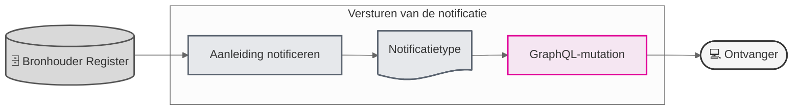

# Notificeren

De dienst **Notificeren** is er om een deelnemer op de hoogte te brengen dat er relevante informatie beschikbaar is voor die deelnemer.

Hier worden alleen de onderdelen beschreven die voortkomen uit de koppelvlak-specificatie. 

Figuur 1 - Vereenvoudigde weergave 

### Notificaties
Om welke relevante informatie het gaat is afhankelijke van het **Notificatietype**. Elke koppelvlakspecificatie bevat een lijst met beschikbare notificatie-typen die de bronhouder verplicht dan wel vrijwillig moet versturen. Per notificatie is beschreven wat de **Aanleiding** is voor het versturen van een notificatie en wie de **Ontvanger** 

### GraphQL-mutation
Het versturen van de notificatie verloopt technisch via een **GraphQL-mutation**. De documentatie daarvan is beschreven in het koppelvlak [**Generiek**](../generiek/index.md).

### Onderdelen

| Onderdeel                   | Documentatie                     | Voor wie                 |
| :-------------------------- | :------------------------------- | :----------------------- |
| GraphQL-schema specificatie | Documentatie Koppelvlak Generiek | Bronhouder               |
| Notificatie(-typen)         | Documentatie Koppelvlak register | Bronhouder en Raadpleger |
| Aanleiding notificatie      | Documentatie Koppelvlak register | Bronhouder en Raadpleger |

### Meer informatie over de dienst Notificeren
Ga voor meer informatie over notificeren naar het Afsprakenstelsel: [Afsprakenstelsel iWlz Netwerkmodel > Applicatie > Diensten > Notificeren en Melden](https://istandaarden.github.io/Afsprakenstelsel-iWlz/current/applicatie/diensten/notificeren-en-melden/)