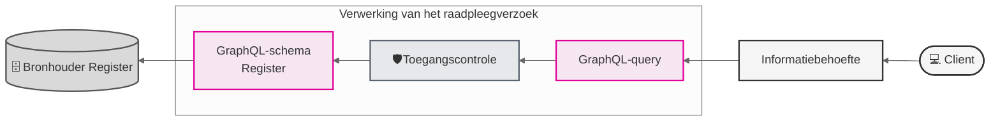

# Raadplegen

De dienst **Raadplegen** wordt aangeboden door de bronhouders aan (toekomstige) afnemer zodat de afnemers instaat worden gesteld relevante informatie in te zien.

Hier worden alleen de onderdelen beschreven die voortkomen uit de koppelvlak-specificatie. 

Figuur 1 - Vereenvoudigde weergave van raadplegen

### Informatiebehoefte - Raadpleeg usecases

Het raadplegen van het register is gebonden aan voorwaarden. De raadpleger moet bevoegd zijn én het vastgestelde raadpleegpatroon volgen. Dit patroon is essentieel voor het valideren van de toestemming.

Als dat patroon niet wordt gevolgd — bijvoorbeeld door ontbrekende autorisatie, onjuiste of incomplete input, het opvragen van ongeoorloofde gegevens — wordt de toegang geweigerd of het resultaat beperkt.

Om het slagen van een raadpleging te vergroten zijn er **Raadpleeg-usecases** opgesteld die naar gelang de situatie of **informatiebehoefte** toepast kunnen worden. Het koppelt de **informatiebehoefte** en het moment van reaadplegen aan een bepaalde **GraphQL-query** template en **toegangscontrole**.

### Query-templates
Onderdeel van de **Raadpleeg** usecases is een verwijzing naar een **GraphQL-query** template die op dat moment gebruikt kan worden.

Zowel de Raadpleeg usecase als de bijbehorende GraphQL-query usecase beschrijven welke input variabelen er verplicht zijn wil de toegangscontrole succesvol zijn. 

De template volgt altijd het GraphQL-schema van het bronregister en is daarmee al beperkt. 

### Toegangscontrole
De toegangscontrole beschrijft hoe welke controles eruit gevoerd moeten worden bij een bepaalde raadpleging. De toegangscontrole koppelt de autorisatie aan de raadpleging en dient als input voor de uiteindelijke (Rego) policy.

### GraphQL-schema
Het GraphQL-schema weerspiegelt het gegevensmodel van een register. Het gegevensmodel is onderdeel van het [Informatiemodel](https://informatiemodel.istandaarden.nl/). Daarnaast beschrijft het welke raadplegingen er mogelijk zijn. 

### Onderdelen

Die componenten die onderdeel zijn van het raadplegen zijn:

| Component                   | Documentatie / Specificatie      | Voor wie         |
| :-------------------------- | :------------------------------- | :--------------- |
| GraphQL-schema specificatie | GrapQL-schema per register       | Bronhouder       |
| Raadpleeg use-cases         | Documentatie koppelvlak register | Raadpleger       |
| GraphQL-query template      | GraphQL-query per register       | Raadpleger       |
| Toegangscontrole use-cases  | Documentatie koppelvlak register | Toegangscontrole |
| Autorisatiematrix           | Documentatie koppelvlak register | Toegangscontrole |

### Meer informatie over de dienst Raadplegen
Ga voor meer informatie over raadplegen naar het Afsprakenstelsel: [Afsprakenstelsel iWlz Netwerkmodel > Applicatie > Diensten > Raadplegen](https://istandaarden.github.io/Afsprakenstelsel-iWlz/current/applicatie/diensten/raadplegen/)

