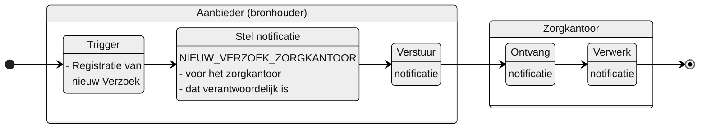

# NIEUW_VERZOEK_ZORGKANTOOR

**Inhoud**

- [NIEUW\_VERZOEK\_ZORGKANTOOR](#nieuw_verzoek_zorgkantoor)
  - [Documentatie](#documentatie)
  - [Trigger](#trigger)
  - [Instructie](#instructie)
  - [Type](#type)
  - [Inhoud notificatie](#inhoud-notificatie)
- [Overige notificaties Leveringsregister](#overige-notificaties-leveringsregister)

## Documentatie
Notificatie aan het verantwoordelijke zorgkantoor wanneer de aanbieder – die van dit zorgkantoor een Bemiddelingsspecificatie heeft ontvangen – een nieuw verzoek registreert.

Het zorgkantoor is daarmee geïnformeerd van de registratie van een nieuw verzoek. 

De notificatie bevat informatie waarmee het zorgkantoor het verzoek kan raadplegen.

## Trigger
De trigger voor het opstellen van de notificatie is: 
 > De registratie van een `Verzoek` in het Leveringsregister

## Instructie
Stel de notificatie op voor: 
> het zorgkantoor dat verantwoordelijk is voor de bemiddelingspecificatie waarnaar is verwezen met `bemiddelingspecificatieID` in de `Levering` waaronder het `Verzoek` is geregistreerd .

## Type
Het type notificatie is:
> VERPLICHT

## Inhoud notificatie
| **Variabele** 	| **Waarde** 	| **Voorbeeld** 	|
|---	|---	|---	|
| timestamp 	| {timestamp} 	| `timestamp: "2024-07-02T00:00:00.000Z"` 	|
| afzenderIDType 	| AGBCODE 	| `afzenderIDType: "AGBCODE"` 	|
| afzenderID 	| {agb-code afzender} 	| `afzenderID: "12345678"` 	|
| ontvangerIDType 	| UZOVI 	| `ontvangerIDType: "UZOVI"` 	|
| ontvangerID 	| {uzovi-code ontvanger} 	| `ontvangerID: "5555"` 	|
| ontvangerKenmerk 	| NULL 	|  	|
| eventType 	| NIEUW_VERZOEK_ZORGKANTOOR 	| `eventType: "NIEUW_VERZOEK_ZORGKANTOOR"` 	|
| subjectList 	|  	| `subjectList: [{` 	|
| ../subject 	| Levering/{bemiddelingspecificatieID}	| `subject: "Levering/ef88ce35-58fa-4e6d-ac7a-6e298dd211d6"` 	|
| ../recordID 	| Verzoek/{VerzoekID} 	| `subject: "Verzoek/76f17bb6-31b3-4042-9417-6e6bb101ce30"` 	|
| | | `}]` |

# Overige notificaties Leveringsregister
De overige notificaties van het Leveringsregister staan [hier](/notificaties/README.md)
