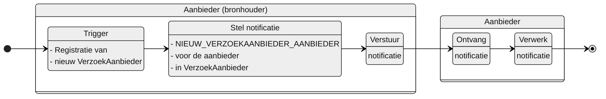

# NIEUW_VERZOEKAANBIEDER_AANBIEDER

**Inhoud**

- [NIEUW\_VERZOEKAANBIEDER\_AANBIEDER](#nieuw_verzoekaanbieder_aanbieder)
  - [Documentatie](#documentatie)
  - [Trigger](#trigger)
  - [Instructie](#instructie)
  - [Type](#type)
  - [Inhoud notificatie](#inhoud-notificatie)
- [Overige notificaties Leveringsregister](#overige-notificaties-leveringsregister)

## Documentatie
Notificatie aan de aanbieder die door een aanbieder met een regierol is betrokken bij een nieuw verzoek voor het leveren van zorg of ondersteuning. 

De aanbieder is daarmee geinformeerd van de registratie. 

De notificatie bevat informatie waarmee de aanbieder de VerzoekAanbieder kan raadplegen.

## Trigger
De trigger voor het opstellen van de notificatie is: 
 > De registratie van een `VerzoekAanbieder` in het Leveringsregister

## Instructie
Stel de notificatie op voor: 
> de aanbieder die geregistreerd is onder `aanbieder` in `VerzoekAanbieder`.

## Type
Het type notificatie is:
> VERPLICHT

## Inhoud notificatie
| **Variabele** 	| **Waarde** 	| **Voorbeeld** 	|
|---	|---	|---	|
| timestamp 	| {timestamp} 	| `timestamp: "2024-07-02T00:00:00.000Z"` 	|
| afzenderIDType 	| AGBCODE 	| `afzenderIDType: "AGBCODE"` 	|
| afzenderID 	| {agb-code afzender} 	| `afzenderID: "12345678"` 	|
| ontvangerIDType 	| AGBCODE 	| `ontvangerIDType: "AGBCODE"` 	|
| ontvangerID 	| {agb-code ontvanger} 	| `ontvangerID: "87654321"` 	|
| ontvangerKenmerk 	| NULL 	|  	|
| eventType 	| NIEUW_VERZOEKAANBIEDER_AANBIEDER 	| `eventType: "NIEUW_VERZOEKAANBIEDER_AANBIEDER"` 	|
| subjectList 	|  	| `subjectList: [{` 	|
| ../subject 	| Verzoek/{VerzoekID} 	| `subject: "Verzoek/ef88ce35-58fa-4e6d-ac7a-6e298dd211d6"` 	|
| ../recordID 	| VerzoekAanbieder/{verzoekAanbiederID} 	| `recordID: "VerzoekAanbieder/76f17bb6-31b3-4042-9417-6e6bb101ce30"` 	|
| | | `}]` |

# Overige notificaties Leveringsregister
De overige notificaties van het Leveringsregister staan [hier](/notificaties/README.md)
