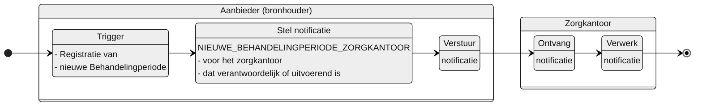

# NIEUWE_BEHANDELINGPERIODE_ZORGKANTOOR

**Inhoud**

- [NIEUWE\_BEHANDELINGPERIODE\_ZORGKANTOOR](#nieuwe_behandelingperiode_zorgkantoor)
  - [Documentatie](#documentatie)
  - [Trigger](#trigger)
  - [Instructie](#instructie)
  - [Type](#type)
  - [Inhoud notificatie](#inhoud-notificatie)
- [Overige notificaties Leveringsregister](#overige-notificaties-leveringsregister)

## Documentatie
Notificatie aan het zorgkantoor wanneer de aanbieder een nieuwe behandelingperiode registreert.

Het zorgkantoor is daarmee geïnformeerd van de registratie van een nieuwe behandelingperiode. 

De notificatie bevat informatie waarmee het zorgkantoor de behandelingperiode kan raadplegen.

## Trigger
De trigger voor het opstellen van de notificatie is: 
 > De registratie van een `Behandelingperiode` in het Leveringsregister

## Instructie
Stel de notificatie op voor: 
> 1. het zorgkantoor dat **verantwoordelijk** is voor de bemiddelingspecificatie waarnaar is verwezen met `bemiddelingspecificatieID` in de `Levering` waaronder de `Behandelingperiode` is geregistreerd.
> 2. het zorgkantoor dat **uitvoerend** is voor de bemiddelingspecificatie waarnaar is verwezen met `bemiddelingspecificatieID` in de `Levering` waaronder de `Behandelingperiode` is geregistreerd, indien deze afwijkend is aan het verantwoordelijk zorgkantoor.

## Type
Het type notificatie is:
> VERPLICHT

## Inhoud notificatie
| **Variabele** 	| **Waarde** 	| **Voorbeeld** 	|
|---	|---	|---	|
| timestamp 	| {timestamp} 	| `timestamp: "2024-07-02T00:00:00.000Z"` 	|
| afzenderIDType 	| AGBCODE 	| `afzenderIDType: "AGBCODE"`	|
| afzenderID 	| {agb-code afzender} 	| `afzenderID: "12345678"` 	|
| ontvangerIDType 	| UZOVI 	| `ontvangerIDType: "UZOVI"` 	|
| ontvangerID 	| {uzovi-code ontvanger} 	| `ontvangerID: "5555"` 	|
| ontvangerKenmerk 	| NULL 	|  	|
| eventType 	| NIEUWE_BEHANDELINGPERIODE_ZORGKANTOOR 	| `eventType: "NIEUWE_BEHANDELINGPERIODE_ZORGKANTOOR"` 	|
| subjectList 	|  	| `subjectList: [{` 	|
| ../subject 	| Levering/{bemiddelingspecificatieID}	| `subject: "Levering/ef88ce35-58fa-4e6d-ac7a-6e298dd211d6"` 	|
| ../recordID 	| Behandelingperiode/{behandelingperiodeID} 	| `subject: "Behandelingperiode/76f17bb6-31b3-4042-9417-6e6bb101ce30"` 	|
| | | `}]` |

# Overige notificaties Leveringsregister
De overige notificaties van het Leveringsregister staan [hier](/notificaties/README.md)
