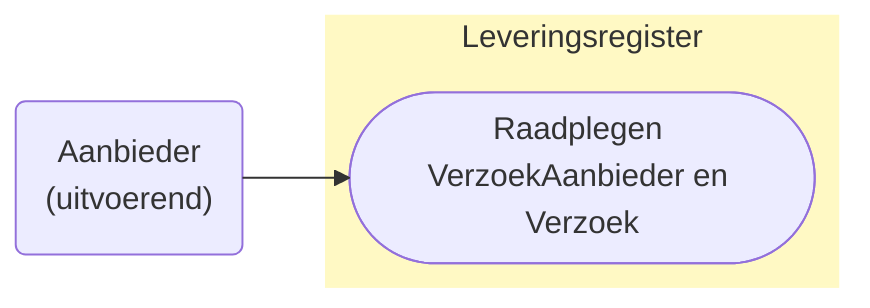
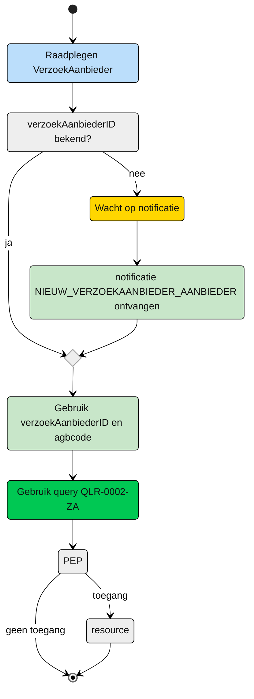

# Raadplegen van VerzoekAanbieder en Verzoek door de Aanbieder (UCLR-0002-ZA)

## Use Case beschrijving

**Titel:** Raadplegen van VerzoekAanbieder en Verzoek door de Aanbieder 
**Actoren:** Aanbieder vernoemd in VerzoekAanbieder

### Precondities:
- VerzoekAanbieder en Verzoek zijn opgenomen in het Leveringsregister.
- De aanbieder is opgenomen in VerzoekAanbieder.

### Autorisatie:
Een aanbieder mag VerzoekAanbieder en Verzoek raadplegen nadat deze aanbieder is opgenomen in VerzoekAanbieder.
- Volledige autorisatieregel: [LRA0006](https://informatiemodel.istandaarden.nl/informatiemodel/iwlz/netwerk/leveringsregister-1/regels/autorisatieregel/lra0006/)
- Autorisatiematrix: [LRA0006](/raadplegen/autorisatiematrix_leveringsregister.md)

### Trigger:
- Een aanbeider wil VerzoekAanbieder en Verzoek raadplegen waarin hij opgenomen is.

## Query-template beschrijving

|**Query ID** | **Beschrijving** | **Verplichte input** | **Resultaat** | 
| --- | ---- | --- | ---- |
| [QLR-0002-ZA](/gql-query/aanbieder/QLR-0002-ZA.graphql) | Op basis van de (ontvangen) verzoekAanbiederID en eigen identiteit, het VerzoekAanbieder, Verzoek, Levering en Client raadplegen| `verzoekAanbiederID`, `agbcode` | VerzoekAanbieder, Verzoek, Levering, Client | 

## Proces raadplegen

Een aanbieder wordt opgenomen in VerzoekAanbieder bij een Verzoek. De aanbieder ontvangt hiervoor een notificatie [NIEUW_VERZOEKAANBIEDER_AANBIEDER](/notificaties/aanbieder/nieuw_verzoekaanbieder_aanbieder.md). Op basis van deze notificatie kan de aanbieder de informatie in het Leveringsregister raadplegen.

### Schematisch:

| **#** | **Toelichting** |
| --- | :--- | 
| 1. | *Start* raadplegen VerzoekAanbieder |
| 2. | Is `verzoekAanbiederID` bekend?  - **Ja** -> Ga verder naar stap 5   - **Nee** -> Wacht op notificatie [NIEUW_VERZOEKAANBIEDER_AANBIEDER]/notificaties/aanbieder/nieuw_verzoekaanbieder_aanbieder.md | 
| 3. | Notificatie is ontvangen |
| 4. | Gebruik de informatie uit de notificatie voor het raadplegen van het Leveringsregister |
| 5. | De aanbieder vult `verzoekAanbiederID` in query-template [QLR-0002-ZA](/gql-query/aanbieder/QLR-0002-ZA.graphql) en initieert een raadpleging |
| 6. | De **aanbieder** stuurt Graphql-request + Acces-token naar het Policy Enforcement Point (PEP) |
| 7. | De PEP voert de [toegangscontrole](/raadplegen/aanbieder/UCLR-0002-toegangscontrole.md) uit en stuurt bij toegang het request door naar het leveringsregister. |
| 8. | De aanbieder ontvangt response van de PEP (bij ongeldig verzoek) of vanuit het Leveringsregister (resource). |
| 9. | *Einde proces* | 

---
Ga naar beschrijving van de bijbehorende [toegangscontrole](/raadplegen/aanbieder/UCLR-0002-toegangscontrole.md) | Terug naar [Raadplegen](/raadplegen/README.md)
