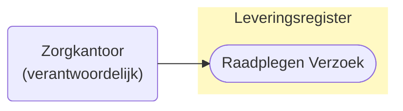
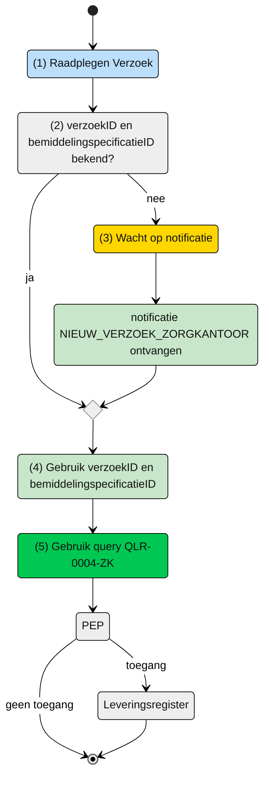

# Raadplegen Verzoek door verantwoordelijk zorgkantoor (UCL-0004-ZK)

> [!CAUTION] 
> Voor de controle op de toegang van deze query is er een PIP controle nodig. De toets of dit mogelijk met de huidige informatie mogelijk is, is moet nog plaatsvinden. De query kan nog wijzigen, wat effect kan hebben op het schema. 

## Use Case Beschrijving

**Titel:** Raadplegen van verzoek door een Zorgkantoor 
**Actoren:** Zorgkantoor dat verantwoordelijk is voor bemiddelingspecificatie

### Precondities: 
- Het Verzoek is opgenomen in het Leveringsregister
- Het zorgkantoor is verantwoordelijk voor de bemiddelingspecificatie waar het Verzoek bij hoort.

### Autorisatie:
Een zorgkantoor mag voor het toeleiden van een cliënt het Verzoek raadplegen die hoort bij een bemiddelingspecificatie waarvoor het zorgkantoor verantwoordelijk is. 
- Volledige autorisatieregel: [LRA0003](https://informatiemodel.istandaarden.nl/informatiemodel/iwlz/netwerk/leveringsregister-1/regels/autorisatieregel/lra0003/)
- Autorisatiematix: [LRA0003](/raadplegen/autorisatiematrix_leveringsregister.md)

### Trigger: 
- Het zorgkantoor wil het Verzoek raadplegen te ondersteuning van het toeleidingsproces van een cliënt.

## Query-template beschrijving
| **Query** | **Beschrijving** | **Verplichte input** | **Resultaat** |
| --- | :--- | :--- | :--- |
| QLR-0004-ZK | Op basis van de (ontvangen) verzoekID, het Verzoek, VerzoekAanbieder, Levering en Client raadplegen | `verzoekID`, `bemiddelingspecificatieID` | Verzoek / VerzoekAanbieder / Levering / Client |

## Proces raadplegen
Het zorgkantoor dat verantwoordelijk is voor de bemiddingspecificatie die hoort bij het Verzoek ontvangt de notificatie `NIEUW_VERZOEK_ZORGKANTOOR`. Nadat het zorgkantoor de notificatie heeft ontvangen mag dat zorgkantoor een raadpleging uitvoeren. De notificatie bevat het `verzoekID` om het Verzoek te raadplegen.

**Schematisch:**

| **#** | **Toelichting** |
| --- | :--- |
| 1. | *Start* |
| 2. | Zijn het `verzoekID` en `bemiddelingspecificatieID` bekend?  <ol><li> - **Ja** -> Ga verder naar stap 4  <li> - **Nee** -> Wacht op notificatie [NIEUW_VERZOEK_ZORGKANTOOR](/notificaties/zorgkantoor/nieuw_verzoek_zorgkantoor.md) 
| 4. | Het zorgkantoor vult het verplichte `verzoekID` en `bemiddelingspecificatieID` in query-template [QLR-0004-ZK](/gql-query/zorgkantoor/QLR-0004-ZK.graphql) en initieert een raadpleging van het Verzoek in het Leveringsregister. |
| 4. | Het zorgkantoor stuurt Graphql-request + Acces-token naar het Policy Enforcement Point (PEP) |
| 5. | De PEP voert de [toegangscontrole](/raadplegen/zorgkantoor/UCLR-0004-toegangscontrole.md) uit en stuurt bij toegang het request door naar het leveringsregister.
| 6. | De aanbieder ontvangt response van de PEP (bij ongeldig verzoek) of vanuit het Leveringsregister (resource). |
| 7. | *Einde proces* | 

---
Ga naar beschrijving van de bijbehorende [toegangscontrole](/raadplegen/zorgkantoor/UCLR-0004-toegangscontrole.md) | Terug naar [Raadplegen](/raadplegen/README.md)
