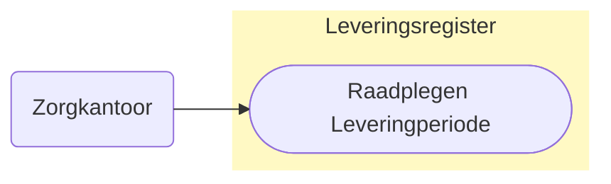
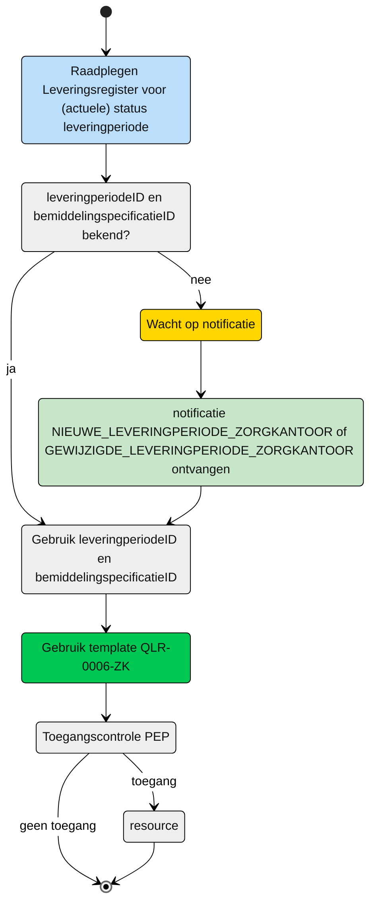

# Raadplegen van de Leveringperiode door het zorgkantoor (UCLR-0006) 

> [!CAUTION] 
> Voor de controle op de toegang van deze query is er een PIP controle nodig. De toets of dit mogelijk met de huidige informatie mogelijk is, is moet nog plaatsvinden. De query kan nog wijzigen, wat effect kan hebben op het schema. 

## **Use Case Beschrijving**  
**Titel:** Raadplegen van de leveringperiode (na notificatie) door het zorgkantoor  
**Actoren:** Zorgkantoor die betrokken is bij de levering van zorg aan een client.  

### Precondities:
- De Leveringperiode is opgenomen in het Leveringsregister.
- Het zorgkantoor is betrokken bij de levering van zorg aan de client door de registratie van een bemiddelingspecificatie door het verantwoordelijk zorgkantoor.

### Autorisatie:
Het zorgkantoor mag de Leveringperiode (en overige gegevens) raadplegen. 
- Volledige autorisatieregel: [LRA0002](https://informatiemodel.istandaarden.nl/informatiemodel/iwlz/netwerk/leveringsregister-1/regels/autorisatieregel/lra0002) (verantwoordelijk zorgkantoor), [LRA0001](https://informatiemodel.istandaarden.nl/informatiemodel/iwlz/netwerk/leveringsregister-1/regels/autorisatieregel/lra0001/) (uitvoerend zorgkantoor)
- Autorisatiematrix: [LRA0001, LRA0002](/raadplegen/autorisatiematrix_leveringsregister.md)

**Trigger:**
- Een zorgkantoor wil de (actuele) leveringperiode (en overige informatie) raadplegen waarvan het de notificatie heeft ontvangen.

## Query-template beschrijving

| **Query ID** | **Beschrijving** | **Verplichte input** | **resultaat** |
|---|---|---|---|
| [**QLR-0006-ZK**](/gql-query/zorgkantoor/QLR-0006-ZK.graphql) | Op basis van de (ontvangen) leveringperiodeID en eigen identificatie, de Leveringperiode en overig toegestane informatie raadplegen raadplegen | `leveringperiodeID`; `bemiddelingspecificatieID` | Leveringperiode / Behandelingperiode /  Levering /  Client / Uitstelperiode / Afstel |

## **Proces raadplegen**

Een zorgkantoor is (via een zorgaanbieder) betrokken bij de zorg van een client. Als de zorgaanbieder een leveringperiode registreert, aanpast of verwijdert, ontvangt het zorgkantoor daarvan een notificatie. (Ga naar het overzicht [notificaties](/notificaties#notificaties-aan-het-zorgkantoor) om te bekijken welke dit zijn).

Op basis van deze notificatie kan het zorgkantoor de informatie in het leveringsregister raadplegen. 

### Schematisch:

| # | Toelichting |
| --: | :-- |
| 1. | *Start* raadplegen Leveringsregister | 
| 2. | Zijn het **`leveringperiodeID`** en **`bemiddelingspecificatieID`** bekend?  <ol><li> - **Ja** →  Ga verder naar stap 6  <li> - **Nee** → Wacht op notificatie [**`NIEUWE_LEVERINGPERIODE_ZORGKANTOOR`** of **`GEWIJZIGDE_LEVERINGPERIODE_ZORGKANTOOR`**](/notificaties/)  | 
| 4. | Notificatie is ontvangen | 
| 5. | Gebruik de informatie uit de notificatie voor het raadplegen van het leveringsregister |
| 6. | Het zorgkantoor vult de verplichte **`leveringperiodeID`** en **`bemiddelingspecificatieID`** in query-template [QLR-0006-ZK.graphql](/gql-query/zorgkantoor/QLR-0006-ZK.graphql) en initieert een raadpleging van de leveringperiode in het Leveringsregister. | 
| 7. | Het zorgkantoor stuurt Graphql-request + Access-token naar het Policy Enforcement Point (PEP) |
| 8. | De PEP voert de [toegangscontrole](UCLR-0006-toegangscontrole.md) uit en stuurt bij toegang het request door naar het Leveringsregister. |
| 9. | Het zorgkantoor ontvangt response van de PEP (bij ongeldig verzoek) of vanuit het Leveringsregister (resource) |
| 10. | *Einde proces* | 

---

Ga naar beschrijving van de bijbehorende [toegangscontrole](UCLR-0006-toegangscontrole.md) | Terug naar [Raadplegen](/raadplegen/README.md)