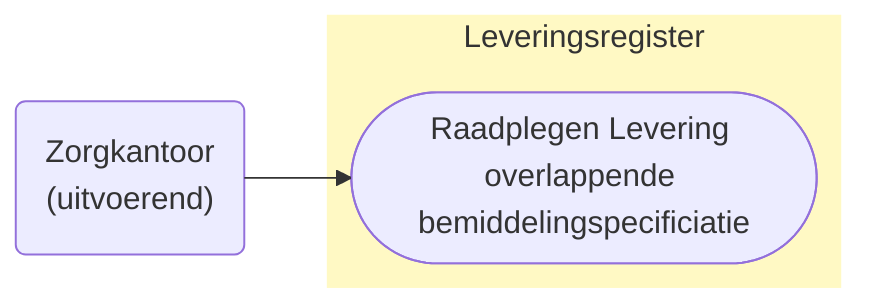
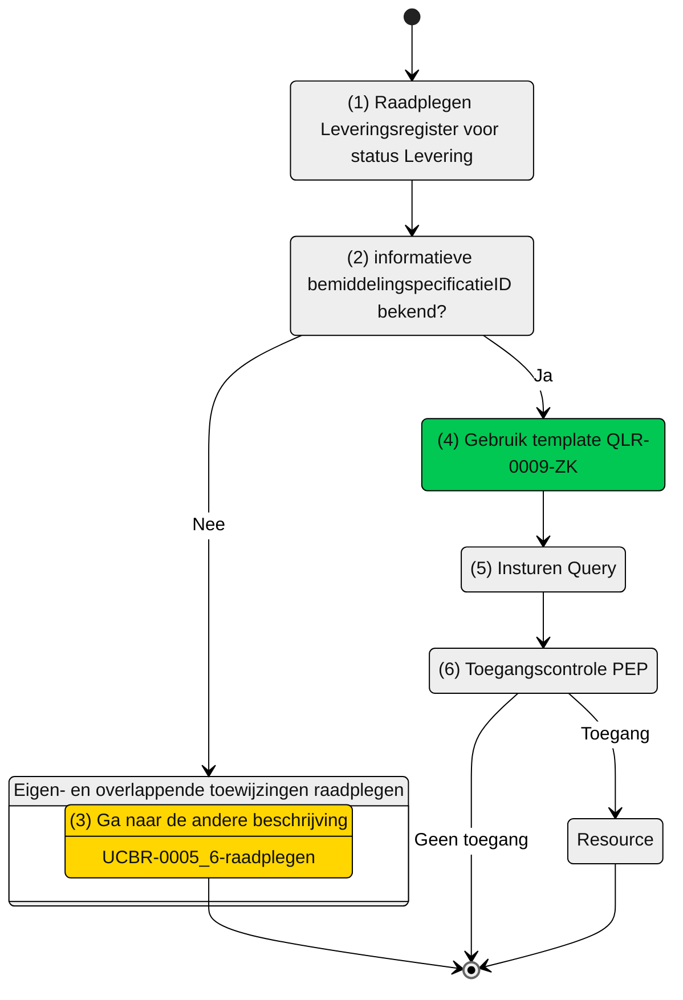

# Use cases raadplegen Levering van een informatieve bemiddelingspecificaties (UCLR-0009-ZK)

> [!CAUTION] 
> Voor de controle op de toegang van deze query is er een PIP controle nodig. De toets of dit mogelijk met de huidige informatie mogelijk is, is moet nog plaatsvinden. De query kan nog wijzigen, wat effect kan hebben op het schema. 

## Use Case Beschrijving

**Titel:** Raadplegen Levering van een informatieve bemiddelingspecificatie  
**Actoren:** Zorgkantoor dat uitvoerend is voor een overlappende bemiddelingspecificatie

### Precondities:
* De levering is opgenomen in het Leveringsregister.
* Het zorgkantoor is uitvoerend zorgkantoor voor een bemiddelingspecificatie die overlapt met de bemiddelingspecificatie waar de levering bij hoort.

### Autorisatie:
Een zorgkantoor mag de Levering (en de overige gegevens) raadplegen.
* Volledige autorisatieregel: [LRA0004](https://informatiemodel.istandaarden.nl/informatiemodel/iwlz/netwerk/leveringsregister-1/regels/autorisatieregel/lra0004/)
* Autorisatiematrix: [LRA0004](/iWlz-levering/raadplegen/autorisatiematrix_leveringsregister.md)

### Trigger:
* Een zorgkantoor mag voor toeleiden de levering (en overige informatie) raadplegen die horen bij de (informatieve) toewijzingen van andere zorgkantoren. 

## Query-template beschrijving 

|Query ID | Beschrijving | Verplichte input | Resultaat |
| :--- | :--- | :--- | :--- |
| [QLR-0009-ZK](/iWlz-levering/gql-query/zorgkantoor/QLR-0009-ZK.graphql) | Op basis van de bemiddelingspecificatieID van de informatieve toewijzing de Levering (en overige toegestane informatie), raadplegen die hoort bij de informatieve toewijzing. | `bemiddelingspecificatieID` | Levering / Client / Leveringperiode / Behandelingperiode / Uitstelperiode / Afstel | 

## Proces raadplegen

Een zorgkantoor is (via een aanbieder) betrokken bij de zorg van een cliënt. 
Met de aanvullende informatie uit de overlappende bemiddelingspecificatie (zie ook: [UCBR-0005_6-raadplegen](https://github.com/iStandaarden/iWlz-bemiddeling/blob/Bemiddelingsregister-1/raadplegen/zorgkantoor/UCBR-0005_6-raadplegen.md)) kan dat zorgkantoor de status van de levering zien die horen bij de informatieve toewijzing(en).

Hiervoor is de informatieve `bemiddelingspecificatieID` nodig.

### Schematisch 

| #    | Toelichting    |
| :--- | :------ |
| 1.   | Start raadplegen Leveringsregister |
| 2.   | Is de informatieve `bemiddelingsspecificatieID` bekend?  - **Ja** -> Ga verder naar stap 4.   - **Nee** -> Ga verder naar stap 3  |
| 3.   | Gebruik eerst query-template `QBR-0005_6-ZK` (zie beschrijving [UCBR-0005_6-raadplegen](https://github.com/iStandaarden/iWlz-bemiddeling/blob/Bemiddelingsregister-1/raadplegen/zorgkantoor/UCBR-0005_6-raadplegen.md)) |
| 4.   |  Gebruik query-template `QLR-00009-ZK` en vul de verplichte parameters:    - `bemiddelingspecificatieID`;  |
| 5.   | Het zorgkantoor stuurt GraphQL-request + Acces-token naar het Policy Enforcement Point (PEP).  |
| 6.   | De PEP voert de [toegangscontrole](/raadplegen/zorgkantoor/UCLR-0009-toegangscontrole.md) uit en stuurt bij toegang het request door naar het Leveringsgregister. |
| 7.   | Het zorgkantoor ontvangt response van de PEP (bij ongeldig verzoek) of vanuit het Leveringsregister (resource).|
| 8.   | *Einde proces* |

 ---

Ga naar beschrijving van de bijbehorende [toegangscontrole](/raadplegen/zorgkantoor/UCLR-0009-toegangscontrole.md)  |  Terug naar [Raadplegen](/raadplegen/README.md)
