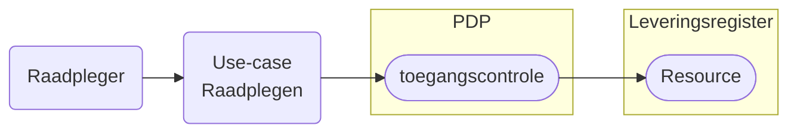

# Raadplegen Leveringsregister 

!!! warning
    Release Candidate 1 - 29-01-2029
    Hieronder staan de eerste beschrijvingen van de basis raadplegingen op het Leveringsregister.

    Waar mogelijk is er een raadpleeg use-case en toegangscontrole beschrijving beschikbaar. Waar dat nog ontbreekt volgen ze zo snel mogelijk maar dat is afhankelijk of de raadpleging technisch mogelijk is rekeninghoudend met de vereiste toegangscontrole. Dit kan leiden tot aanpassing van de query en aanpassing van het schema. Daar waar dit speelt is dat afzonderlijk aangegeven. 

De use-cases voor het raadplegen van het Leveringsregister per rol en bijbehorende beschrijving van de toegangscontrole door de PDP. 

```mermaid
---
config:
  theme: mc
  look: classic
  layout: elk
---
flowchart LR
 subgraph s1["PDP"]
          P["toegangscontrole"]
 end
 subgraph s2["Leveringsregister"]
          B["Resource"]
  end
    A["Raadpleger"] --> R
    R["Use-case<br>Raadplegen"] --> P
    P --> B
    B@{ shape: terminal}
    P@{ shape: terminal}
    A@{ shape: rounded}
    R@{ shape: rounded}
    
```

!!! info
    Ga naar [Leeswijzer](../../../leeswijzer/index.md) voor de algemene toelichting over het onderdeel Raadplegen.

## Use-cases

Kies een use-case voor de beschrijving van het raadplegen of controleren van de toegang van die raadpleging.

### Aanbieder
| Doel | toelichting | raadplegen | toegangscontrole |
| :--- | :--- | :--- | :--- |
| Status levering andere aanbieder | **Als** aanbieder **wil ik** voor het leveren van zorg of ondersteuning gegevens over de status van de levering van de zorg of ondersteuning raadplegen die horen bij de (informatieve) toewijzingen (bemiddelingspecificaties) van andere aanbieders **zodat ik** het volledige inzicht heb in de leveringen en levering beter kan afstemmen. | [UCLR-0001-raadplegen](./UCLR-0001-raadplegen.md) *(concept)* | [UCLR-0001-toegangscontrole](../toegangscontrole/UCLR-0001-toegangscontrole.md) *(concept)* |  
| VerzoekAanbieder en Verzoek | **Als** aanbieder die een notificatie over `VerzoekAanbieder` heeft ontvangen, **wil ik** VerzoekAanbieder, het bijbehorende Verzoek en de cliënt kunnen raadplegen, zodat ik op de hoogte ben van de aanvraag voor een toewijzing. | [UCLR-0002-raadplegen](./UCLR-0002-raadplegen.md) *(concept)* | [UCLR-0002-toegangscontrole](../toegangscontrole/UCLR-0002-toegangscontrole.md) *(concept)* |  

### Zorgkantoor
| Doel | toelichting | raadplegen | toegangscontrole |
| :--- | :--- | :--- | :--- |
| Nieuwe of Gewijzigde Leveringperiode | **Als** zorgkantoor **wil ik** de status van de Leveringsperiode raadplegen (naar aanleiding van de notificatie die ik heb ontvangen) **zodat ik** de zorgstatus van een toewijzing (bemiddelingspecificatie) kan beoordelen. | [UCLR-0006-raadplegen](./UCLR-0006-raadplegen.md) *(concept)* | [UCLR-0006-toegangscontrole](../toegangscontrole/UCLR-0006-toegangscontrole.md) *(concept)* |
| Nieuwe of Gewijzigde Uitstelperiode | **Als** zorgkantoor **wil ik** de status van de Uitstelperiode raadplegen (naar aanleiding van de notificatie die ik heb ontvangen) **zodat ik** de zorgstatus van een toewijzing (bemiddelingspecificatie) kan beoordelen. | [UCLR-0007-raadplegen](./UCLR-0007-raadplegen.md) *(concept)* | [UCLR-0007-toegangscontrole](../toegangscontrole/UCLR-0007-toegangscontrole.md) *(concept)* |
| Nieuw of Gewijzigd Afstel | **Als** zorgkantoor **wil ik** de status van de Afstel raadplegen (naar aanleiding van de notificatie die ik heb ontvangen) **zodat ik** de zorgstatus van een toewijzing (bemiddelingspecificatie) kan beoordelen. | [UCLR-0008-raadplegen](./UCLR-0008-raadplegen.md) *(concept)* | [UCLR-0008-toegangscontrole](../toegangscontrole/UCLR-0008-toegangscontrole.md) *(concept)* |
| Nieuw of Gewijzigd Verzoek | **Als** verantwoordelijk zorgkantoor **wil ik** het Verzoek en bijbehorende VerzoekAanbieders kunnen raadplegen **zodat ik** de client naar de juiste zorg kan toeleiden. | [UCLR-0004-raadplegen](./UCLR-0004-raadplegen.md) *(concept)* | [UCLR-0004-toegangscontrole](../toegangscontrole/UCLR-0004-toegangscontrole.md) *(concept)*  |
| Status Levering van informatieve bemiddelingspecificaties | **Als**  uitvoerend zorgkantoor **wil ik** de status van de levering kunnen raadplegen horend bij een informatieve toewijzing (bemiddelingspecificaties), **zodat ik** inzicht heb in de leveringen die horen bij de (informatieve) toewijzingen van andere zorgaanbieders/zorgkantoren. | [UCLR-0009-raadplegen](./UCLR-0009-raadplegen.md) *(concept)*  | [UCLR-0009-toegangscontole](../toegangscontrole/UCLR-0009-toegangscontrole.md) *(concept)* |
| Status Behandelperiode | **Als** (uitvoerend) zorgkantoor **wil ik** de status van de de behandelingperiode raadplegen, (na notificatie) door het zorgkantoor, **zodat ik** inzicht heb in de actuele status van de behandelperiode. | [UCLR-0010-raadplegen](./UCLR-0010-raadplegen.md) *(concept)* | [UCLR-0010-toegangscontrole](../toegangscontrole/UCLR-0010-toegangscontrole.md) *(concept)* |

