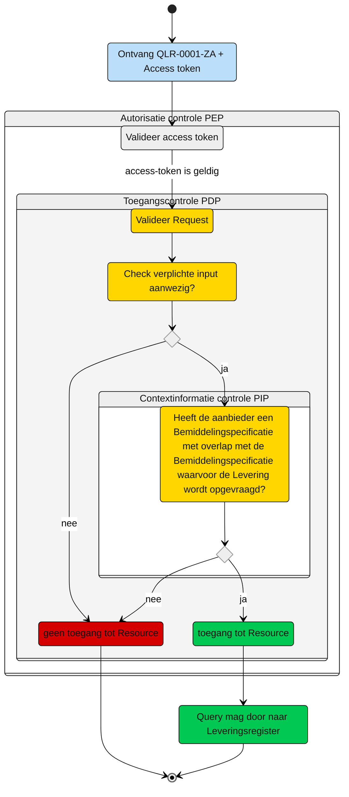

# Toegangscontrole: Raadplegen van de Levering die horen bij overlappende Bemiddelingspecificatie(s) door de Aanbieder (UCLR-0001)

> [!Caution]
> Voor de controle op toegang van deze query is er een PIP controle nodig. De toets of dit met de huidige informatie mogelijk is, moet nog plaatsvinden. De query kan nog wijzigen, wat effect kan hebben op het schema.


Beschrijving van de **toegangscontrole** door de Policy Decision Point (PDP) en indien van toepassing Policy Information Point (PIP).

N.b. Het valideren van de Acces-token door de PEP is geen onderdeel van deze beschrijving. Zie daarvoor het [Afsprakenstelsel iWlz - nID netwerkstelsel - 5. policy Enforcement Point](https://wlz.atlassian.net/wiki/spaces/IWLZAS/pages/229441537/nID+netwerkstelsel#5.-Policy-Enforcement-Point-(PEP)).

## Toegangscontrole PDP

### Subject
- **Entiteit:** Aanbieder
- **Kenmerk:** In bezit van een acces-token met daarin de eigen `agbcode`.

### Action
- **Type:** `raadplegen` (read)
- **Omschrijving:** Uitvoeren van GraphQL-query [QLR-0001-ZA](/gql-query/aanbieder/QLR-0001-ZA.graphql)  op het Leveringsregister door een aanbieder. 

### Resource
- **Type:** `Leveringsregister`
- **ID:** `bemiddelingspecificatieID` van de informatieve bemiddelingspecificatie
- **Beperking:** Toegang tot de gegevens over de Levering van de informatieve toewijzing, indien deze toewijzing periode-overlap heeft met de eigen bemiddelingspecificatie. 
- **Inhoud:** De nodes Levering en de gerelateerde Leveringperiode, Behandelingperiode, Uitstelperiode, Afstel en Client mogen worden opgevraagd.

### Context
- **Query-parameters vereist:
  - informatieve `bemiddelingspecificatieID` 

- **Toegangsvoorwaarde:** Er is alleen toegang als aan alle volgende voorwaarde is voldaan:
    - De parameters zoals hierboven aanwezig zijn; 
    - De acces-token bevat een geldige `agbcode` van de aanbieder;

    - In het **Bemiddelingsregister** bestaat er een `Bemiddelingspecificatie` waarbij:<br>
        1. de `instelling` overeenkomt met de `agbcode` uit de acces-token **én**;<br>
        2. deze `bemiddelingspecificatie` behoort tot dezelfde `Bemiddeling` als waar de `bemiddelingspecificatie` waarvoor de `Levering` opgevraagd wordt ook bij hoort **én;**<br>
        3. deze `bemiddelingspecificaties` overlappen in periode met elkaar **én;**<br> 

    

 ### Resultaat
 > Toegang tot het Leveringsregister via query [QLR-0001-ZA](/iWlz-levering/gql-query/aanbieder/QLR-0001-ZA.graphql) is **alleen toegestaan** als:
 > - De relevante parameters aanwezig zijn in de query;
 > - De acces-token bevat een geldige `agbcode`;
 > - Er een `Bemiddelingspecificatie is voor:
 >   - De `agbcode` (uit de access-token) én;
 >   - die hoort bij dezelfde `Bemiddeling` als de `bemiddelingspecificatie` waarvoor de `levering` opgevraagd wordt én;
>   - die overlapt met de `bemiddelingspecificatie` waarvoor de `levering` opgevraagd wordt
>
> Indien aan deze voorwaarden is voldaan, mogen alle bijbehorende GraphQL-nodes worden opgevraagd conform de structuur van de query-template. 


## Toegangscontrole-flows Aanbieder: QLR-0001-ZA
Beschrijving van het autorisatieproces door de PEP.

### Schematisch:



| # | Toelichting |
|:--- | :--- |
| 1. | Ontvangst GraphQL-request + acces-token door **PEP**. |
| 2. | De **PEP** valideert de acces-token en geeft na goedkeur het request door aan de PDP. |
| 3. | De **PDP** controleert op: <ol><li> Of het request voldoet aan de template en er geen ongeoorloofde gegevens worden opgevraagd; <li> Aanwezigheid van de verplichte parameters in het request. </ol> Is aan alle voorwaarden voldaan? <br/> - **Ja** -> Controle context-informatie door **PIP**: stap 4. <br/> - **Nee** -> geen toegang tot de resource - *Einde proces (geen toegang)*. |
| 4. | De **PIP** controleert in het `Bemiddelingsregister` op de aanwezigheid van een `Bemiddelingspecificatie` voor het raadplegende zorgkantoor dat overlap heeft met de `Bemiddelingspecificatie` waarvoor de Levering(status) wordt geraadpleegd:<BR/>Hiervoor zijn er twee PIP-requests nodig:<BR/><ol><BR/><li> PIP-context data: Haal context-informatie op van de `Bemiddelingspecificatie` waarvoor de Levering(status) geraadpleegd wordt;<BR/><li> PIP-context validatie: Gebruik de context-informatie uit het PIP-request onder 1 en voeg deze toe aan het PIP-request om te bepalen of er een `Bemiddelingspecificatie is voor het raadplegende zorgkantoor met overlap.<BR/></ol><BR/> Is er (minimaal) één `Bemiddelingspecificatie` voor het raadplegende zorgkantoor aanwezig? <BR/><BR/>- **Ja**  -> Toegang tot de resource: stap 5. <BR/>- **Nee** -> Geen toegang tot de resource - *Einde proces (geen toegang)*. |
| 5. | De aanbieder krijgt toegang tot de `Levering`, met bijbehorende `Leveringperiode`, `Behandelingperiode`, `Uitstelperiode` en `Afstel`.
| 6. | *Einde*

## Toegangscontrole PIP

### 1. Ophalen Context data Bemiddelingspecificatie
```gql
# Raadplegen PIP contextdata
# Haal context data op voor de Bemiddelingspecificatie waar inzage in de levering gewenst is.
# Gebruik deze context data in de toegangscontrole "PIPcontextBSvalidatie"

    query PIPcontextBSdata(
    $bemiddelingspecificatieID: UUID! # bemiddelingspecificatieID uit initiele raadpleging
    ) {
    bemiddelingspecificatie(
        where: {bemiddelingspecificatieID: {eq: $bemiddelingspecificatieID}}
    ) {
        bemiddelingspecificatieID
        toewijzingIngangsdatum
        toewijzingEinddatum
        vaststellingMoment
    }
    }

```

### 2. PIP context validatie
Validatie aanwezigheid *Eigen* Bemiddelingspecificatie met overlap op te vragen Bemiddelingspecificatie (Informatieve)

```gql
    # Op basis van de gegevens van de bemiddelingsspecificatie waarvan de leveringstatus geraadpleegd wordt,
    # controleren of er voor het raadplegende zorgaanbieder een bemiddelingspecifcatie is dat overlapt heeft.
    # Als het resultaat leeg is, bestaat er geen geldige Bemiddelingspecificatie met overlap
    # voor het raadplegende zorgaanbieder.

    query PIPcontextBSvalidatie(
    $bemiddelingspecificatieID: UUID! # bemiddelingspecificatieID uit initiele query
    $agbcodeToken: String! # afkomstig uit token
    $toewijzingIngangsdatum: Date! # toewijzingIngangsdatum uit PIPcontextdata
    $toewijzingEinddatum: Date # eventueel toewijzingEinddatum uit PIPcontextdata
    $toewijzingEinddatumMoment: DateTime # als er een einddatum is + T00:00:00.000+01:00
    $datumvaststellingMoment: Date! # datumdeel vaststellingsmoment
    ) {
    bemiddelingspecificatie(
        where: {bemiddelingspecificatieID: {eq: $bemiddelingspecificatieID}}
    ) {
        # bemiddelingspecificatieID
        bemiddeling {
        # bemiddelingID
        bemiddelingspecificatie(
            where: {
            and: [
                # Er moet een eigen.bemiddelingspecificatie zijn voor opvragende zorgaanbieder
                {instelling: {eq: $agbcodeToken}}
                # eigen.bspec.toewijzingIngangsdatum lte opgevraagde.Bspec.toewijzingEinddatum of
                # eigen.bspec.vaststellingsmoment lte opgevraagde.bspec.toewijzingeinddatum
                {
                or: [
                    {toewijzingIngangsdatum: {lte: $toewijzingEinddatum}}
                    {vaststellingMoment: {lte: $toewijzingEinddatumMoment}}
                ]
                }
                # eigen.bspec.toewijzingEinddatum is null of
                # eigen.bspec.toewijzingEinddatum gte opgevraagde.bspec.toewijzingIngangsdatum of
                # eigen.bspec.toewijzingEinddatum gte opgevraagde.bspec.vaststellingMoment
                {
                or: [
                    {toewijzingEinddatum: {eq: null}}
                    {toewijzingEinddatum: {gte: $toewijzingIngangsdatum}}
                    {toewijzingEinddatum: {gte: $datumvaststellingMoment}}
                ]
                }
                # die toegang geldt t/m 31 mei van het jaar dat volgt op de einddatum van de eigen Bemiddelingspecificatie.
            ]
            }
        ) {
            bemiddelingspecificatieID
        }
        }
    }
    }
```
----

Ga naar [UC beschrijving raadplegen](/raadplegen/aanbieder/UCLR-0001-raadplegen.md) -- Terug naar [Raadplegen](/raadplegen/README.md)
