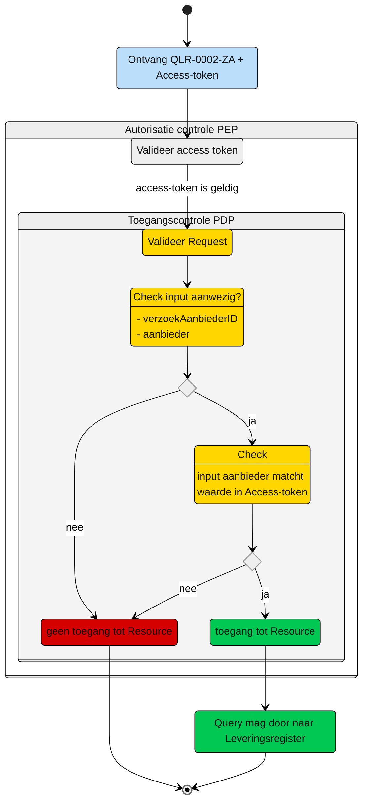

# Toegangscontrole: Raadplegen van VerzoekAanbieder en Verzoek door de aanbieder (UCLR-0002)

Beschrijving van de **toegangscontrole** door de Policy Decision Point (PDP) en indien van toepassing Policy Information Point (PIP).

N.b. Het valideren van de Acces-token door de PEP is geen onderdeel van deze beschrijving. Zie daarvoor het [Afsprakenstelsel iWlz - nID netwerkstelsel - 5. policy Enforcement Point](https://wlz.atlassian.net/wiki/spaces/IWLZAS/pages/229441537/nID+netwerkstelsel#5.-Policy-Enforcement-Point-(PEP)).

## Toegangscontrole PDP

### Subject
- **Entiteit:** Aanbieder
- **Kenmerk:** In bezit van een access-token met daarin de eigen `agbcode`.

### Action
- **Type:** `raadplegen` (read)
- **Omschrijving:** Uitvoeren van GraphQL-query [QLR-0002-ZA.graphql](/gql-query/aanbieder/QLR-0002-ZA.graphql) op het Leveringsregister door een aanbieder.

### Resource
- **Type:** `Leveringsregister`
- **ID:** `verzoekAanbiederID`
- **Beperking:** Alleen toegang tot gegevens die horen bij VerzoekAanbieder waarin de aanbieder is opgenomen.
- **Inhoud:** Alleen de nodes VerzoekAanbieder, Verzoek en de gerelateerde Levering en Client die horen bij de opgevraagde VerzoekAanbieder mogen worden opgevraagd.

### Context
- **Query-parameters:** vereist: Het `verzoekAanbiederID` en de `agbcode` moeten aanwezig zijn in de query
- **Toegangsvoorwaarde:** Er is alleen toegang als aan alle volgende voorwaarden is voldaan:
    - De parameter `verzoekAanbiederID` is aanwezig in de query;
    - De parameter `agbcode` is aanwezig in de query;
    - De acces-token bevat een geldige `agbcode` van de aanbieder;
    - De in de query meegegeven `agbcode` komt overeen met de `agbcode` in de acces-token

### Resultaat
> Toegang tot het Leveringsregister via query [QLR-0002-ZA](/gql-query/aanbieder/QLR-0002-ZA.graphql) is **alleen toegestaan** als:
> - Parameter `verzoekAanbiederID`is meegegeven in de query;
> - Parameter `agbcode` is meegegeven in de query;
> - De acces-token bevat een geldige `agbcode`;
> - De in de query meegegeven `agbcode` komt overeen met de `agbcode` in de acces-token.
>
> Als aan alle voorwaarden i voldaan, mogen de nodes `VerzoekAanbieder`, `Verzoek`, `Levering` en `Client` die horen bij dit `verzoekAanbiederID` worden opgevraagd. 


## Toegangscontrole-flows Aanbieder: QLR-0002-ZA
Beschrijving van het autorisatieproces door de PEP.

### Schematisch:



| # | Toelichting |
| --: | :-- |
| 1. |Ontvangst GraphQL-request + access-token door **PEP** |
| 2. |De **PEP** valideert de access-token en geeft na goedkeur het request door aan de PDP |
| 3. |De **PDP** controleert op:<br/>1. Of het request voldoet aan de template en er geen ongeoorloofde gegevens worden opgevraagd.<br/>2. Aanwezigheid van de verplichte parameters in het request;<br/>3. Of de **`agbcode`** in request overeenkomt met de waarde in de **`access-token`**;<br/><br/>Is aan alle voorwaarden voldaan?<br/> - **Ja** →  Ga verder naar stap 4<br/>- **Nee** → *Einde proces (geen toegang.)*   |
| 4. | De aanbieder krijgt toegang tot het Leveringsregister.|
| 5. | *Einde* |

## Toegangscontrole PIP:
```gql
nvt

```
----

Ga naar [UC beschrijving raadplegen](/raadplegen/aanbieder/UCLR-0002-raadplegen.md) -- Terug naar [Raadplegen](/raadplegen/README.md)