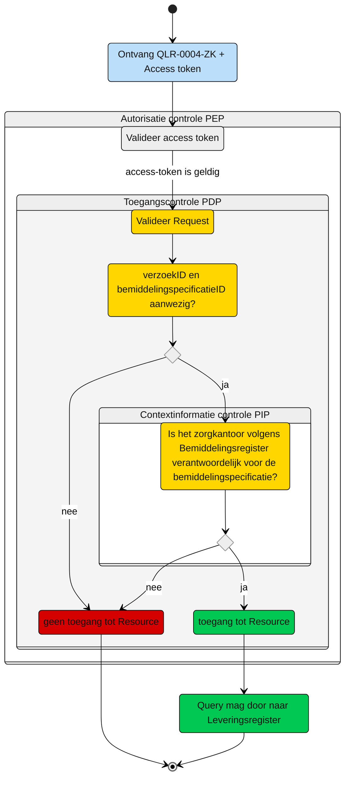

# Toegangscontrole: Raadpleeg Verzoek door verantwoordelijk zorgkantoor (UCLR-0004-ZK)

> [!CAUTION] 
> Voor de controle op de toegang van deze query is er een PIP controle nodig. De toets of dit mogelijk met de huidige informatie mogelijk is, is moet nog plaatsvinden. De query kan nog wijzigen, wat effect kan hebben op het schema. 

Beschrijving van de **toegangscontrole** door de Policy Decision Point (DPD) en indien van toepassing Policy Information Point (PIP).

N.b. Het valideren van de Acces-token door de PEP is geen onderdeel van deze beschrijving. Zie hiervoor het [Afsprakenstelsel iWlz - nID netwerkstelsel - 5. policy Enforcement Point](https://wlz.atlassian.net/wiki/spaces/IWLZAS/pages/229441537/nID+netwerkstelsel#5.-Policy-Enforcement-Point-(PEP)).

## Toegangscontrole PDP

### Subject
- **Entiteit:** Verantwoordelijk zorgkantoor,
- **Kenmerk:** In bezit van een acces-token met daarin de eigen `uzovicode`

### Action
- **Type:** `raadplegen` (read)
- **Omschrijving:** Uitvoeren van GraphQL-query [QLR-0004-ZK](/gql-query/zorgkantoor/QLR-0004-ZK.graphql) op het Leveringsregister door een zorgkantoor.

### Resource 
- **Type:** `Leveringsregister`
- **ID:** `verzoekID`
- **Beperking:** Alleen toegang tot gegevens over het Verzoek die horen bij een bemiddelingspecificatie waarvoor het zorgkantoor verantwoordelijk is.
- **Inhoud:** De node Verzoek en de gerelateerde nodes VerzoekAanbieder, Levering en Client.

### Context 
- **Query-parameters vereist:** Het `verzoekID` en `bemiddelingspecificatieID` moet aanwezig zijn in de query.
- **Toegangsvoorwaarde:** Er is alleen toegang als aan alle volgende voorwaarde is voldaan:
    - De parameter `verzoekID` en `bemiddelingspecificatieID` zijn meegegeven in de query
    - De acces-token bevat een geldige `uzovicode`
    - De `uzovicode` in de acces-token komt overeen met `verantwoordelijkZorgkantoor` in `Bemiddeling` die hoort bij de `bemiddelingspecificatie` waarvan het `verzoekID` is meegegeven in de query.

    ## Resultaat
    > Toegang tot het Leveringsregister via QLR-0004-ZK is alleen toegestaan als:
    > - Parameter `verzoekID` en `bemiddelingspecificatieID` zijn meegegeven in de query
    > - In het bemiddelingregister een match is gevonden tussen:
    >   - De `uzovicode` (uit de acces-token)
    >   - En `verantwoordelijkZorgkantoor` in `Bemiddeling` die hoort bij `bemiddelingspecificatie` met `bemiddelingspecificatieID` zoals in de query meegegeven
    >
    >Indien aan deze voorwaarde is voldaan, mogen de nodes Verzoek, VerzoekAanbieders, Levering en Client worden opgevraagd conform de structuur van de query-template
<br/>

# Toegangscontrole-flows Zorgkantoor verantwoordelijk: QLR-0004-ZK

Beschrijving van het autorisatieproces door de PEP.

**schematisch**
**schematisch:**



| # | Toelichting |
| --: | :-- |
| 1. |Ontvangst GraphQL-request + access-token door **PEP** |
| 2. |De **PEP** valideert de access-token en geeft na goedkeur het request door aan de PDP |
| 3. |De **PDP** controleert op:<ol><li>Of het request voldoet aan de template en er geen ongeoorloofde gegevens worden opgevraagd.<li> Aanwezigheid van de verplichte parameters in het request;</ol>Is aan alle voorwaarden voldaan?<br/> - **Ja** →  Controle context-informatie door **PIP**: stap 4<br/>- **Nee** → geen toegang tot de resource - *Einde proces (geen toegang.)* |  
| 4. | De **PIP** controleert in het `Bemiddelingsregister` op de aanwezigheid van een `Bemiddelingspecificatie`met `bemiddelingspecificatieID` zoals meegegeven in de query waarbij:<br/><ol><li> het `verantwoordelijkZorgkantoor` in `Bemiddeling` die hoort bij deze `bemiddelingspecificatieID` overeenkomt met de `uzovicode` uit de acces-token. .</ol> Is aan de voorwaarde voldaan?<br/> - **Ja** →  Toegang tot de resource: stap 5<br/>- **Nee** → geen toegang tot de resource - *Einde proces (geen toegang.)*  |
| 5. | Het zorgkantoor krijgt toegang tot de entiteiten Verzoek,  VerzoekAanbieder, Levering en Client die bij horen bij de Levering waar het verzoekID uit de query bij hoort.
| 6. | *Einde*


**Controle query PIP:**
```gql
query PIPValidatie (
  $bemiddelingspecificatieID: UUID! # afkomstig uit query
  $uzovicodeZorgkantoor: String! # afkomstig uit Access-token
) {
  bemiddelingspecificatie(
    where: {
      bemiddelingspecificatieID: { eq: $bemiddelingspecificatieID }
      bemiddeling: { verantwoordelijkZorgkantoor: { eq: $uzovicodeZorgkantoor } }
    }
  ) {
    bemiddelingspecificatieID
    uitvoerendZorgkantoor
    bemiddeling {
      bemiddelingID
      verantwoordelijkZorgkantoor
    }
  }
}
```

---
Ga naar [UC beschrijving raadplegen](/raadplegen/zorgkantoor/UCLR-0006-raadplegen.md) -- Terug naar [Raadplegen](/raadplegen/README.md)

 

