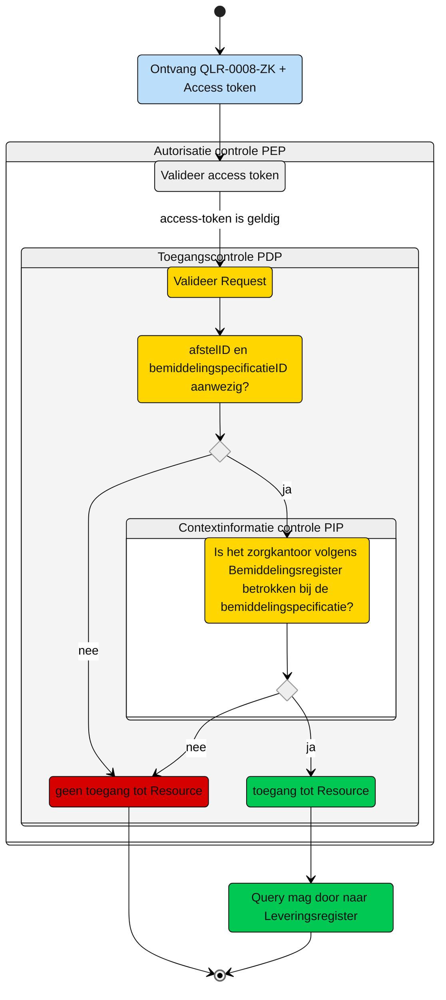

# Toegangscontrole: Raadplegen van Afstel door het zorgkantoor (UCLR-0008)  

> [!CAUTION] 
> Voor de controle op de toegang van deze query is er een PIP controle nodig. De toets of dit mogelijk met de huidige informatie mogelijk is, is moet nog plaatsvinden. De query kan nog wijzigen, wat effect kan hebben op het schema. 

Beschrijving van de **toegangscontrole** door de Policy Decision Point (PDP) en indien van toepassing Policy Information Point (PIP).

N.b. Het valideren van de Acces-token door de PEP is geen onderdeel van de ze beschrijving. Zie daarvoor het [Afsprakenstelsel iWlz - nID netwerkstelsel - 5. Policy Enforcement Point.](https://wlz.atlassian.net/wiki/spaces/IWLZAS/pages/229441537/nID+netwerkstelsel#5.-Policy-Enforcement-Point-(PEP))

## Toegangscontrole PDP
### Subject
- **Entiteit:** Zorgkantoor, verantwoordelijk of uitvoerend
- **Kenmerk:** In bezit van een access-token met daarin de eigen `uzovicode`


### **Action**
- **Type:** `raadplegen` (read)
- **Omschrijving:** Uitvoeren van GraphQL-query [`QLR-0008-ZK.graphql`](/gql-query/zorgkantoor/QLR-0008-ZK.graphql) op het Leveringsregister door een zorgkantoor


### **Resource**
- **Type:** `Wlz Leveringsregister`
- **ID:** `afstelID`; `bemiddelingspecificatieID`
- **Beperking:** Alleen toegang tot gegevens van het Afstel (en overige informatie) waarvoor het zorgkantoor:
  1. Aan te merken is als het uitvoerend zorgkantoor voor de Bemiddelingspecificatie waaraan het Afstel via Levering is gekoppeld;
  2. Aan te merken is als een verantwoordelijk zorgkantoor, die betrokken is bij dezelfde Bemiddeling waaronder de Bemiddelingspecificatie valt waaraan het Afstel via Levering is gekoppeld. 
- **Inhoud:** Alle nodes, behalve `Verzoek` en `VerzoekAanbieder`, in het GraphQL-schema die horen bij dit `Afstel` mogen direct worden opgevraagd


### **Context**
- **Query-parameters vereist:** Het `afstelID` en `bemiddelingspecificatieID` moeten zijn meegegeven in de query
- **Toegangsvoorwaarde:**  Er is alleen toegang als aan alle volgende voorwaarden is voldaan:
  - De parameter `afstelID` en `bemiddelingspecificatieID` zijn aanwezig in de query;
  - De **access-token** bevat een geldige `uzovicode` van het zorgkantoor;
  - In het **Bemiddelingsregister** bestaat er een `Bemiddelingspecificatie` met `bemiddelingspecificatieID` zoals in de query meegegeven waarbij:
    1.  Het `uitvoerendZorgkantoor` overeenkomt met de `uzovicode` uit de access-token, **óf**
    2.  Het `verantwoordelijkZorgkantoor` in `Bemiddeling` die hoort bij deze `bemiddelingspecificatieID` overeenkomt met de `uzovicode` uit de acces-token. 


### Resultaat

> Toegang tot het Leveringsregister via query [`QLR-0008-ZK.graphql`](/gql-query/zorgkantoor/QLR-0008-ZK.graphql) is **alleen toegestaan** als:
>
> - Parameter **`afstelID`** **en**  **`bemiddelingspecificatieID`** zijn meegegeven in de query
> - De access-token bevat een geldige **`uzovicode`**
> - In het Bemiddelingsregister is een match gevonden tussen:
>   - De **`uzovicode`** (uit de access-token)
>   - En een **`Bemiddelingspecificatie`** met **`bemiddelingspecificatieID`** zoals in de query meegegeven
> 
> Indien aan deze voorwaarden is voldaan, mogen alle bijbehorende GraphQL-nodes (m.u.v. `Verzoek` en `VerzoekAanbieder`) worden opgevraagd conform de structuur van de query-template


# Toegangscontrole-flows Zorgkantoor uitvoerend: QLR-0008-ZK.graphql

Beschrijving van het autorisatieproces door de PEP.

**schematisch:**



| # | Toelichting |
| --: | :-- |
| 1. |Ontvangst GraphQL-request + access-token door **PEP** |
| 2. |De **PEP** valideert de access-token en geeft na goedkeur het request door aan de PDP |
| 3. |De **PDP** controleert op:<ol><li>Of het request voldoet aan de template en er geen ongeoorloofde gegevens worden opgevraagd.<li> Aanwezigheid van de verplichte parameters in het request;</ol>Is aan alle voorwaarden voldaan?<br/> - **Ja** →  Controle context-informatie door **PIP**: stap 4<br/>- **Nee** → geen toegang tot de resource - *Einde proces (geen toegang.)* |  
| 4. | De **PIP** controleert in het `Bemiddelingsregister` op de aanwezigheid van een `Bemiddelingspecificatie`met `bemiddelingspecificatieID` zoals meegegeven in de query waarbij:<br/><ol><li> Het `uitvoerendZorgkantoor` overeenkomt met de `uzovicode` uit de access-token, **óf** <li> het `verantwoordelijkZorgkantoor` in `Bemiddeling` die hoort bij deze `bemiddelingspecificatieID` overeenkomt met de `uzovicode` uit de acces-token. .</ol> Is aan de voorwaarde voldaan?<br/> - **Ja** →  Toegang tot de resource: stap 5<br/>- **Nee** → geen toegang tot de resource - *Einde proces (geen toegang.)*  |
| 5. | Het zorgkantoor krijgt toegang tot alle entiteiten (m.u.v. Verzoek en VerzoekAanbieder) die bij de Levering horen waar de afstelID uit de query bij hoort.
| 6. | *Einde*


**Controle query PIP:**
```gql
query PIPValidatie (
  $bemiddelingspecificatieID: UUID! # afkomstig uit query
  $uzovicodeZorgkantoor: String! # afkomstig uit Access-token
) {
  bemiddelingspecificatie(
    where: {
      bemiddelingspecificatieID: { eq: $bemiddelingspecificatieID }
      or: [
        { uitvoerendZorgkantoor: { eq: $uzovicodeZorgkantoor } }
        { bemiddeling: { verantwoordelijkZorgkantoor: { eq: $uzovicodeZorgkantoor } } }
      ]
    }
  ) {
    bemiddelingspecificatieID
    uitvoerendZorgkantoor
    bemiddeling {
      bemiddelingID
      verantwoordelijkZorgkantoor
    }
  }
}
```

---
Ga naar [UC beschrijving raadplegen](/raadplegen/zorgkantoor/UCLR-0008-raadplegen.md) -- Terug naar [Raadplegen](/raadplegen/README.md)