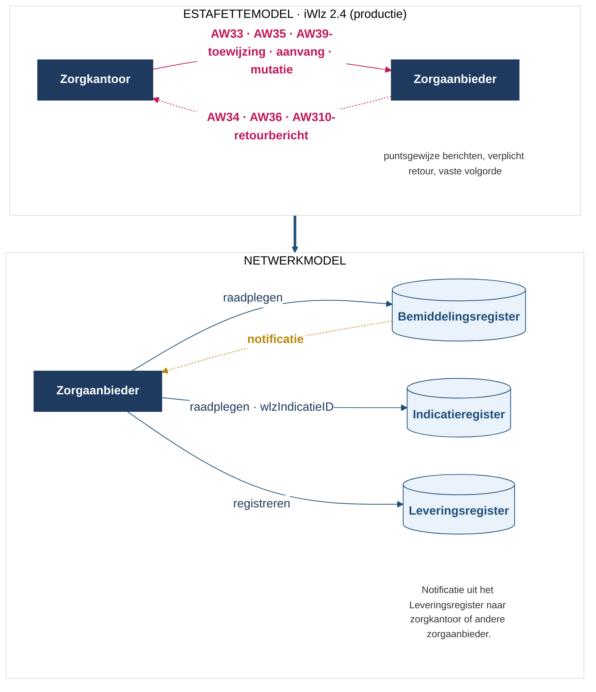

# Technische aansluiting Zorgaanbieder

## 1. Inleiding

```mermaid
---
config:
  theme: base
  themeVariables:
    background: "#ffffff"
    primaryColor: "#ffffff"
    primaryTextColor: "#1e3a5f"
    primaryBorderColor: "#d0d7de"
    clusterBkg: "#ffffff"
    clusterBorder: "#d8dee4"
    edgeLabelBackground: "#ffffff"
    lineColor: "#1f4e79"
    fontFamily: "Helvetica, Arial, sans-serif"
---
flowchart TB
    subgraph EST["ESTAFETTEMODEL &middot; iWlz 2.4 (productie)"]
        direction LR
        ZK["Zorgkantoor"]
        ZA1["Zorgaanbieder"]
        ZK -- "AW33 &middot; AW35 &middot; AW39-toewijzing &middot; aanvang &middot; mutatie" --> ZA1
        ZA1 -. "AW34 &middot; AW36 &middot; AW310-retourbericht" .-> ZK
        CAP1["puntsgewijze berichten, verplicht retour, vaste volgorde"]
    end

    subgraph NET["NETWERKMODEL"]
        direction LR
        ZA2["Zorgaanbieder"]
        BEM[("Bemiddelingsregister")]
        IND[("Indicatieregister")]
        LEV[("Leveringsregister")]
        ZA2 -- "raadplegen" --> BEM
        ZA2 -- "raadplegen &middot; wlzIndicatieID" --> IND
        ZA2 -- "registreren" --> LEV
        BEM -. "notificatie" .-> ZA2
        CAP2["Notificatie uit het Leveringsregister naar zorgkantoor of andere zorgaanbieder."]
    end

    EST ==> NET

    classDef actor fill:#1e3a5f,stroke:#1e3a5f,color:#ffffff,font-weight:bold
    classDef register fill:#eaf2fb,stroke:#1f4e79,color:#1f4e79,font-weight:bold
    classDef caption fill:none,stroke:none,color:#333333,font-size:13px
    class ZK,ZA1,ZA2 actor
    class BEM,IND,LEV register
    class CAP1,CAP2 caption

    linkStyle 0,1 stroke:#c2185b,color:#c2185b,font-weight:bold
    linkStyle 5 stroke:#b8860b,color:#b8860b,font-weight:bold
```